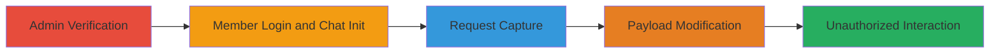

---
tags:
  - auth-bypass
  - api-manipulation
  - chatbot
  - gemini
  - dust
type: attack_chain
tools:
  - '[[tools/Burp-Suite]]'
tactics:
  - '[[Initial Access]]'
verified: false
platforms:
  - Web
submitted: true
complexity: medium
created_at: '2023-10-01T00:00:00Z'
procedures:
  - '[[procedures/Bypass-Dust-Chatbot-Restrictions-via-API-Manipulation]]'
step_count: 5
techniques:
  - '[[Exploit Public-Facing Application]]'
  - '[[Valid Accounts]]'
updated_at: '2025-12-14T17:30:27.211Z'
description: >-
  Multi-stage attack exploiting an authorization bypass in the Dust chatbot
  system to allow non-authorized member users to access disabled or restricted
  Gemini AI chatbots by manipulating HTTP requests.
skill_level: intermediate
impact_level: high
id: 91f241d0-e878-4f8a-976e-a389cee0d9dd
validated: true
mitre_tactics:
  - '[[Initial Access]]'
mitre_techniques:
  - '[[Exploit Public-Facing Application]]'
  - '[[Valid Accounts]]'
---
# Authorization Bypass in Dust Chatbot via Unauthorized Mention Injection

Multi-stage attack chain demonstrating a complete workflow to bypass admin restrictions on AI chatbots in the Dust system, enabling unauthorized access to premium or disabled features like the Gemini agent.

## Chain Metrics Dashboard

| Metric | Value |
|--------|-------|
| Chain Status | Unverified |
| Total Steps | 5 |
| Execution Time | ~10 minutes |
| Skill Level | Intermediate |
| Complexity | Medium |
| Impact Level | High |

## Attack Flow Visualization

## Prerequisites & Requirements

### Required Tools

- [[tools/Burp-Suite]]

### Target Environment

- Web-based Dust chatbot platform
- Access to admin and member accounts
- API endpoints for assistant conversations

### Initial Access Requirements

- Valid admin credentials to disable agents
- Valid member credentials (non-admin)
- Network access to the Dust application
- Burp Suite configured as proxy for HTTP interception

## Detailed Attack Procedures

### Step 1: Admin Verification of Agent Status
procedure: [[procedures/Bypass-Dust-Chatbot-Restrictions-via-API-Manipulation]]

**Objective**: Confirm that the target Gemini agent is disabled or restricted by admin controls.

**Instructions**: Log in to the Dust application using admin credentials. Navigate to the admin dashboard and access the 'Manage Agents' section to verify the status of the Gemini agent, ensuring it is set to disabled or restricted.

**Expected Output**: Dashboard displays Gemini agent as unavailable or disabled for non-admin users.

**Success Indicators**:
- Gemini agent confirmed disabled in admin view
- No access errors for admin

### Step 2: Member Account Chat Initiation
procedure: [[procedures/Bypass-Dust-Chatbot-Restrictions-via-API-Manipulation]]

**Objective**: Switch to a non-authorized member account and attempt to start a chat with an available agent to prepare for request capture.

**Instructions**: Log out of the admin account and log in with member credentials. In the chat interface, initiate a new conversation and select an available agent from the UI prompt 'which agent would you like to chat with?'.

**Expected Output**: Chat interface loads with available agents, but Gemini not listed.

**Success Indicators**:
- Member login successful
- Chat initiation without errors

### Step 3: Capture Outgoing Request
procedure: [[procedures/Bypass-Dust-Chatbot-Restrictions-via-API-Manipulation]]

**Objective**: Intercept the HTTP request sent during chat initiation using a proxy tool.

**Instructions**: Configure Burp Suite to intercept traffic from the browser. Proceed with the chat initiation in Step 2, capturing the POST request to the API endpoint for message editing or creation.

**Expected Output**: Burp Suite displays the intercepted POST request, typically to `/api/w/{workspace}/assistant/conversations/{conversation}/messages/{message}/edit`.

**Success Indicators**:
- Request captured in Burp Suite
- JSON payload visible in request body

### Step 4: Modify Request Payload
procedure: [[procedures/Bypass-Dust-Chatbot-Restrictions-via-API-Manipulation]]

**Objective**: Alter the JSON payload to inject unauthorized references to the restricted Gemini agent.

**Instructions**: In Burp Suite, edit the request body to change the 'mention' and 'configurationId' fields to target 'gemini-pro'. Update the content to include something like ':mention[gemini-pro]{sId=gemini-pro} how are you?' and modify the mentions array to [{'type':'agent','configurationId':'gemini-pro'}]. The endpoint should resemble POST /api/w/BSsJ1zPUYE/assistant/conversations/PdBk9DSYXA/messages/UyXjPLmW5j/edit.

**Expected Output**: Modified request ready for forwarding, with injected Gemini parameters.

**Success Indicators**:
- Payload successfully edited without syntax errors
- Unauthorized agent ID injected

### Step 5: Forward and Interact with Unauthorized Agent
procedure: [[procedures/Bypass-Dust-Chatbot-Restrictions-via-API-Manipulation]]

**Objective**: Send the modified request to gain access to the restricted chatbot and confirm the bypass.

**Instructions**: Forward the altered request in Burp Suite to the server. Observe the response and continue interacting with the Gemini chatbot through subsequent requests.

**Expected Output**: Server responds with a message from the Gemini agent, indicating successful access.

**Success Indicators**:
- Response from Gemini chatbot received
- Unauthorized interaction possible despite admin restrictions

## Attack Chain Summary

### Key Achievements

1. Verified admin restrictions on Gemini agent
2. Bypassed authorization using API manipulation
3. Enabled unauthorized access to premium AI features
4. Demonstrated potential for policy violations and abuse

## Technique & Tactic Coverage

### MITRE ATT&CK Techniques

- [[Exploit Public-Facing Application]] Exploit Public-Facing Application
- [[Valid Accounts]] Valid Accounts

### MITRE ATT&CK Tactics

- [[Initial Access]] Initial Access

---

*Last updated: 2023-10-01T00:00:00Z*
