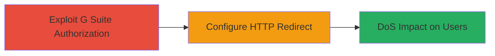

# Authorization Bypass in Google G Suite Leading to HTTP Redirect DoS on UberEats

Multi-stage attack chain demonstrating exploitation of an authorization flaw in Google G Suite combined with Uber's domain misconfiguration to control ubereats.com settings and induce a Denial of Service via HTTP redirect.

## Chain Metrics Dashboard

| Metric | Value |
|--------|-------|
| Chain Status | Unverified |
| Total Steps | 2 |
| Execution Time | ~15 minutes |
| Skill Level | Intermediate |
| Complexity | Medium |
| Impact Level | High |

## Attack Flow Visualization

## Prerequisites & Requirements

### Required Tools

- Web browser with developer tools
- Access to Google account (attacker-controlled)

### Target Environment

- Google G Suite (Workspace) admin console
- Domain: ubereats.com (misconfigured delegation)
- Web platform with DNS and HTTP redirect services

### Initial Access Requirements

- No prior credentials to Uber systems
- Ability to test G Suite permissions on delegated domains
- Network access to Google services

## Detailed Attack Procedures

### Step 1: Exploit G Suite Authorization Bypass
procedure: [[procedures/Exploit-G-Suite-Authorization-Bypass]]

**Objective**: Gain unauthorized access to domain management settings for ubereats.com via G Suite flaw.

**Instructions**: Log in to a Google account and navigate to the G Suite admin console. Test permissions on the target domain by attempting to access domain verification or redirect settings without proper authorization. If the flaw allows, proceed to edit domain configurations as if delegated.

**Expected Output**: Successful access to ubereats.com domain settings in G Suite admin panel.

**Success Indicators**:
- Domain ubereats.com appears editable in G Suite
- No authentication prompts for Uber-specific controls

### Step 2: Configure Domain HTTP Redirect
procedure: [[procedures/Configure-Domain-HTTP-Redirect]]

**Objective**: Set up an HTTP redirect to an invalid location, disrupting access for UberEats users.

**Instructions**: In the G Suite domain management interface, locate the URL redirect or domain alias settings for ubereats.com. Configure a redirect to a non-existent or disruptive endpoint (e.g., a 404 page or attacker-controlled sink). Save and propagate the changes via DNS.

**Expected Output**: HTTP requests to ubereats.com redirect to the specified invalid location, confirmed via browser testing.

**Success Indicators**:
- Redirect active: curl ubereats.com shows Location header to invalid URL
- User access disrupted: UberEats app/web fails to load for affected customers

## Attack Chain Summary

### Key Achievements

1. Unauthorized control over Uber's ubereats.com domain via G Suite
2. Configuration of disruptive HTTP redirect
3. Temporary DoS impacting UberEats service availability

## Technique & Tactic Coverage

### MITRE ATT&CK Techniques

- [[T1078.004]]
- [[Endpoint Denial of Service]]

### MITRE ATT&CK Tactics

- [[Initial Access]]
- [[Impact]]

*Last updated: 2023-10-01T00:00:00Z*
