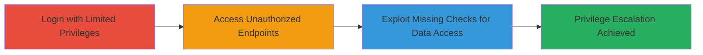

# Authorization Bypass on Shopify Dashboard via Missing Permission Checks

Multi-stage attack chain demonstrating a complete workflow to bypass authorization on Shopify's dashboard endpoints, enabling unauthorized access to sensitive store information.

## Chain Metrics Dashboard

| Metric | Value |
|--------|-------|
| Chain Status | Unverified |
| Total Steps | 3 |
| Execution Time | ~5 minutes |
| Skill Level | Intermediate |
| Complexity | Medium |
| Impact Level | High |

## Attack Flow Visualization



## Prerequisites & Requirements

### Required Tools

- Browser developer tools for inspecting cookies
- [[tools/curl]] (inferred for endpoint testing)

### Target Environment

- Shopify merchant dashboard (web application)
- Required services/ports: HTTPS on port 443
- Network access requirements: Valid internet connection and Shopify account credentials

### Initial Access Requirements

- Credential requirements: Valid Shopify account with limited privileges (e.g., channel overview access only)
- Network position: Direct access to Shopify's web interface
- Prior access needed: None, but a low-privilege account is essential

## Detailed Attack Procedures

### Step 1: Login with Limited Privileges
procedure: [[procedures/Login-with-Limited-Shopify-Privileges]]

**Objective**: Establish a session with restricted permissions to set up the bypass.

**Instructions**: Create or use a Shopify user account with limited access, such as permissions only for channel overviews. Log in via the web interface to obtain session cookies.

Use browser tools to capture the authentication cookies after login.

**Expected Output**: Active session with limited privileges, session cookies available for reuse.

**Success Indicators**:
- Successful login without errors
- Access granted to permitted sections (e.g., channel overviews) but denied to Home screen

### Step 2: Access Unauthorized Dashboard Endpoints
procedure: [[procedures/Access-Unauthorized-Shopify-Dashboard-Endpoints]]

**Objective**: Leverage the existing session to request restricted endpoints without additional checks.

**Instructions**: Extract session cookies from the browser. Use them to make requests to unauthorized endpoints, such as those for the Home screen, while having only channel overview permissions.

For example, use [[commands/curl-access-endpoint]] to test:

```bash
curl -H "Cookie: session_id=your_session_cookie;" https://admin.shopify.com/store/home
```

**Expected Output**: Response containing Home screen data without authorization denial.

**Success Indicators**:
- Unauthorized endpoint returns data instead of 403/401 error
- Sensitive dashboard elements visible in response

### Step 3: Exploit Missing Permission Checks for Data Access
procedure: [[procedures/Exploit-Missing-Permission-Checks-for-Data-Access]]

**Objective**: View or modify restricted store information by exploiting the lack of separate validations.

**Instructions**: With access confirmed, interact with the endpoints to retrieve or alter data. For editing, if forms are available, submit changes using the same session cookies.

Test data retrieval with [[commands/curl-access-endpoint]]:

```bash
curl -H "Cookie: session_id=your_session_cookie;" https://admin.shopify.com/store/channel-overview/edit
```

If edit capabilities exist, POST modifications accordingly.

**Expected Output**: Retrieved or modified sensitive store data (e.g., dashboard analytics, settings).

**Success Indicators**:
- Unauthorized data displayed or changes applied successfully
- No permission errors triggered

## Attack Chain Summary

### Key Achievements

1. Bypassed authorization using valid limited-privilege sessions
2. Accessed restricted Home screen and channel overview data
3. Enabled potential editing of admin-restricted store information, leading to privilege escalation

## Technique & Tactic Coverage

### MITRE ATT&CK Techniques

- [[Valid Accounts]] Valid Accounts
- [[Exploit Public-Facing Application]] Exploit Public-Facing Application

### MITRE ATT&CK Tactics

- [[Initial Access]] Initial Access
- [[Lateral Movement]] Lateral Movement

---
*Last updated: 2023-10-01T00:00:00Z*
