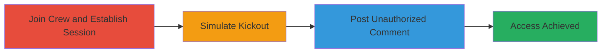

---
tags:
  - authorization-bypass
  - session-management
  - web-vulnerability
type: attack_chain
tools: []
tactics:
  - '[[Initial Access]]'
verified: false
platforms:
  - Web
submitted: true
complexity: medium
created_at: '2023-10-01T00:00:00Z'
procedures:
  - '[[procedures/Join-Crew-and-Establish-Session]]'
  - '[[procedures/Simulate-Crew-Kickout]]'
  - '[[procedures/Post-Comment-Using-Persistent-Session]]'
step_count: 3
techniques:
  - '[[Valid Accounts]]'
updated_at: '2025-12-14T17:28:52.151Z'
description: >-
  Multi-stage attack demonstrating how ex-crew members can bypass authorization
  to post comments on a crew wall due to uninvalidated sessions retaining old
  permissions.
skill_level: intermediate
impact_level: high
id: 355e63db-d9b6-4189-bcb7-2c2a6c49ae27
validated: true
mitre_tactics:
  - '[[Initial Access]]'
mitre_techniques:
  - '[[Valid Accounts]]'
---
# Authorization Bypass via Persistent Sessions After Crew Kickout

Multi-stage attack chain demonstrating a complete attack workflow exploiting session management flaws in a crew-based social feature.

## Chain Metrics Dashboard

| Metric | Value |
|--------|-------|
| Chain Status | Unverified |
| Total Steps | 3 |
| Execution Time | ~5 minutes |
| Skill Level | Intermediate |
| Complexity | Medium |
| Impact Level | High |

## Attack Flow Visualization

## Prerequisites & Requirements

### Required Tools

- Web browser (e.g., Chrome or Firefox)
- Account on the target platform (Rockstar Games Social Club)

### Target Environment

- Web platform with crew management features
- Active crew for testing
- No specific ports or services beyond standard HTTPS

### Initial Access Requirements

- Valid user account
- Network access to the web application
- Prior knowledge of crew joining process

## Detailed Attack Procedures

### Step 1: Join Crew and Establish Session
procedure: [[procedures/Join-Crew-and-Establish-Session]]

**Objective**: Gain legitimate access to the crew and create an active session with associated permissions.

**Instructions**: Log in to the platform, search for an existing crew, and join it. Perform initial actions like viewing the crew wall to establish session cookies and permissions.

**Expected Output**: Successful join confirmation and ability to interact with crew features.

**Success Indicators**:
- Crew membership confirmed
- Session active with crew permissions

### Step 2: Simulate Crew Kickout
procedure: [[procedures/Simulate-Crew-Kickout]]

**Objective**: Remove the account from the crew while preserving the existing session.

**Instructions**: Have a crew administrator remove the member via the admin panel. Verify removal by attempting to access crew features as an outsider.

**Expected Output**: Membership status updated to non-member, but session cookies remain intact.

**Success Indicators**:
- Account shows as kicked out
- No immediate session invalidation

### Step 3: Post Comment Using Persistent Session
procedure: [[procedures/Post-Comment-Using-Persistent-Session]]

**Objective**: Exploit the uninvalidated session to perform unauthorized actions on the crew wall.

**Instructions**: Using the same browser session, navigate to the crew wall and attempt to post a comment. The action succeeds due to retained permissions without re-verification.

**Expected Output**: Comment posted successfully on the crew wall despite non-membership.

**Success Indicators**:
- Comment appears on the wall
- No error for insufficient permissions

## Attack Chain Summary

### Key Achievements

1. Established a persistent session with elevated crew permissions
2. Bypassed membership checks post-kickout
3. Achieved unauthorized data modification on crew features

## Technique & Tactic Coverage

### MITRE ATT&CK Techniques

- [[Valid Accounts]]

### MITRE ATT&CK Tactics

- [[Initial Access]]

---
*Last updated: 2023-10-01T00:00:00Z*
