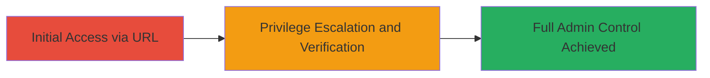

# Automatic Admin Access via Improper URL Authentication in DoD Oracle APEX Application

Multi-stage attack chain demonstrating a complete attack workflow exploiting improper access control in a U.S. Department of Defense web application built on Oracle APEX. By simply visiting a crafted URL, an attacker gains automatic authentication as an administrative user, bypassing all credential checks and enabling full control over sensitive data and system functions.

## Chain Metrics Dashboard

| Metric | Value |
|--------|-------|
| Chain Status | Unverified |
| Total Steps | 2 |
| Execution Time | ~1 minute |
| Skill Level | Beginner |
| Complexity | Low |
| Impact Level | Critical |

## Attack Flow Visualization

## Prerequisites & Requirements

### Required Tools

- Web browser (e.g., Chrome, Firefox)

### Target Environment

- Web platform
- Oracle APEX application
- Accessible via public internet (https://*.mil domain)

### Initial Access Requirements

- No credentials required
- Direct network access to the target URL
- No prior access needed

## Detailed Attack Procedures

### Step 1: Access Vulnerable URL
procedure: [[procedures/Access-Vulnerable-URL-for-Auto-Auth]]

**Objective**: Trigger automatic authentication as an administrative user by visiting the specially crafted URL, bypassing all standard login mechanisms.

**Instructions**: Open a web browser and navigate directly to the vulnerable URL: `https://███.mil/apexcrrel/f?p=150:24:23467499301323::NO:::`. This URL contains specific parameters that exploit the improper access control, creating a session and logging in as the hardcoded admin account 'ben auto log user' without any further input.

**Expected Output**: The application loads with the user interface indicating a successful login, redirecting to the main dashboard or admin panel.

**Success Indicators**:
- Page loads without prompting for credentials
- No authentication errors or redirects to login page

### Step 2: Verify Admin Privileges
procedure: [[procedures/Verify-Admin-Privileges-in-DoD-App]]

**Objective**: Confirm the elevated administrative privileges granted by the auto-authentication, allowing validation of access to sensitive features like user management and data viewing.

**Instructions**: Once the page loads, inspect the top right corner of the application interface for the logged-in user details. Look for the username 'ben auto log user' and any admin indicators, such as access to menus for creating submissions, uploading files, viewing historical data, managing users, or sending emails.

**Expected Output**: Display of 'ben auto log user' as the active session, with full admin menu options visible and functional.

**Success Indicators**:
- Username shows as 'ben auto log user'
- Admin functions (e.g., user add/edit, file upload, data publishing) are accessible and executable

## Attack Chain Summary

### Key Achievements

1. Bypassed authentication to gain admin access without credentials
2. Enabled unauthorized actions including file uploads, user role assignments, spam email distribution, and data manipulation
3. Compromised confidentiality (access to submissions since 2012), integrity (data modification), and availability (account deletions)

## Technique & Tactic Coverage

### MITRE ATT&CK Techniques

- [[Valid Accounts]] Valid Accounts
- [[Exploit Public-Facing Application]] Exploit Public-Facing Application

### MITRE ATT&CK Tactics

- [[Initial Access]] Initial Access

---
*Last updated: 2023-10-01T00:00:00Z*
