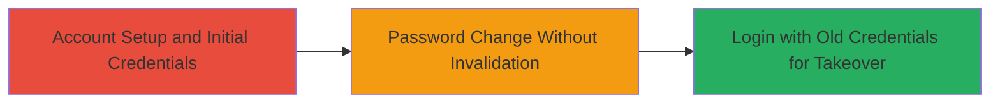

---
tags:
  - account-takeover
  - authentication-bypass
  - improper-authentication
type: attack_chain
tools: []
tactics:
  - '[[Initial Access]]'
verified: false
platforms:
  - Mobile App
  - Web
submitted: true
complexity: medium
created_at: '2023-10-01T00:00:00Z'
procedures:
  - '[[procedures/Generate-Initial-QR-Code-and-Password-in-BCM-Messenger]]'
  - >-
    [[procedures/Change-Password-Without-Invalidating-Old-Credentials-in-BCM-Messenger]]
  - >-
    [[procedures/Login-with-Old-Password-and-QR-Code-for-Account-Takeover-in-BCM-Messenger]]
step_count: 3
techniques:
  - '[[Valid Accounts]]'
updated_at: '2025-12-14T17:32:58.253Z'
description: >-
  Multi-stage attack exploiting improper authentication in BCM Messenger,
  allowing account takeover using old passwords and QR codes that remain valid
  after a password change.
skill_level: intermediate
impact_level: high
id: ff5f857b-0d4c-4d6f-b0c0-379349a91233
validated: true
mitre_tactics:
  - '[[Initial Access]]'
mitre_techniques:
  - '[[Valid Accounts]]'
---
# BCM Messenger Account Takeover via Uninvalidated Old Password and QR Code

Multi-stage attack chain demonstrating account takeover in BCM Messenger by exploiting the failure to invalidate old passwords and QR codes (containing private keys) after a password change. The server does not revoke prior authentication data, allowing attackers with access to old credentials to gain unauthorized access.

## Chain Metrics Dashboard

| Metric | Value |
|--------|-------|
| Chain Status | Unverified |
| Total Steps | 3 |
| Execution Time | ~5 minutes |
| Skill Level | Intermediate |
| Complexity | Medium |
| Impact Level | High |

## Attack Flow Visualization

## Prerequisites & Requirements

### Required Tools

- None (manual app interaction)

### Target Environment

- BCM Messenger Mobile App or Web client
- Active user account
- Access to old password and QR code (scanned or imaged)

### Initial Access Requirements

- Legitimate access to the target account for initial setup
- No special network privileges required; standard internet access

## Detailed Attack Procedures

### Step 1: Account Setup and Initial Credentials
procedure: [[procedures/Generate-Initial-QR-Code-and-Password-in-BCM-Messenger]]

**Objective**: Establish an account and obtain initial authentication credentials (password and QR code with private key) to set up the vulnerability.

**Instructions**: Register a new account or log in to an existing one in the BCM Messenger app. During login, generate and scan the QR code, which contains the private key for authentication, and provide the password.

**Expected Output**: Successful login with new credentials stored locally.

**Success Indicators**:
- Account accessible with initial password and QR code
- QR code scanned and private key loaded in the app

### Step 2: Password Change Without Invalidation
procedure: [[procedures/Change-Password-Without-Invalidating-Old-Credentials-in-BCM-Messenger]]

**Objective**: Change the account password, triggering generation of a new QR code, but leaving old credentials valid on the server.

**Instructions**: Navigate to account settings in the BCM Messenger app and update the password. The app will generate a new QR code with an updated private key, but the server does not invalidate the old password or prior private key.

**Expected Output**: New password set and new QR code generated locally; old credentials remain functional.

**Success Indicators**:
- New login successful with updated password and QR code
- No errors during password change process

### Step 3: Login with Old Credentials for Takeover
procedure: [[procedures/Login-with-Old-Password-and-QR-Code-for-Account-Takeover-in-BCM-Messenger]]

**Objective**: Use the old password and QR code to authenticate and take over the account, bypassing the password change.

**Instructions**: In a separate instance of the BCM Messenger app (or incognito session on web), attempt login using the original password and scan the old QR code containing the prior private key.

**Expected Output**: Successful authentication and full account access, including messages and settings.

**Success Indicators**:
- Login accepted with old credentials
- Attacker gains control of the account without the new password

## Attack Chain Summary

### Key Achievements

1. Demonstrated persistence of old authentication data post-password change
2. Enabled unauthorized account access via legacy QR code and password
3. Highlighted server-side failure to revoke prior credentials, leading to takeover

## Technique & Tactic Coverage

### MITRE ATT&CK Techniques

- [[Valid Accounts]]

### MITRE ATT&CK Tactics

- [[Initial Access]]

---
*Last updated: 2023-10-01T00:00:00Z*
