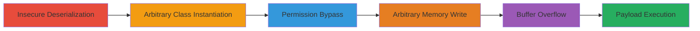

---
tags:
  - bd-j
  - deserialization
  - privilege-escalation
  - buffer-overflow
  - arbitrary-code-execution
  - ps4
  - ps5
type: attack_chain
tools: []
tactics:
  - '[[Execution]]'
  - '[[Privilege Escalation]]'
commands: []
platforms:
  - PS4
  - PS5
complexity: high
procedures:
  - '[[procedures/Exploit-Insecure-Deserialization-in-BD-J]]'
  - '[[procedures/Instantiate-Arbitrary-Restricted-Classes]]'
  - '[[procedures/Bypass-Permission-Checks-for-File-System-Access]]'
  - '[[procedures/Achieve-Arbitrary-Memory-Write-in-Compiler-Process]]'
  - '[[procedures/Trigger-Buffer-Overflow-in-UDF-Driver]]'
  - '[[procedures/Burn-and-Load-Exploit-ISO]]'
step_count: 6
techniques:
  - '[[Exploitation for Client Execution]]'
  - '[[Exploitation for Privilege Escalation]]'
description: >-
  Multi-stage exploit chain targeting BD-J vulnerabilities on PS4 and PS5 for
  arbitrary code execution and kernel panics
skill_level: advanced
impact_level: high
id: 89658f08-6e77-404f-bb85-fb3cd2ba0ab9
created_at: '2025-12-11T03:47:57.525Z'
updated_at: '2025-12-11T03:47:57.525Z'
verified: false
validated: true
submitted: true
mitre_tactics:
  - '[[TA0002]]'
  - '[[TA0004]]'
mitre_techniques:
  - '[[T1203]]'
  - '[[T1068]]'
---
# BD-J Exploit Chain Leading to Arbitrary Code Execution on PS4 and PS5

Multi-stage attack chain demonstrating a complete exploit workflow targeting vulnerabilities in the BD-J environment on PS4 and PS5, leading to arbitrary code execution, file system access, and kernel panics.

## Chain Metrics Dashboard

| Metric | Value |
|--------|-------|
| Chain Status | Unverified |
| Total Steps | 6 |
| Execution Time | ~30 minutes |
| Skill Level | Advanced |
| Complexity | High |
| Impact Level | High |

## Attack Flow Visualization



## Prerequisites & Requirements

### Required Tools

- #netcat

### Target Environment

- PS4 or PS5 console
- Required services/ports: Compiler Agent, UDF Driver, JIT Compiler; Port 1337 open
- Network access to the console's IP

### Initial Access Requirements

- Ability to burn and insert a custom Blu-ray disc (bd-jb.iso with UDF 2.5 file system)
- Network connection to send payloads

## Detailed Attack Procedures

### Step 1: Exploit Insecure Deserialization - [[procedures/Exploit-Insecure-Deserialization-in-BD-J]]

**Objective**: Instantiate classes under privileged context by exploiting insecure deserialization.

**Instructions**: Replace the userprefs file with a malicious serialized object using readObject() in UserPreferenceManagerImpl. This allows instantiation of a ClassLoader subclass to bypass the security manager on older firmwares.

**Expected Output**: Successful instantiation of privileged classes.

**Success Indicators**:
- Privileged context achieved
- No security manager errors

### Step 2: Instantiate Arbitrary Restricted Classes - [[procedures/Instantiate-Arbitrary-Restricted-Classes]]

**Objective**: Use the privileged context to instantiate restricted classes.

**Instructions**: Leverage com.oracle.security.Service.newInstance to call Class.forName on arbitrary class names, bypassing checks with a custom ProviderAccessor.

**Expected Output**: Restricted classes (e.g., sun.*) instantiated.

**Success Indicators**:
- Unauthorized classes loaded
- Access to restricted functionality

### Step 3: Bypass Permission Checks for File System Access - [[procedures/Bypass-Permission-Checks-for-File-System-Access]]

**Objective**: Gain access to the file system by bypassing permission checks.

**Instructions**: Use IxcProxy.invokeMethod to call methods under privileged context by subclassing target classes and implementing interfaces that throw RemoteException, e.g., bypassing File.list() checks.

**Expected Output**: File system structure leaked, files dumped from restricted directories like /app0/.

**Success Indicators**:
- Successful file listing in restricted areas
- No permission denied errors

### Step 4: Achieve Arbitrary Memory Write in Compiler Process - [[procedures/Achieve-Arbitrary-Memory-Write-in-Compiler-Process]]

**Objective**: Write arbitrary data to JIT memory.

**Instructions**: Send a CompilerAgentRequest with an untrusted compiler_data pointer to copy request data into JIT memory, enabling execution of arbitrary payloads.

**Expected Output**: Arbitrary payloads executed in compiler process.

**Success Indicators**:
- Memory write confirmed
- Payload execution without crashes

### Step 5: Trigger Buffer Overflow in UDF Driver - [[procedures/Trigger-Buffer-Overflow-in-UDF-Driver]]

**Objective**: Cause a kernel panic via buffer overflow.

**Instructions**: Create a UDF file with inf_len larger than sector_size, leading to overflow in memcpy() during udf_read_internal. Use [[commands/nc-send-payload]] to send the payload:

```bash
nc $PS4IP 1337 < payload.bin
```

**Expected Output**: Kernel panic triggered.

**Success Indicators**:
- System crash or panic observed
- Overflow exploitation confirmed

### Step 6: Burn and Load Exploit ISO - [[procedures/Burn-and-Load-Exploit-ISO]]

**Objective**: Load the exploit chain and execute the payload.

**Instructions**: Burn bd-jb.iso with UDF 2.5 file system, insert into PS4/PS5, and send payload using [[commands/nc-send-payload]] to execute the chain and trigger kernel panic via modified /PWN/0 file:

```bash
nc $PS4IP 1337 < payload.bin
```

**Expected Output**: Full chain executed, arbitrary code running.

**Success Indicators**:
- ISO loaded successfully
- Payload executed, kernel panic or code execution achieved

## Attack Chain Summary

### Key Achievements

1. Arbitrary code execution without kernel exploits
2. Potential for loading pirated games
3. Kernel panics and system compromise

## Technique & Tactic Coverage

### MITRE ATT&CK Techniques

- [[Exploitation for Client Execution]]
- [[Exploitation for Privilege Escalation]]

### MITRE ATT&CK Tactics

- [[Execution]]
- [[Privilege Escalation]]

*Last updated: 2023-10-01*
