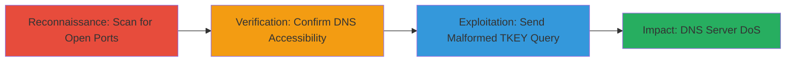

---
tags:
  - dos
  - dns
  - bind9
  - cve-2015-5477
  - reconnaissance
type: attack_chain
tools:
  - '[[tools/Nmap]]'
  - '[[tools/telnet]]'
  - '[[tools/tkeypoc]]'
tactics:
  - '[[Reconnaissance]]'
  - '[[Impact]]'
commands:
  - '[[commands/nmap-scan-host]]'
  - '[[commands/telnet-connect-port]]'
  - '[[commands/execute-bind9-tkey-poc]]'
platforms:
  - Linux
  - Network
complexity: low
procedures:
  - '[[procedures/Scan-Target-for-Open-DNS-Port]]'
  - '[[procedures/Verify-DNS-Service-Accessibility]]'
  - '[[procedures/Exploit-BIND9-TKEY-Vulnerability-with-PoC]]'
step_count: 3
techniques:
  - '[[Active Scanning]]'
  - '[[Exploit Public-Facing Application]]'
  - '[[Network Denial of Service]]'
description: >-
  A multi-step attack chain exploiting CVE-2015-5477 in BIND9 to perform a
  denial of service on a public-facing DNS server through reconnaissance,
  verification, and crafted TKEY queries.
skill_level: intermediate
impact_level: high
id: 8e5f6136-350c-49fd-bd20-c9952765bcd7
created_at: '2025-12-14T17:26:36.899Z'
updated_at: '2025-12-14T17:26:36.899Z'
verified: false
validated: true
submitted: true
mitre_tactics:
  - '[[Reconnaissance]]'
  - '[[Impact]]'
mitre_techniques:
  - '[[Active Scanning]]'
  - '[[Exploit Public-Facing Application]]'
  - '[[Network Denial of Service]]'
---
# BIND9 TKEY DoS Exploitation via Malformed DNS Queries

Multi-stage attack chain demonstrating reconnaissance, verification, and exploitation of the CVE-2015-5477 vulnerability in BIND9 to cause a denial of service on a DNS server.

## Chain Metrics Dashboard

| Metric | Value |
|--------|-------|
| Chain Status | Unverified |
| Total Steps | 3 |
| Execution Time | ~5 minutes |
| Skill Level | Intermediate |
| Complexity | Low |
| Impact Level | High |

## Attack Flow Visualization



## Prerequisites & Requirements

### Required Tools

- [[tools/Nmap]]
- [[tools/telnet]]
- [[tools/tkeypoc]]

### Target Environment

- Linux-based DNS server running BIND9 (vulnerable to CVE-2015-5477)
- Open port 53 (DNS service)
- Network access to the target host (e.g., ci.nextcloud.com)

### Initial Access Requirements

- No credentials required
- Direct network connectivity to the target
- No prior access needed; assumes external attacker position

## Detailed Attack Procedures

### Step 1: Initial Reconnaissance
procedure: [[procedures/Scan-Target-for-Open-DNS-Port]]

**Objective**: Identify open ports and services on the target host to discover the DNS service on port 53.

**Instructions**: Use [[commands/nmap-scan-host]] to perform a basic port scan:

```bash
nmap ci.nextcloud.com
```

**Expected Output**: Nmap scan report showing the host is up and ports such as 22/tcp, 53/tcp (DNS, tcpwrapped), 80/tcp, and 443/tcp open.

**Success Indicators**:
- Port 53 identified as open and associated with DNS service
- Confirmation of tcpwrapped version indicating BIND9 or similar

### Step 2: Service Verification
procedure: [[procedures/Verify-DNS-Service-Accessibility]]

**Objective**: Confirm that the DNS service on port 53 is reachable and responsive.

**Instructions**: Establish a connection using [[commands/telnet-connect-port]]:

```bash
 telnet ci.nextcloud.com 53
```

**Expected Output**: Successful connection message: "Connected to ci.nextcloud.com. Escape character is '^]'". Exit with Ctrl+C or ^].

**Success Indicators**:
- TCP connection established without errors
- Service responsiveness confirmed

### Step 3: Vulnerability Exploitation
procedure: [[procedures/Exploit-BIND9-TKEY-Vulnerability-with-PoC]]

**Objective**: Send a malformed TKEY query to trigger the DoS vulnerability in BIND9, potentially crashing the server.

**Instructions**: Execute the PoC using [[commands/execute-bind9-tkey-poc]]:

```bash
python tkeypoc.py ci.nextcloud.com
```

**Expected Output**: Script output: "CVE-2015-5477 BIND9 TKEY PoC\nSending packet to ci.nextcloud.com ...\nDone." Follow up by scanning the target again to check if the DNS service is unresponsive.

**Success Indicators**:
- Packet sent successfully without local errors
- Subsequent connection attempts to port 53 fail or timeout, indicating server crash

## Attack Chain Summary

### Key Achievements

1. Discovered vulnerable DNS service via port scanning
2. Verified accessibility of the target port
3. Demonstrated DoS by exploiting TKEY query handling flaw, enabling potential DDoS amplification

## Technique & Tactic Coverage

### MITRE ATT&CK Techniques

- [[Active Scanning]] Active Scanning
- [[Exploit Public-Facing Application]] Exploit Public-Facing Application
- [[Network Denial of Service]] Network Denial of Service

### MITRE ATT&CK Tactics

- [[Reconnaissance]] Reconnaissance
- [[Impact]] Impact

---
*Last updated: 2023-10-01*
