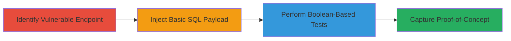

# Blind SQL Injection Exploitation in DoD Web Application via URL-Encoded POST Parameter

Multi-stage attack chain demonstrating the discovery and confirmation of a Blind SQL Injection vulnerability in a U.S. Department of Defense web application, allowing attackers to infer backend database information through boolean-based responses.

## Chain Metrics Dashboard

| Metric | Value |
|--------|-------|
| Chain Status | Unverified |
| Total Steps | 4 |
| Execution Time | ~15 minutes |
| Skill Level | Intermediate |
| Complexity | Medium |
| Impact Level | High |

## Attack Flow Visualization

## Prerequisites & Requirements

### Required Tools

- Browser developer tools or proxy like Burp Suite for intercepting and modifying POST requests
- Video recording software for proof-of-concept

### Target Environment

- Web application hosted on a server with SQL backend (e.g., MySQL, SQL Server)
- Required services/ports: HTTP/HTTPS on port 80/443
- Network access requirements: Direct access to the public-facing web application

### Initial Access Requirements

- No credentials required (public-facing endpoint)
- Network position: External attacker with internet access
- Prior access needed: None

## Detailed Attack Procedures

### Step 1: Identify Vulnerable Endpoint
procedure: [[procedures/Detect-and-Confirm-Blind-SQL-Injection]]

**Objective**: Locate the POST endpoint susceptible to SQL injection by targeting URL-encoded input parameters.

**Instructions**: Use a browser or proxy tool to send a POST request to the target endpoint https://██████████/██████, focusing on the URL-encoded parameter ███. Inspect the request for opportunities to inject SQL syntax without immediate error messages.

**Expected Output**: Normal application response indicating the parameter is processed but potentially vulnerable to injection.

**Success Indicators**:
- Endpoint accepts POST requests with the specified parameter
- No immediate input validation errors

### Step 2: Inject Basic SQL Payload to Test for Injection
procedure: [[procedures/Detect-and-Confirm-Blind-SQL-Injection]]

**Objective**: Test if the parameter allows SQL syntax injection by observing response differences.

**Instructions**: Modify the POST parameter ███ to include a basic payload such as `-1' OR 3 _2_ 1=6 AND 1=1 or '4mEwSPwJ'='`. Send the request and compare the response to a baseline legitimate input.

**Expected Output**: Altered response behavior, such as a different page load time or content, indicating SQL evaluation.

**Success Indicators**:
- Response differs from baseline, suggesting injection point
- No SQL error exposed, confirming blind nature

### Step 3: Perform Boolean-Based Tests to Confirm Blind SQLi
procedure: [[procedures/Detect-and-Confirm-Blind-SQL-Injection]]

**Objective**: Use boolean conditions to infer database logic and confirm blind SQL injection capability.

**Instructions**: Send multiple POST requests with payloads designed to trigger TRUE or FALSE conditions:
- TRUE test: `-1' OR 1=1 or '4mEwSPwJ'='`
- FALSE test: `-1' OR 2=4 or '4mEwSPwJ'='`
- Complex TRUE: `-1' OR 3 _2<(1+2+4) or '4mEwSPwJ'='`
- Complex FALSE: `-1' OR 3_ 2>(1+2+4) or '4mEwSPwJ'='`
Observe response patterns (e.g., success vs. error pages) to map boolean outcomes.

**Expected Output**: Consistent TRUE responses for valid conditions and FALSE for invalid, allowing inference of database state.

**Success Indicators**:
- Predictable response differentiation based on boolean logic
- Ability to chain conditions for data extraction potential

### Step 4: Capture Proof-of-Concept Video
procedure: [[procedures/Detect-and-Confirm-Blind-SQL-Injection]]

**Objective**: Document the exploitation for verification and reporting.

**Instructions**: Record a screen capture of the injection process, including request crafting, payload submission, and response analysis showing TRUE/FALSE behaviors.

**Expected Output**: Video file demonstrating the vulnerability in action.

**Success Indicators**:
- Clear visual evidence of response changes tied to SQL conditions
- Reproducible steps for validation

## Attack Chain Summary

### Key Achievements

1. Identified a blind SQL injection point in a sensitive DoD application
2. Confirmed vulnerability through boolean inference without direct data leakage
3. Demonstrated potential for backend database control and data extraction

## Technique & Tactic Coverage

### MITRE ATT&CK Techniques

- [[Exploit Public-Facing Application]]

### MITRE ATT&CK Tactics

- [[Initial Access]]
- [[Collection]]

---
*Last updated: 2023-10-01T00:00:00Z*
