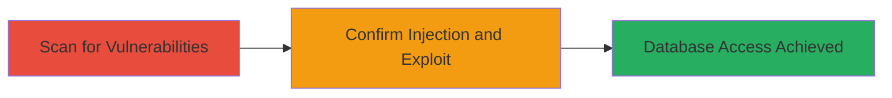

# Blind SQL Injection Exploitation via User-Agent Header

Multi-stage attack chain demonstrating the discovery and exploitation of a blind SQL injection vulnerability in the User-Agent HTTP header of a web application, leading to arbitrary SQL command execution and potential unauthorized access to sensitive database data.

## Chain Metrics Dashboard

| Metric | Value |
|--------|-------|
| Chain Status | Unverified |
| Total Steps | 2 |
| Execution Time | ~5 minutes |
| Skill Level | Intermediate |
| Complexity | Medium |
| Impact Level | High |

## Attack Flow Visualization



## Prerequisites & Requirements

### Required Tools

- [[tools/sqlmap]]

### Target Environment

- Web application running on HTTPS
- Database backend: MySQL >= 8.0.0 or MariaDB fork
- No specific ports required beyond standard HTTP/HTTPS (80/443)

### Initial Access Requirements

- Network access to the target website (https://target.com)
- No credentials needed for initial scanning
- Prior reconnaissance to identify the target URL

## Detailed Attack Procedures

### Step 1: Scan for SQL Injection Vulnerabilities
procedure: [[procedures/Scan-Target-for-SQL-Injection-Vulnerabilities]]

**Objective**: Identify potential SQL injection points in the target web application, focusing on HTTP headers like User-Agent.

**Instructions**: Use [[commands/sqlmap-scan-user-agent]] to scan the target URL with elevated risk and level settings:

```bash
sqlmap --url "https://target.com/" --batch --random-agent --level 5 --risk 3
```

This command tests various injection points including headers. Monitor the output for vulnerability detection.

**Expected Output**: Detection of injectable parameters, such as headers, with details on the type of injection (e.g., boolean-based blind).

**Success Indicators**:
- sqlmap reports a vulnerable parameter like User-Agent
- Basic DBMS information retrieved (e.g., MySQL version)

### Step 2: Confirm and Exploit Blind SQL Injection
procedure: [[procedures/Confirm-and-Exploit-Blind-SQL-Injection]]

**Objective**: Verify the vulnerability and demonstrate exploitation, such as retrieving database information or executing arbitrary SQL commands.

**Instructions**: Based on scan results, sqlmap automatically confirms the injection. For manual verification or further exploitation, use targeted sqlmap options to dump data or execute commands. For example, to enumerate the database:

```bash
sqlmap --url "https://target.com/" --dbms=mysql --technique=B --random-agent -H "User-Agent: ' OR 1=1--"
```

Adjust payloads to extract sensitive data like user tables.

**Expected Output**: Confirmation of boolean-based blind injection, DBMS details (e.g., 'back-end DBMS: MySQL >= 8.0.0 (MariaDB fork)'), and potential data dumps.

**Success Indicators**:
- Successful payload injection without errors
- Retrieval of database schema or version information
- Ability to execute custom SQL queries

## Attack Chain Summary

### Key Achievements

1. Discovery of blind SQL injection in User-Agent header using automated scanning.
2. Confirmation of vulnerability type and database backend.
3. Potential for unauthorized data access and database manipulation.

## Technique & Tactic Coverage

### MITRE ATT&CK Techniques

- [[Exploit Public-Facing Application]]

### MITRE ATT&CK Tactics

- [[Initial Access]]

---
*Last updated: 2023-10-01T00:00:00Z*
