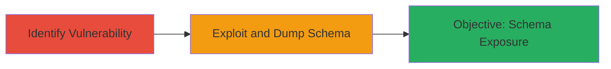

---
tags:
  - sqli
  - blind-sqli
  - waf-bypass
  - web-vulnerability
type: attack_chain
tools:
  - '[[tools/sqlmap]]'
tactics:
  - '[[Initial Access]]'
  - '[[Collection]]'
verified: false
platforms:
  - Web
submitted: true
complexity: medium
created_at: '2023-10-01T00:00:00Z'
procedures:
  - '[[procedures/Identify-Blind-SQL-Injection-Vulnerability]]'
  - '[[procedures/Exploit-Blind-SQL-Injection-with-sqlmap]]'
step_count: 2
techniques:
  - '[[Exploit Public-Facing Application]]'
  - '[[Disable or Modify Tools]]'
updated_at: '2025-12-14T03:15:10.078Z'
description: >-
  A multi-stage attack exploiting a Blind SQL Injection vulnerability on the
  Starbucks Guatemala beverage detail endpoint, bypassing WAF to dump database
  schema.
skill_level: intermediate
impact_level: high
id: 0107cd4b-2663-45a4-9eb7-93352e728d13
validated: true
mitre_tactics:
  - '[[Initial Access]]'
  - '[[Collection]]'
mitre_techniques:
  - '[[Exploit Public-Facing Application]]'
  - '[[Disable or Modify Tools]]'
---
# Blind SQL Injection and WAF Bypass to Dump Database Schema on Starbucks Guatemala Website

Multi-stage attack chain demonstrating exploitation of a Blind SQL Injection on the beverage detail endpoint of the Starbucks Guatemala website, leading to database schema dumping while bypassing WAF protections.

## Chain Metrics Dashboard

| Metric | Value |
|--------|-------|
| Chain Status | Unverified |
| Total Steps | 2 |
| Execution Time | ~10 minutes |
| Skill Level | Intermediate |
| Complexity | Medium |
| Impact Level | High |

## Attack Flow Visualization



## Prerequisites & Requirements

### Required Tools

- [[tools/sqlmap]]

### Target Environment

- Web platform
- Accessible public-facing website (e.g., http://www.starbucks.com.gt/menu/beverage/detail)
- No authentication required for initial access

### Initial Access Requirements

- Internet access to the target endpoint
- No prior credentials needed
- Basic knowledge of SQL injection payloads

## Detailed Attack Procedures

### Step 1: Identify Blind SQL Injection Vulnerability
procedure: [[procedures/Identify-Blind-SQL-Injection-Vulnerability]]

**Objective**: Locate and confirm the presence of a Blind SQL Injection vulnerability in the beverage detail endpoint parameters.

**Instructions**: Manually inspect the target endpoint http://www.starbucks.com.gt/menu/beverage/detail for injectable parameters, such as query strings or form inputs. Test with basic payloads like ' OR 1=1 -- to observe response differences indicating blind injection (e.g., time-based or boolean-based delays).

**Expected Output**: Confirmation of injection point through altered response times or boolean outcomes without direct error messages.

**Success Indicators**:
- Response time increases with SLEEP() payload
- Boolean conditions alter page behavior subtly

### Step 2: Exploit Blind SQL Injection with sqlmap
procedure: [[procedures/Exploit-Blind-SQL-Injection-with-sqlmap]]

**Objective**: Use sqlmap to automate exploitation, bypass WAF, and extract database schema from multiple tables.

**Instructions**: Launch sqlmap against the identified endpoint using [[commands/sqlmap-blind-injection-dump]] to detect and exploit the blind SQLi, specifying options to handle WAF evasion and target schema dumping.

```bash
python sqlmap.py -u "http://www.starbucks.com.gt/menu/beverage/detail?id=1" --technique=B --dbms=mysql --dump-all --batch --tamper=space2comment
```

Monitor the output for successful schema extraction.

**Expected Output**: Dumped database schema including table structures from several tables.

**Success Indicators**:
- Sqlmap confirms blind SQLi vulnerability
- Schema data retrieved without WAF blocking

## Attack Chain Summary

### Key Achievements

1. Identified and confirmed Blind SQL Injection on public endpoint
2. Bypassed WAF using sqlmap's evasion techniques
3. Successfully dumped limited database schema, exposing data structures

## Technique & Tactic Coverage

### MITRE ATT&CK Techniques

- [[Exploit Public-Facing Application]]
- [[Disable or Modify Tools]]

### MITRE ATT&CK Tactics

- [[Initial Access]]
- [[Collection]]

---
*Last updated: 2023-10-01T00:00:00Z*
