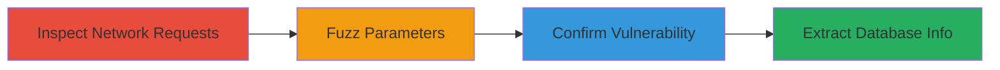

# Blind SQL Injection in AgileCRM Endpoint to Extract Rocket.Chat Database Metadata

Multi-stage attack chain demonstrating exploitation of a Blind SQL Injection vulnerability in the third-party AgileCRM stats endpoint integrated into the Rocket.Chat static website, allowing extraction of sensitive database metadata.

## Chain Metrics Dashboard

| Metric | Value |
|--------|-------|
| Chain Status | Unverified |
| Total Steps | 4 |
| Execution Time | ~10 minutes |
| Skill Level | Intermediate |
| Complexity | Medium |
| Impact Level | High |

## Attack Flow Visualization

## Prerequisites & Requirements

### Required Tools

- Web browser with developer tools (e.g., Chrome DevTools)
- Command-line tool like curl for payload testing

### Target Environment

- Web platform with JavaScript-loaded third-party scripts
- Access to MySQL-backed services via public endpoints
- No authentication required for initial access

### Initial Access Requirements

- Public internet access to https://rocket.chat/
- No credentials needed
- Ability to inspect and modify network requests

## Detailed Attack Procedures

### Step 1: Inspect Network Requests
procedure: [[procedures/Inspect-Network-Requests-for-Third-Party-Endpoints]]

**Objective**: Identify third-party endpoints loaded by the target website to discover potential injection points.

**Instructions**: Load the Rocket.Chat homepage in a browser and use developer tools to monitor network traffic. Look for requests to external domains like AgileCRM.

**Expected Output**: Identification of the https://stats2.agilecrm.com/addstats endpoint with parameters such as callback, guid, sid, url, agile, domain.

**Success Indicators**:
- Third-party stats endpoint discovered
- Parameters like 'new' visible in requests

### Step 2: Fuzz Parameters
procedure: [[procedures/Fuzz-Parameters-for-SQL-Injection-Vulnerabilities]]

**Objective**: Test parameters for SQL injection vulnerabilities by injecting malformed inputs.

**Instructions**: Use a proxy tool or direct manipulation to fuzz parameters in the identified endpoint, focusing on 'new' and similar fields with SQL syntax like quotes or unions.

**Expected Output**: Anomalous responses indicating potential SQL errors or delays when fuzzing the 'new' parameter.

**Success Indicators**:
- Unusual server behavior on specific inputs
- No immediate errors but hints of injection

### Step 3: Confirm Vulnerability
procedure: [[procedures/Confirm-Blind-SQL-Injection-with-Time-Based-Payload]]

**Objective**: Verify the Blind SQL Injection by inducing measurable delays using time-based functions.

**Instructions**: Inject a time-based payload into the 'new' parameter via a crafted request to cause a delay, confirming SQL execution.

**Expected Output**: Response time increases by 5 seconds due to sleep function execution.

**Success Indicators**:
- Consistent delay on payload injection
- No data returned but behavioral confirmation

### Step 4: Extract Database Information
procedure: [[procedures/Extract-Database-Schema-via-Blind-SQL-Injection]]

**Objective**: Use confirmed injection to enumerate database metadata including version, hostname, databases, and tables.

**Instructions**: Craft conditional queries to extract information bit-by-bit, such as using ASCII comparisons for version extraction.

**Expected Output**: Database details like MySQL 5.0.12, localhost hostname, databases (information_schema, mysql, performance_schema, stats), and tables (3, persons, map).

**Success Indicators**:
- Successful extraction of schema elements
- Potential access to user statistics

## Attack Chain Summary

### Key Achievements

1. Discovery of vulnerable third-party endpoint in Rocket.Chat
2. Confirmation of Blind SQLi allowing arbitrary SQL execution
3. Extraction of sensitive MySQL metadata from AgileCRM backend
4. Potential for further compromise of rocketchat.agilecrm.com

## Technique & Tactic Coverage

### MITRE ATT&CK Techniques

- [[Exploit Public-Facing Application]]
- [[Credential Dumping]]

### MITRE ATT&CK Tactics

- [[Initial Access]]
- [[Discovery]]
- [[Collection]]

---
*Last updated: 2023-10-01T00:00:00Z*
