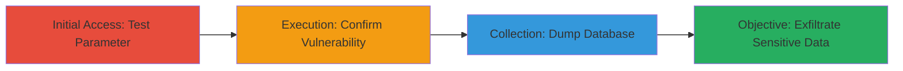

---
tags:
  - sqli
  - blind-sqli
  - sqlmap
  - mysql
  - web
  - dod
  - data-exfiltration
type: attack_chain
tools:
  - '[[tools/sqlmap]]'
tactics:
  - '[[Initial Access]]'
  - '[[Collection]]'
commands:
  - '[[commands/sqlmap-test-blind-sqli]]'
  - '[[commands/sqlmap-dump-database]]'
platforms:
  - Web
  - MySQL
complexity: medium
procedures:
  - '[[procedures/Detect-Blind-SQL-Injection-with-SQLMap]]'
  - '[[procedures/Dump-Database-via-Blind-SQL-Injection-with-SQLMap]]'
step_count: 2
techniques:
  - '[[Exploit Public-Facing Application]]'
description: >-
  A multi-step attack exploiting a Blind SQL Injection vulnerability in a U.S.
  Department of Defense web application's filter[event] parameter to confirm the
  vulnerability and dump sensitive database contents including user auth
  details, API keys, and operational data.
skill_level: intermediate
impact_level: high
id: 5232b81c-dce0-47a3-8b9c-472045b90666
created_at: '2025-12-14T03:15:05.111Z'
updated_at: '2025-12-14T03:15:05.111Z'
verified: false
validated: true
submitted: true
mitre_tactics:
  - '[[Initial Access]]'
  - '[[Collection]]'
mitre_techniques:
  - '[[Exploit Public-Facing Application]]'
---
# Blind SQL Injection in DoD Web App to Dump Sensitive Database Contents

## Overview

This attack chain demonstrates the exploitation of a Blind SQL Injection (SQLi) vulnerability in the filter[event] parameter of a U.S. Department of Defense web application. Using the SQLMap tool, attackers can confirm the vulnerability through boolean-based and time-based techniques without direct data output, then proceed to extract the entire database structure and contents. The impact includes exposure of sensitive information such as user authentication details, API keys, OAuth tokens, media files, logs, and operational data, potentially enabling unauthorized access, privilege escalation, and broader data breaches in a high-security environment.

## Chain Metrics Dashboard

| Metric | Value |
|--------|-------|
| Chain Status | Unverified |
| Total Steps | 2 |
| Execution Time | ~30-60 minutes |
| Skill Level | Intermediate |
| Complexity | Medium |
| Impact Level | High |

## Attack Flow Visualization



## Prerequisites & Requirements

### Required Tools

- [[tools/sqlmap]]

### Target Environment

- Web application hosted on a server with MySQL backend
- Accessible URL with the vulnerable filter[event] parameter
- No authentication required for initial testing (public-facing app)

### Initial Access Requirements

- Direct network access to the target web application
- No prior credentials needed, but evasion techniques like random User-Agent may be required to bypass basic WAFs

## Detailed Attack Procedures

### Step 1: Test and Confirm Blind SQL Injection
procedure: [[procedures/Detect-Blind-SQL-Injection-with-SQLMap]]

**Objective**: Identify and verify the Blind SQL Injection vulnerability in the filter[event] parameter using boolean-based and time-based techniques to retrieve basic database information like the current database name.

**Instructions**: Target the redacted URL with SQLMap, specifying the filter[event] parameter, MySQL DBMS, and high-risk/level settings for thorough testing. Use the [[commands/sqlmap-test-blind-sqli]] command:

```bash
sqlmap -u "███████" --technique=BT --level=5 --risk=3 --threads=10 -p 'filter[event]' --dbms='MySQL' --batch --current-db --random-agent
```

This command automates payload injection and infers responses based on boolean conditions or delays.

**Expected Output**: Confirmation of the vulnerability, current database name (e.g., a DoD-specific DB), and potential error logs if unsuccessful.

**Success Indicators**:
- SQLMap reports the parameter as injectable
- Database name enumerated successfully
- No immediate 500 errors or blocks from defenses

### Step 2: Dump Full Database Contents
procedure: [[procedures/Dump-Database-via-Blind-SQL-Injection-with-SQLMap]]

**Objective**: Exploit the confirmed vulnerability to extract all database tables and data, including sensitive elements like auth sessions, API keys, and logs.

**Instructions**: Re-run SQLMap on the same target but replace the database enumeration flag with the dump option to pull all contents. Execute the [[commands/sqlmap-dump-database]] command:

```bash
sqlmap -u "███████" --technique=BT --level=5 --risk=3 --threads=10 -p 'filter[event]' --dbms='MySQL' --batch --dump --random-agent
```

This will systematically query and reconstruct the database via blind techniques.

**Expected Output**: CSV or table dumps of over 300 tables, including 360_batchinfo, auth_member_sessions, api_key, media_set, with exposed credentials and tokens.

**Success Indicators**:
- Tables and data successfully dumped to local files
- Sensitive data like OAuth tokens visible in output
- No detection or interruption during multi-threaded extraction

## Attack Chain Summary

### Key Achievements

1. Confirmed Blind SQLi in a high-security DoD application without direct output
2. Extracted database schema and full contents, exposing critical assets
3. Demonstrated potential for unauthorized access and escalation in government systems

## Technique & Tactic Coverage

### MITRE ATT&CK Techniques

- [[Exploit Public-Facing Application]]

### MITRE ATT&CK Tactics

- [[Initial Access]]
- [[Collection]]

---
*Last updated: 2023-10-01*
