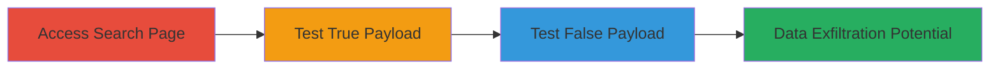

# Blind SQL Injection in HackerOne CVE Discovery Search for Analytics Data Disclosure

Multi-stage attack chain demonstrating a complete blind SQL injection workflow in the HackerOne platform's CVE Discovery Search feature, allowing confirmation of injection and potential extraction of cached analytics data.

## Chain Metrics Dashboard

| Metric | Value |
|--------|-------|
| Chain Status | Unverified |
| Total Steps | 3 |
| Execution Time | ~5 minutes |
| Skill Level | Intermediate |
| Complexity | Medium |
| Impact Level | High |

## Attack Flow Visualization

## Prerequisites & Requirements

### Required Tools

- [[tools/Chrome]]

### Target Environment

- Web platform
- Required services/ports: HTTPS (443)
- Network access requirements: Public internet access to https://hackerone.com

### Initial Access Requirements

- No credentials required for public search feature
- Network position: External attacker
- Prior access needed: None

## Detailed Attack Procedures

### Step 1: Access CVE Discovery Search Page
procedure: [[procedures/Access-HackerOne-CVE-Discovery-Search-Page]]

**Objective**: Navigate to the vulnerable CVE Discovery Search interface to prepare for injection testing.

**Instructions**: Open a web browser and visit the HackerOne CVE Discovery Search page at https://hackerone.com/intelligence/cve_discovery. This loads the GraphQL-powered search interface where user inputs are processed.

**Expected Output**: The search page loads, allowing entry of search terms that query the ranked_cve_entries resolver.

**Success Indicators**:
- Page loads without errors
- Search input field is visible and functional

### Step 2: Test SQL Injection with True Payload
procedure: [[procedures/Test-SQL-Injection-with-True-Payload]]

**Objective**: Inject a SQL payload that evaluates to true to confirm results are returned, indicating successful injection into the SQL query.

**Instructions**: In the search field, enter a valid CVE-related term (e.g., a known CVE ID) followed by a whitespace-split payload like "validterm /**/AND/**/'1%'='1". Submit the search. This payload is concatenated into the SQL clause without sanitization, altering the query to always return matching results.

**Expected Output**: Search results are returned as if the valid term alone was used, confirming the injection point in the GraphQL resolver.

**Success Indicators**:
- Results appear despite the injected SQL syntax
- No error messages; query executes successfully

### Step 3: Test SQL Injection with False Payload
procedure: [[procedures/Test-SQL-Injection-with-False-Payload]]

**Objective**: Inject a SQL payload that evaluates to false to confirm no results are returned, validating blind SQL injection control.

**Instructions**: Modify the search input to use a false-evaluating payload, such as "validterm /**/AND/**/'1%'='0". Submit the search. This changes the SQL condition to exclude results, demonstrating manipulation of the backend query.

**Expected Output**: No search results are returned, even though the base term would normally match.

**Success Indicators**:
- Zero results displayed
- Consistent with false condition, confirming injection

## Attack Chain Summary

### Key Achievements

1. Confirmed SQL injection vulnerability in GraphQL search resolver
2. Demonstrated blind injection via conditional payloads
3. Highlighted potential for extracting cached analytics data like reports and teams

## Technique & Tactic Coverage

### MITRE ATT&CK Techniques

- [[Exploit Public-Facing Application]]

### MITRE ATT&CK Tactics

- [[Initial Access]]
- [[Collection]]

---
*Last updated: 2023-10-01T00:00:00Z*
