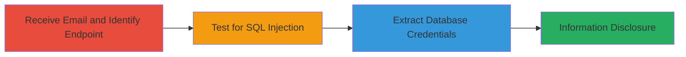

# Blind SQL Injection in Uber Email Unsubscribe Endpoint for Database Credential Disclosure

Multi-stage attack chain demonstrating exploitation of a SQL injection vulnerability in the unsubscribe endpoint of Uber's email tracking service, leading to disclosure of MySQL database credentials.

## Chain Metrics Dashboard

| Metric | Value |
|--------|-------|
| Chain Status | Unverified |
| Total Steps | 3 |
| Execution Time | ~15 minutes |
| Skill Level | Intermediate |
| Complexity | Medium |
| Impact Level | High |

## Attack Flow Visualization



## Prerequisites & Requirements

### Required Tools

- [[tools/Python-Requests-Library]]

### Target Environment

- Web application using MySQL backend
- Access to email service endpoint (e.g., sctrack.email.uber.com.cn)
- No authentication required for unsubscribe link

### Initial Access Requirements

- Receipt of target email with unsubscribe link
- Network access to the public-facing endpoint
- Python environment for scripting

## Detailed Attack Procedures

### Step 1: Receive Email and Identify Unsubscribe Endpoint

procedure: [[procedures/Test-Unsubscribe-Endpoint-for-SQL-Injection]]

**Objective**: Identify the vulnerable unsubscribe endpoint from a received email and prepare for testing.

**Instructions**: Inspect the received Uber advertisement email to locate the unsubscribe link, which points to http://sctrack.email.uber.com.cn/track/unsubscribe.do with a base64-encoded JSON payload containing user_id and receiver fields.

**Expected Output**: Valid unsubscribe URL ready for modification.

**Success Indicators**:
- Unsubscribe link extracted
- Base64 payload decoded to reveal user_id parameter

### Step 2: Test for SQL Injection Vulnerability

procedure: [[procedures/Test-Unsubscribe-Endpoint-for-SQL-Injection]]

**Objective**: Confirm the presence of time-based blind SQL injection in the user_id parameter.

**Instructions**: Modify the user_id in the JSON payload to inject a SLEEP(12) function, re-encode to base64, and send via GET request using [[commands/uber-unsubscribe-sqli-poc]]:

```bash
curl -G "http://sctrack.email.uber.com.cn/track/unsubscribe.do" --data-urlencode "p=eyJ1c2VyX2lkIjogIjU3NTUgYW5kIHNsZWVwKDEyKT0xIiwgInJlY2VpdmVyIjogIm9yYW5nZUBteW1haWwifQ=="
```

Monitor response time for a 12-second delay.

**Expected Output**: HTTP response with delayed timing indicating SQL execution.

**Success Indicators**:
- Response delay of approximately 12 seconds
- No error but observable timing difference

### Step 3: Extract Database Credentials

procedure: [[procedures/Extract-MySQL-User-via-Blind-SQL-Injection]]

**Objective**: Use blind SQL injection to extract the MySQL USER() function output, revealing database username and host.

**Instructions**: Execute the Python script [[commands/python-blind-sqli-dump-user]] to iteratively guess characters of the USER() output by checking response lengths:

```bash
python sqli_dump.py
```

The script sends payloads like '5755 and mid(user(),%d,1)='%c'#', encodes them, and prints matching characters.

**Expected Output**: Printed string forming 'sendcloud_w@10.9.79.210'.

**Success Indicators**:
- Characters extracted position by position
- Full username and database host disclosed
- Potential for further extraction of database name 'sendcloud'

## Attack Chain Summary

### Key Achievements

1. Confirmed time-based blind SQL injection in public-facing unsubscribe endpoint
2. Extracted MySQL credentials without direct error messages
3. Demonstrated potential for broader database information disclosure via third-party service

## Technique & Tactic Coverage

### MITRE ATT&CK Techniques

- [[Exploit Public-Facing Application]]

### MITRE ATT&CK Tactics

- [[Initial Access]]
- [[Collection]]

---
*Last updated: 2023-10-01T00:00:00Z*
