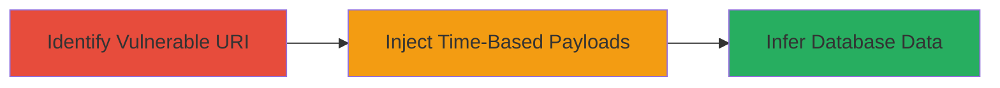

---
tags:
  - sqli
  - blind-sqli
  - time-based
  - database-exfiltration
type: attack_chain
tools:
  - '[[tools/sqlmap]]'
tactics:
  - '[[Initial Access]]'
commands:
  - '[[commands/curl-inject-sleep-payload]]'
platforms:
  - Web
complexity: medium
procedures:
  - '[[procedures/Exploit-Blind-Time-Based-SQL-Injection-via-URI-Path]]'
step_count: 1
techniques:
  - '[[Exploit Public-Facing Application]]'
description: >-
  A time-based blind SQL injection attack exploiting insufficient input
  validation in the URI path of a web application to infer sensitive database
  information through response delays.
skill_level: intermediate
impact_level: high
id: 4e170e76-38ba-4b1c-8215-5bded7d04977
created_at: '2025-12-14T03:46:20.629Z'
updated_at: '2025-12-14T03:46:20.629Z'
verified: false
validated: true
submitted: true
mitre_tactics:
  - '[[Initial Access]]'
mitre_techniques:
  - '[[Exploit Public-Facing Application]]'
---
# Blind SQL Injection via URI Path to Extract Database Structure

Multi-stage attack chain demonstrating a complete attack workflow.

## Chain Metrics Dashboard

| Metric | Value |
|--------|-------|
| Chain Status | Unverified |
| Total Steps | 1 |
| Execution Time | ~10-30 minutes |
| Skill Level | Intermediate |
| Complexity | Medium |
| Impact Level | High |

## Attack Flow Visualization



## Prerequisites & Requirements

### Required Tools

- [[tools/sqlmap]]
- curl (for manual testing)

### Target Environment

- Web application with database backend (e.g., MySQL, PostgreSQL)
- Accessible URI path handling user input without sanitization
- No required services/ports beyond standard HTTP/HTTPS (80/443)

### Initial Access Requirements

- Network access to the target web application
- No prior credentials needed; public-facing endpoint
- Basic knowledge of SQL syntax and timing attacks

## Detailed Attack Procedures

### Step 1: Exploit the Vulnerability
procedure: [[procedures/Exploit-Blind-Time-Based-SQL-Injection-via-URI-Path]]

**Objective**: Inject malicious SQL payloads into the URI path to cause database delays, allowing inference of sensitive data like database structure or user information without direct output.

**Instructions**: Begin by identifying the injectable URI path, such as `/app/resource/[input]`. Test for time-based blind SQLi using a sleep function in the database (e.g., SLEEP(5) for MySQL). Use [[commands/curl-inject-sleep-payload]] to send payloads and measure response times:

```bash
curl -w "%{time_total}s" "http://target.com/vulnerable/path'; IF(ASCII(SUBSTRING((SELECT database()),1,1))>64, SLEEP(5), 0) -- - "
```

If the response takes longer than 5 seconds, the condition is true, confirming injection. Iterate payloads to extract characters one by one, such as database name, table names, or data. For automation, use [[tools/sqlmap]] with time-based detection:

```bash
sqlmap -u "http://target.com/vulnerable/path/*" --technique=T --dbms=mysql --level=3 --risk=2
```

**Expected Output**: Delayed responses (e.g., >5s) for true conditions, normal responses for false. Extracted data like database name: "mars_db".

**Success Indicators**:
- Response time increases significantly with sleep payload
- Successful extraction of at least one database schema element (e.g., table name)
- No direct errors, but inferred data via timing

## Attack Chain Summary

### Key Achievements

1. Confirmed blind SQL injection vulnerability in URI path
2. Extracted database structure (e.g., table names, column info) via time delays
3. Demonstrated potential for sensitive data exfiltration without visible output

## Technique & Tactic Coverage

### MITRE ATT&CK Techniques

- [[Exploit Public-Facing Application]]

### MITRE ATT&CK Tactics

- [[Initial Access]]

---
*Last updated: 2023-10-01*
