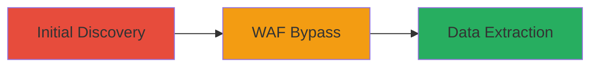

---
tags:
  - sql-injection
  - blind-sqli
  - waf-bypass
  - data-exfiltration
type: attack_chain
tools:
  - '[[tools/Akamai-WAF]]'
tactics:
  - '[[Initial Access]]'
  - '[[Collection]]'
commands: []
platforms:
  - Web
complexity: medium
procedures:
  - '[[procedures/Discover-Vulnerable-Endpoint]]'
  - '[[procedures/Bypass-WAF-with-SQL-Payload]]'
  - '[[procedures/Extract-Data-via-Blind-SQLi]]'
step_count: 3
techniques:
  - '[[Exploit Public-Facing Application]]'
description: >-
  Exploitation of a blind SQL injection vulnerability in a web endpoint to read
  database data while bypassing web application firewall protections
skill_level: intermediate
impact_level: high
id: 46b466ab-31db-4193-86f6-baca2cf64d86
created_at: '2025-12-11T03:48:05.946Z'
updated_at: '2025-12-11T03:48:05.946Z'
verified: false
validated: true
submitted: true
mitre_tactics:
  - '[[TA0001]]'
  - '[[TA0009]]'
mitre_techniques:
  - '[[T1190]]'
---
# Blind SQL Injection via countryFilter Parameter to Extract Database Data Bypassing WAF

Multi-stage attack chain demonstrating the exploitation of a blind SQL injection vulnerability in the report_xml.php endpoint of a Valve partner reporting page, allowing an attacker to read SQL data from a backing database by bypassing the Akamai WAF.

## Chain Metrics Dashboard

| Metric | Value |
|--------|-------|
| Chain Status | Unverified |
| Total Steps | 3 |
| Execution Time | ~15 minutes |
| Skill Level | Intermediate |
| Complexity | Medium |
| Impact Level | High |

## Attack Flow Visualization



## Prerequisites & Requirements

### Required Tools

- [[tools/Akamai-WAF]] (for understanding bypass, though it's defensive)
- [[commands/sqlmap-blind-exploit]] (inferred for blind SQLi exploitation)
- [[commands/curl-inject-sqli-payload]] (for sending HTTP requests)

### Target Environment

- Web platform running PHP
- SQL database backend
- Akamai WAF protecting the endpoint

### Initial Access Requirements

- Access to the public-facing report_xml.php endpoint
- No credentials required for initial injection
- Network access to the target URL

## Detailed Attack Procedures

### Step 1: Initial Discovery - [[procedures/Discover-Vulnerable-Endpoint]]

**Procedure**: [[procedures/Discover-Vulnerable-Endpoint]]

**Objective**: Identify the vulnerable countryFilter[] parameter in the report_xml.php endpoint through parameter analysis and basic testing.

**Expected Output**: Confirmation of a potentially injectable parameter that responds differently to malformed inputs.

First, send a basic request to the endpoint using [[commands/curl-inject-sqli-payload]] to observe normal behavior:

```bash
curl "https://target.com/report_xml.php?countryFilter[]=normal_value"
```

Then, test for injection points by appending a single quote using [[commands/curl-inject-sqli-payload]]:

```bash
curl "https://target.com/report_xml.php?countryFilter[]='"
```

Look for error responses or delays indicating SQL errors.

**Success Indicators**:
- Different response times or error messages on invalid inputs
- Endpoint accepts array parameters without validation

### Step 2: WAF Bypass - [[procedures/Bypass-WAF-with-SQL-Payload]]

**Procedure**: [[procedures/Bypass-WAF-with-SQL-Payload]]

**Objective**: Craft SQL payloads that evade Akamai WAF detection to confirm the blind injection vulnerability.

**Expected Output**: Successful injection without WAF blocking, indicated by boolean-based responses.

Craft a payload that uses boolean logic to bypass WAF, such as using comments or encoded characters. Use [[commands/curl-inject-sqli-payload]]:

```bash
curl "https://target.com/report_xml.php?countryFilter[]=1' AND 1=1 --"
```

Compare responses to false conditions:

```bash
curl "https://target.com/report_xml.php?countryFilter[]=1' AND 1=2 --"
```

If responses differ, WAF bypass is successful.

**Success Indicators**:
- No WAF block page returned
- Observable differences in true/false query responses

### Step 3: Data Extraction - [[procedures/Extract-Data-via-Blind-SQLi]]

**Procedure**: [[procedures/Extract-Data-via-Blind-SQLi]]

**Objective**: Extract sensitive data from the SQL database using time-based or boolean blind techniques.

**Expected Output**: Dumped data such as table names or records from the database.

Automate extraction using [[commands/sqlmap-blind-exploit]] with a configured request:

```bash
sqlmap -u "https://target.com/report_xml.php?countryFilter[]=1" --batch --dump
```

Manually, use time-based payloads with [[commands/curl-inject-sqli-payload]]:

```bash
curl "https://target.com/report_xml.php?countryFilter[]=1' AND IF(1=1, SLEEP(5), 0) --"
```

Observe delays to infer data bits.

**Success Indicators**:
- Successful extraction of database content
- No interruption from WAF or other defenses

## Attack Chain Summary

### Key Achievements

1. Identified and confirmed blind SQLi in countryFilter[] parameter
2. Bypassed Akamai WAF with crafted payloads
3. Extracted sensitive SQL data from the backing database

## Technique & Tactic Coverage

### MITRE ATT&CK Techniques

- [[Exploit Public-Facing Application]]

### MITRE ATT&CK Tactics

- [[Initial Access]]
- [[Collection]]

*Last updated: 2023-10-01*
