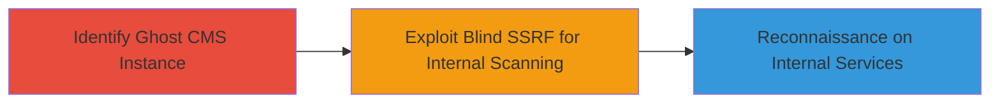

---
tags:
  - ssrf
  - blind-ssrf
  - ghost-cms
  - internal-scanning
  - reconnaissance
type: attack_chain
tools: []
tactics:
  - '[[Initial Access]]'
  - '[[Reconnaissance]]'
verified: false
platforms:
  - Web
  - Node.js
submitted: true
complexity: medium
created_at: '2023-10-01T00:00:00Z'
procedures:
  - '[[procedures/Exploit-Blind-SSRF-in-Ghost-CMS-oEmbed]]'
step_count: 2
techniques:
  - '[[Exploit Public-Facing Application]]'
updated_at: '2025-12-14T04:39:02.463Z'
description: >-
  A multi-stage attack chain exploiting a blind SSRF vulnerability in Ghost
  CMS's oEmbed functionality to perform internal network reconnaissance,
  bypassing a previous mitigation.
skill_level: intermediate
impact_level: low
id: 2305e32c-b610-4ef0-a583-189b17c264f2
validated: true
mitre_tactics:
  - '[[Initial Access]]'
  - '[[Reconnaissance]]'
mitre_techniques:
  - '[[Exploit Public-Facing Application]]'
---
# Blind SSRF Bypass in Ghost CMS for Internal Port Scanning

Multi-stage attack chain demonstrating a complete attack workflow exploiting a blind Server-Side Request Forgery (SSRF) vulnerability in Ghost CMS, allowing attackers to scan internal ports and read oEmbed contents from internal resources without direct data exfiltration.

## Chain Metrics Dashboard

| Metric | Value |
|--------|-------|
| Chain Status | Unverified |
| Total Steps | 2 |
| Execution Time | ~5 minutes |
| Skill Level | Intermediate |
| Complexity | Medium |
| Impact Level | Low |

## Attack Flow Visualization



## Prerequisites & Requirements

### Required Tools

- [[commands/curl-ssrf-payload]]

### Target Environment

- Ghost CMS running on Node.js (Web platform)
- Access to public-facing Ghost CMS instance with oEmbed enabled
- Internal network resources (e.g., ports 80, 443, or custom services)

### Initial Access Requirements

- No credentials required (public-facing application)
- Direct network access to the Ghost CMS endpoint
- No prior access needed beyond internet connectivity

## Detailed Attack Procedures

### Step 1: Identify Ghost CMS Instance

procedure: [[procedures/Identify-Ghost-CMS-Instance]]

**Objective**: Locate and confirm a vulnerable Ghost CMS deployment to target for SSRF exploitation.

**Instructions**: Manually inspect the target website for Ghost CMS indicators, such as specific meta tags or powered-by headers. Use browser developer tools or a simple HTTP request to check for the oEmbed endpoint.

Execute [[commands/curl-ghost-detection]] to probe the target:

```bash
curl -s https://target.com/ghost/api/oembed/?url=http://example.com | grep -i ghost
```

**Expected Output**: Response containing Ghost CMS version or oEmbed structure confirming the platform.

**Success Indicators**:
- Presence of Ghost CMS headers or oEmbed endpoint
- Version information indicating potential vulnerability (post-fix for #793704)

### Step 2: Exploit Blind SSRF for Internal Scanning

procedure: [[procedures/Exploit-Blind-SSRF-in-Ghost-CMS-oEmbed]]

**Objective**: Leverage the SSRF vulnerability to send requests to internal network resources, enabling blind port scanning via timing differences or error responses.

**Instructions**: Craft a malicious oEmbed URL pointing to internal IPs and ports. Send requests to the Ghost CMS oEmbed endpoint with payloads like internal host:port to trigger SSRF. Monitor response times or boolean differences (e.g., success vs. error) to infer port openness.

Use [[commands/curl-ssrf-payload]] to test an internal port:

```bash
curl -s "https://target.com/ghost/api/oembed/?url=http://169.254.169.254/latest/meta-data/" -w "%{time_total}\n"
```

Repeat for various ports (e.g., 80, 443, 8080) and compare response times:

```bash
for port in 80 443 8080; do curl -s "https://target.com/ghost/api/oembed/?url=http://internal-ip:$port/" -w "Port $port: %{time_total}s\n"; done
```

**Expected Output**: Varied response times indicating open ports (slower for open, faster for closed) or partial oEmbed data from internal services.

**Success Indicators**:
- Differences in response times confirming open internal ports
- Retrieval of oEmbed-like content from internal resources without direct exfiltration

## Attack Chain Summary

### Key Achievements

1. Bypassed previous SSRF mitigation in Ghost CMS oEmbed handling
2. Performed blind internal port scanning for reconnaissance
3. Read limited oEmbed contents from internal network services

## Technique & Tactic Coverage

### MITRE ATT&CK Techniques

- [[Exploit Public-Facing Application]]

### MITRE ATT&CK Tactics

- [[Initial Access]]
- [[Reconnaissance]]

---
*Last updated: 2023-10-01T00:00:00Z*
