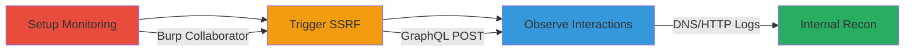

# Blind SSRF Exploitation in GraphQL allTicks Query for Internal Reconnaissance

Multi-stage attack chain demonstrating a complete attack workflow exploiting SSRF in a GraphQL endpoint to perform blind internal reconnaissance.

## Chain Metrics Dashboard

| Metric | Value |
|--------|-------|
| Chain Status | Unverified |
| Total Steps | 3 |
| Execution Time | ~5 minutes |
| Skill Level | Intermediate |
| Complexity | Medium |
| Impact Level | High |

## Attack Flow Visualization



## Prerequisites & Requirements

### Required Tools

- [[tools/Burp-Suite]]
- [[tools/Burp-Collaborator]]

### Target Environment

- Web platform with GraphQL endpoint (pwapi.ex2b.com)
- No authentication required for the 'allTicks' query
- Network access to the public GraphQL endpoint

### Initial Access Requirements

- Public access to pwapi.ex2b.com
- No prior credentials needed
- Burp Suite Pro for Collaborator access

## Detailed Attack Procedures

### Step 1: Setup Monitoring
procedure: [[procedures/Set-Up-Burp-Collaborator-for-SSRF-Detection]]

**Objective**: Establish a monitoring endpoint to detect server-side requests originating from the target server.

**Instructions**: Launch Burp Suite and access the Collaborator tool to generate a unique domain for tracking DNS and HTTP interactions. Copy the generated Collaborator payload URL for use in subsequent steps.

**Expected Output**: A unique domain like `abc123xyz.oastify.com` ready for monitoring.

**Success Indicators**:
- Collaborator client is running and polling for interactions
- Unique domain generated without errors

### Step 2: Trigger SSRF
procedure: [[procedures/Send-Malicious-GraphQL-Query-to-Trigger-SSRF]]

**Objective**: Send a crafted GraphQL query to the vulnerable 'allTicks' endpoint, injecting the Collaborator URL into the 'source' parameter to force a server-side GET request.

**Instructions**: Use Burp Suite's Repeater or Intruder to craft and send a POST request to `https://pwapi.ex2b.com/graphql` with the following body, replacing the source with your Collaborator URL:

```json
{
  "query": "query { allTicks(source: \"http://[collaborator-domain]/test\") { id } }"
}
```

Send the request and observe the response (which will not include internal data due to blind SSRF).

**Expected Output**: GraphQL response with no errors, but no internal data leaked.

**Success Indicators**:
- Request accepted without validation errors
- No immediate HTTP response anomalies

### Step 3: Observe Interactions
procedure: [[procedures/Monitor-and-Confirm-SSRF-via-Collaborator]]

**Objective**: Monitor the Collaborator for incoming DNS resolutions and HTTP requests, confirming the SSRF and enabling further internal scanning.

**Instructions**: In Burp Collaborator, poll for new interactions. Test additional payloads like `http://[collaborator-domain]:8080/` for port scanning or internal IPs like `http://127.0.0.1:admin-port/` to probe services.

**Expected Output**: Logs showing DNS queries and GET requests from the target's IP to the Collaborator domain.

**Success Indicators**:
- Incoming DNS/HTTP from pwapi.ex2b.com server IP
- Successful port scans or internal endpoint hits

## Attack Chain Summary

### Key Achievements

1. Confirmed blind SSRF in GraphQL 'allTicks' query via external URL injection.
2. Demonstrated capability for internal port scanning and service discovery.
3. Highlighted potential for chaining to deeper internal vulnerabilities without response leakage.

## Technique & Tactic Coverage

### MITRE ATT&CK Techniques

- [[Exploit Public-Facing Application]]
- [[Vulnerability Scanning]]

### MITRE ATT&CK Tactics

- [[Initial Access]]
- [[Reconnaissance]]

---
*Last updated: 2023-10-01T00:00:00Z*
