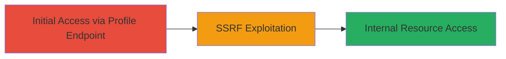

# Blind SSRF Exploitation in MakerDAO Chat Profile Endpoint

Multi-stage attack chain demonstrating a complete attack workflow targeting a blind SSRF vulnerability in the MakerDAO chat application's profile endpoint.

## Chain Metrics Dashboard

| Metric | Value |
|--------|-------|
| Chain Status | Unverified |
| Total Steps | 1 |
| Execution Time | ~5 minutes |
| Skill Level | Intermediate |
| Complexity | Medium |
| Impact Level | High |

## Attack Flow Visualization



## Prerequisites & Requirements

### Required Tools

- [[Burp Suite]] (for intercepting and crafting requests)

### Target Environment

- Web platform
- Accessible HTTPS endpoint: https://chat.makerdao.com/account/profile
- No specific ports required beyond standard HTTPS (443)

### Initial Access Requirements

- Valid user session or authentication to access the /account/profile endpoint
- Network access to the target domain
- No prior privileged access needed, but authentication may be required for the endpoint

## Detailed Attack Procedures

### Step 1: Exploit Blind SSRF
procedure: [[procedures/Exploit-Blind-SSRF-via-Profile-Endpoint]]

**Objective**: Send crafted requests to the vulnerable /account/profile endpoint to trigger server-side requests to internal or external resources, detecting blind SSRF through response anomalies or out-of-band techniques.

**Instructions**: Authenticate to the target application if required, then use a proxy like Burp Suite to intercept and modify requests to the profile endpoint. Craft a payload in a user-controlled parameter (e.g., a redirect or image URL field) to point to an internal service like http://localhost:8080 or an attacker-controlled server for exfiltration. Send the request and monitor for timing differences, error responses, or callbacks to confirm SSRF.

For example, use [[commands/curl-ssrf-test]] to simulate the request:

```bash
curl -X POST https://chat.makerdao.com/account/profile \
  -H "Content-Type: application/json" \
  -d '{"redirect_url": "http://169.254.169.254/latest/meta-data/"}' \
  -b "session_cookie=your_session_here"
```

If the endpoint processes the redirect_url without validation, it may fetch internal metadata. For blind detection, use a unique URL on your server and check access logs.

**Expected Output**: Server response may not directly reveal the SSRF success, but anomalies like delayed responses or log entries on your callback server indicate exploitation.

**Success Indicators**:
- Unusual response time variations
- Access logs on attacker-controlled server showing request from target IP
- Potential error messages hinting at internal fetch failures

## Attack Chain Summary

### Key Achievements

1. Successful triggering of server-side requests to unauthorized resources
2. Potential access to internal metadata or services without direct feedback
3. Demonstration of critical vulnerability leading to information disclosure risks

## Technique & Tactic Coverage

### MITRE ATT&CK Techniques

- [[Exploit Public-Facing Application]]

### MITRE ATT&CK Tactics

- [[Initial Access]]

---
*Last updated: 2023-10-01T00:00:00Z*
