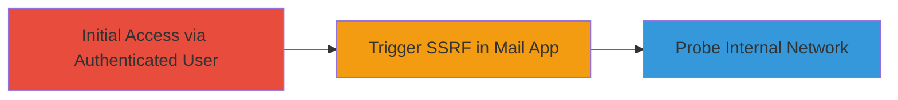

---
tags:
  - ssrf
  - blind-ssrf
  - nextcloud
  - web
type: attack_chain
tools: []
tactics:
  - '[[Initial Access]]'
  - '[[Reconnaissance]]'
verified: false
platforms:
  - Web
submitted: true
complexity: medium
created_at: '2023-10-01T00:00:00Z'
procedures:
  - '[[procedures/Exploit-Blind-SSRF-in-Nextcloud-Mail-App]]'
step_count: 1
techniques:
  - '[[Exploit Public-Facing Application]]'
updated_at: '2025-12-14T04:08:48.411Z'
description: >-
  A multi-stage attack leveraging a blind SSRF vulnerability in Nextcloud's mail
  app to probe internal networks without elevated privileges.
skill_level: intermediate
impact_level: low
id: fbbcd204-17be-4994-92d8-e78dac2f595c
validated: true
mitre_tactics:
  - '[[Initial Access]]'
  - '[[Reconnaissance]]'
mitre_techniques:
  - '[[Exploit Public-Facing Application]]'
---
# Blind SSRF Exploitation in Nextcloud Mail App for Internal Network Probing

Multi-stage attack chain demonstrating exploitation of a blind SSRF vulnerability in Nextcloud's mail app, allowing normal users to trigger server-side requests to internal resources.

## Chain Metrics Dashboard

| Metric | Value |
|--------|-------|
| Chain Status | Unverified |
| Total Steps | 1 |
| Execution Time | ~5 minutes |
| Skill Level | Intermediate |
| Complexity | Medium |
| Impact Level | Low |

## Attack Flow Visualization



## Prerequisites & Requirements

### Required Tools

- Browser or [[commands/curl-send-ssrf-payload]]

### Target Environment

- Nextcloud instance with mail app enabled
- Web platform access
- No elevated privileges required

### Initial Access Requirements

- Valid normal user credentials for Nextcloud
- Network access to the Nextcloud web interface
- No prior internal access needed

## Detailed Attack Procedures

### Step 1: Trigger Blind SSRF in Mail App
procedure: [[procedures/Exploit-Blind-SSRF-in-Nextcloud-Mail-App]]

**Objective**: Exploit insufficient URL validation in the mail app to force the server to make requests to internal endpoints, enabling blind probing of internal networks.

**Instructions**: Authenticate as a normal user in Nextcloud, navigate to the mail app, and submit a malicious URL (e.g., an internal metadata service) via a feature like URL preview or attachment fetch. Use [[commands/curl-send-ssrf-payload]] to simulate the request if testing via API:

```bash
curl -X POST 'https://nextcloud.example.com/apps/mail/api/v1/fetch' \
  -H 'Authorization: Basic <base64-encoded-credentials>' \
  -d 'url=http://169.254.169.254/latest/meta-data/' \
  -d 'other_params=valid_data'
```

Observe for blind indicators such as timing delays or error responses that confirm internal request processing.

**Expected Output**: Server response without direct data leakage, but side-channel confirmation (e.g., delayed response for successful internal fetch).

**Success Indicators**:
- Delayed response indicating internal request success
- No direct error for invalid external URL but subtle behavioral changes

## Attack Chain Summary

### Key Achievements

1. Successful blind SSRF trigger without privileges
2. Potential internal network probing (e.g., metadata services)
3. Low-severity impact demonstration leading to CVE assignment

## Technique & Tactic Coverage

### MITRE ATT&CK Techniques

- [[Exploit Public-Facing Application]]

### MITRE ATT&CK Tactics

- [[Initial Access]]
- [[Reconnaissance]]

---
*Last updated: 2023-10-01T00:00:00Z*
