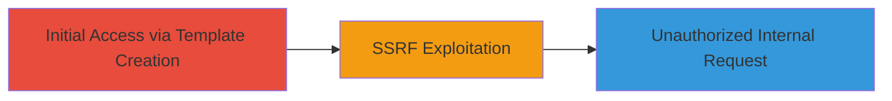

---
tags:
  - ssrf
  - blind-ssrf
  - web-vulnerability
type: attack_chain
tools: []
tactics:
  - '[[Initial Access]]'
verified: false
platforms:
  - Web
submitted: true
complexity: medium
created_at: '2023-10-01T00:00:00Z'
procedures:
  - '[[procedures/Exploiting-Blind-SSRF-in-Email-Template-Creation]]'
step_count: 1
techniques:
  - '[[Exploit Public-Facing Application]]'
updated_at: '2025-12-14T04:39:09.527Z'
description: >-
  A multi-stage attack chain exploiting a Blind Server-Side Request Forgery
  vulnerability in the Stripo Inc platform's email template creation feature,
  allowing unauthorized server requests to internal resources.
skill_level: intermediate
impact_level: high
id: 1f8f4a0d-5259-4fe0-ade4-e3c443dbce75
validated: true
mitre_tactics:
  - '[[Initial Access]]'
mitre_techniques:
  - '[[Exploit Public-Facing Application]]'
---
# Blind SSRF Exploitation in Stripo Email Template Creation

Multi-stage attack chain demonstrating exploitation of a Blind SSRF vulnerability in the Stripo Inc platform during email template creation, enabling the server to make unauthorized requests to internal or external resources.

## Chain Metrics Dashboard

| Metric | Value |
|--------|-------|
| Chain Status | Unverified |
| Total Steps | 1 |
| Execution Time | ~5 minutes |
| Skill Level | Intermediate |
| Complexity | Medium |
| Impact Level | High |

## Attack Flow Visualization



## Prerequisites & Requirements

### Required Tools

- [[tools/curl]]

### Target Environment

- Web platform (Stripo Inc email template editor)
- Required services/ports: HTTPS (443)
- Network access requirements: Internet access to Stripo's public endpoint

### Initial Access Requirements

- Valid user account on Stripo Inc platform
- Network position: External attacker with authenticated access
- Prior access needed: Ability to create email templates

## Detailed Attack Procedures

### Step 1: Exploit Blind SSRF in Template Creation
procedure: [[procedures/Exploiting-Blind-SSRF-in-Email-Template-Creation]]

**Objective**: Trick the server into making unauthorized requests to internal resources by injecting a malicious URL during email template creation.

**Instructions**: Authenticate to the Stripo platform and navigate to the email template creation interface. Use [[commands/curl-ssrf-payload]] to submit a template with a SSRF payload targeting an internal endpoint, such as metadata service.

```bash
curl -X POST 'https://app.stripo.email/api/templates' \
  -H 'Authorization: Bearer YOUR_TOKEN' \
  -H 'Content-Type: application/json' \
  -d '{"name":"Test Template","content":""}'
```

Monitor for blind indicators like timing delays or error responses that confirm the internal request was processed.

**Expected Output**: Server response indicating template creation success (200 OK), with no direct output from internal request due to blind nature.

**Success Indicators**:
- Template created without errors
- Indirect confirmation via timing or logs (e.g., delayed response when targeting slow internal endpoints)

## Attack Chain Summary

### Key Achievements

1. Successful injection of SSRF payload via template URL field
2. Server execution of unauthorized internal request
3. Potential access to sensitive internal resources like AWS metadata

## Technique & Tactic Coverage

### MITRE ATT&CK Techniques

- [[Exploit Public-Facing Application]]

### MITRE ATT&CK Tactics

- [[Initial Access]]

---
*Last updated: 2023-10-01T00:00:00Z*
