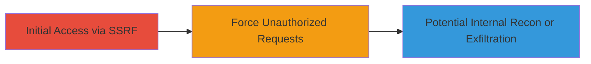

---
tags:
  - ssrf
  - blind-ssrf
  - kubernetes
  - api
type: attack_chain
tools: []
tactics:
  - '[[Initial Access]]'
commands:
  - '[[commands/curl-test-k8s-ssrf]]'
verified: false
platforms:
  - Web
  - Kubernetes
submitted: true
complexity: medium
procedures:
  - '[[procedures/Exploiting-Blind-SSRF-via-JSON-Parameter-in-Kubernetes-API]]'
step_count: 1
techniques:
  - '[[Exploit Public-Facing Application]]'
description: >-
  A single-stage attack exploiting a blind server-side request forgery
  vulnerability in a Kubernetes API endpoint to force unauthorized requests to
  arbitrary URLs.
skill_level: intermediate
impact_level: high
id: 43ed80a7-e3fb-4c51-adb2-29624a705a6b
created_at: '2025-12-14T04:08:48.510Z'
updated_at: '2025-12-14T04:08:48.510Z'
validated: true
mitre_tactics:
  - '[[Initial Access]]'
mitre_techniques:
  - '[[Exploit Public-Facing Application]]'
---
# Blind SSRF Exploitation on Kubernetes Snapshots API

Multi-stage attack chain demonstrating a complete attack workflow.

## Chain Metrics Dashboard

| Metric | Value |
|--------|-------|
| Chain Status | Unverified |
| Total Steps | 1 |
| Execution Time | ~5 minutes |
| Skill Level | Intermediate |
| Complexity | Medium |
| Impact Level | High |

## Attack Flow Visualization



## Prerequisites & Requirements

### Required Tools

- None (uses standard HTTP client like curl)

### Target Environment

- Kubernetes cluster with exposed API endpoint
- Web service on port 80/443
- Publicly accessible snapshots API

### Initial Access Requirements

- Internet access to the target endpoint
- No authentication required (public-facing)
- Ability to send HTTP POST requests

## Detailed Attack Procedures

### Step 1: Exploit SSRF Vulnerability
procedure: [[procedures/Exploiting-Blind-SSRF-via-JSON-Parameter-in-Kubernetes-API]]

**Objective**: Identify and trigger the SSRF vulnerability by submitting a crafted JSON request to the snapshots API, forcing the server to make requests to arbitrary internal or external URLs.

**Instructions**: Use [[commands/curl-test-k8s-ssrf]] to send a POST request with a malicious URL in the JSON payload, such as an internal metadata endpoint to test for access:

```bash
curl -X POST http://velodrome.canary.k8s.io/api/snapshots -H "Content-Type: application/json" -d '{"url": "http://169.254.169.254/latest/meta-data/"}'
```

Monitor for any indirect indicators like timing delays or error responses that might confirm the request was processed blindly.

**Expected Output**: HTTP response from the API (e.g., 200 OK or error), but no direct visibility into the forged request's response due to blind nature.

**Success Indicators**:
- Server accepts the request without validation errors
- No immediate rejection of arbitrary URL
- Potential for follow-up tests showing internal access (e.g., via external callback if possible)

## Attack Chain Summary

### Key Achievements

1. Successful identification of unvalidated JSON parameter in Kubernetes API
2. Exploitation forcing server-side requests to arbitrary URLs
3. Demonstration of potential for internal resource access or information disclosure

## Technique & Tactic Coverage

### MITRE ATT&CK Techniques

- [[Exploit Public-Facing Application]]

### MITRE ATT&CK Tactics

- [[Initial Access]]

---
*Last updated: 2023-10-01*
