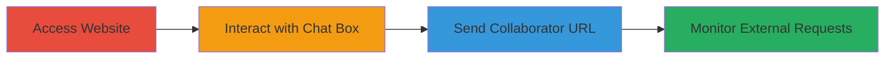

---
tags:
  - ssrf
  - blind-ssrf
  - web-vulnerability
  - external-request-forgery
type: attack_chain
tools:
  - '[[tools/Burp-Collaborator]]'
tactics:
  - '[[Initial Access]]'
verified: false
platforms:
  - Web
submitted: true
complexity: medium
created_at: '2023-10-01T00:00:00Z'
procedures:
  - '[[procedures/Access-Target-Website-and-Chat-Box]]'
  - '[[procedures/Send-Burp-Collaborator-URL-via-Chat]]'
  - '[[procedures/Monitor-Burp-Collaborator-for-SSRF-Confirmation]]'
step_count: 4
techniques:
  - '[[Exploit Public-Facing Application]]'
updated_at: '2025-12-14T03:46:09.272Z'
description: >-
  A multi-step attack chain exploiting a Blind Server-Side Request Forgery
  (SSRF) vulnerability in the chat box of the MTN Group website to induce
  unauthorized external HTTP and DNS requests, enabling reconnaissance and
  potential further compromise.
skill_level: intermediate
impact_level: high
id: 5d3ad227-23a4-41d2-ad0a-c01752640fe9
validated: true
mitre_tactics:
  - '[[Initial Access]]'
mitre_techniques:
  - '[[Exploit Public-Facing Application]]'
---
# Blind SSRF Exploitation via MTN Group Website Chat Box

Multi-stage attack chain demonstrating the exploitation of a Blind SSRF vulnerability in the MTN Group's website chat or messenger box feature. The attack involves navigating to the site, interacting with the chat interface to send a controlled URL, and observing server-side requests to confirm the vulnerability. This allows for attack surface analysis, potential malicious file fetching, internal IP access, and sensitive information leakage.

## Chain Metrics Dashboard

| Metric | Value |
|--------|-------|
| Chain Status | Unverified |
| Total Steps | 4 |
| Execution Time | ~5 minutes |
| Skill Level | Intermediate |
| Complexity | Medium |
| Impact Level | High |

## Attack Flow Visualization

## Prerequisites & Requirements

### Required Tools

- [[tools/Burp-Collaborator]]

### Target Environment

- Web platform
- Public-facing website with chat/messenger feature
- No specific ports or services required beyond standard HTTP/HTTPS

### Initial Access Requirements

- Internet access to the target website
- No credentials needed
- Browser for interaction

## Detailed Attack Procedures

### Step 1: Access Target Website
procedure: [[procedures/Access-Target-Website-and-Chat-Box]]

**Objective**: Gain initial access to the vulnerable website to identify the chat interface.

**Instructions**: Open a web browser and navigate to the main page of the MTN Group website (e.g., https://www.mtn.co.za or similar regional variant). Ensure the page loads fully to observe interactive elements.

**Expected Output**: The homepage displays, including any chat or messenger widget.

**Success Indicators**:
- Website loads without errors
- Chat box is visible

### Step 2: Locate and Interact with Chat Box
procedure: [[procedures/Access-Target-Website-and-Chat-Box]]

**Objective**: Identify the vulnerable chat or messenger box for input injection.

**Instructions**: Scan the page layout, focusing on the bottom right corner where the chat widget typically appears. Click to open or activate the chat interface if it's collapsed.

**Expected Output**: Chat input field becomes active and ready for text entry.

**Success Indicators**:
- Chat box opens
- Input field accepts text

### Step 3: Send Collaborator URL via Chat
procedure: [[procedures/Send-Burp-Collaborator-URL-via-Chat]]

**Objective**: Inject a controlled external URL to trigger server-side requests.

**Instructions**: Generate a unique Burp Collaborator payload URL using [[tools/Burp-Collaborator]]. Paste the URL (e.g., `https://your-unique-collaborator-domain.oastify.com/test.png`) into the chat input field and click the send button.

**Expected Output**: The message appears sent in the chat, but no immediate client-side response.

**Success Indicators**:
- URL submitted without validation errors
- No client-side blocking

### Step 4: Monitor for SSRF Confirmation
procedure: [[procedures/Monitor-Burp-Collaborator-for-SSRF-Confirmation]]

**Objective**: Observe out-of-band interactions to validate the Blind SSRF.

**Instructions**: Switch to the Burp Collaborator interface and monitor for incoming HTTP and DNS requests. Look for server fetches, such as attempts to retrieve `test.png` or resolve the domain.

**Expected Output**: Logs show external requests from the target's server IP, including DNS resolutions and HTTP GETs.

**Success Indicators**:
- DNS interaction recorded
- HTTP request to the collaborator URL observed
- Potential internal details leaked in headers

## Attack Chain Summary

### Key Achievements

1. Confirmed Blind SSRF in chat functionality allowing arbitrary external requests
2. Demonstrated potential for reconnaissance via internal IP exposure
3. Highlighted risks of malicious file delivery and server infection

## Technique & Tactic Coverage

### MITRE ATT&CK Techniques

- [[Exploit Public-Facing Application]]

### MITRE ATT&CK Tactics

- [[Initial Access]]

---
*Last updated: 2023-10-01T00:00:00Z*
