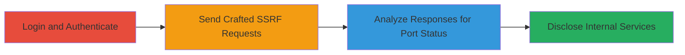

# Blind SSRF for Internal Port Scanning in Infogram API

Multi-stage attack chain demonstrating a complete attack workflow exploiting Blind SSRF in the Infogram API endpoint /api/web_resource/url to perform internal port scanning on localhost, leading to information disclosure of open internal services.

## Chain Metrics Dashboard

| Metric | Value |
|--------|-------|
| Chain Status | Unverified |
| Total Steps | 3 |
| Execution Time | ~5 minutes |
| Skill Level | Intermediate |
| Complexity | Medium |
| Impact Level | High |

## Attack Flow Visualization



## Prerequisites & Requirements

### Required Tools

- [[tools/curl]]

### Target Environment

- Web application: Infogram platform
- Required services/ports: Access to /api/web_resource/url endpoint
- Network access requirements: Internet access to infogram.com; authenticated session

### Initial Access Requirements

- Credential requirements: Valid user account on Infogram
- Network position: External attacker with login access
- Prior access needed: Successful login to the application

## Detailed Attack Procedures

### Step 1: Login to Infogram
procedure: [[procedures/Exploit-Blind-SSRF-for-Port-Scanning]]

**Objective**: Authenticate to the Infogram application to gain access to the vulnerable API endpoint.

**Instructions**: Use a web browser or [[commands/curl-login-infogram]] to log in with valid credentials. This establishes a session cookie required for API requests.

```bash
curl -X POST https://infogram.com/login -d "username=user&password=pass" -c cookies.txt
```

**Expected Output**: Successful login response with session cookies stored.

**Success Indicators**:
- HTTP 200 OK on login
- Valid session established

### Step 2: Send SSRF Requests to Scan Ports
procedure: [[procedures/Exploit-Blind-SSRF-for-Port-Scanning]]

**Objective**: Exploit the Blind SSRF in /api/web_resource/url by sending GET requests with internal localhost URLs in the 'q' parameter to probe ports.

**Instructions**: Use [[commands/curl-infogram-ssrf-scan]] to target localhost ports (e.g., 80, 81, 6000) via http://0:[PORT]/ or http://127.0.0.1:[PORT]/.

```bash
curl -b cookies.txt "https://infogram.com/api/web_resource/url?q=http://0:80/"
curl -b cookies.txt "https://infogram.com/api/web_resource/url?q=http://0:81/"
curl -b cookies.txt "https://infogram.com/api/web_resource/url?q=http://0:6000/"
```

**Expected Output**: For open ports, JSON with title and description (e.g., {"title":"Infogram Site","description":"...","url":"http://0:6000/"}); for closed ports, 404 Not Found.

**Success Indicators**:
- 200 OK responses for open ports
- Exposure of internal site titles

### Step 3: Analyze Responses for Information Disclosure
procedure: [[procedures/Exploit-Blind-SSRF-for-Port-Scanning]]

**Objective**: Interpret API responses to identify open internal ports and disclose service information.

**Instructions**: Review the JSON responses from previous requests. Open ports return 200 with metadata; closed return 404. Script or manually log results for ports in a range (e.g., 1-10000) to map internal network.

**Expected Output**: List of open ports (e.g., 80, 81, 6000) with service details like titles.

**Success Indicators**:
- Identification of internal services
- Potential exposure of sensitive internal endpoints

## Attack Chain Summary

### Key Achievements

1. Successful authentication to access the API
2. Exploitation of Blind SSRF to scan localhost ports
3. Disclosure of open internal services on ports 80, 81, and 6000

## Technique & Tactic Coverage

### MITRE ATT&CK Techniques

- [[Exploit Public-Facing Application]] Exploit Public-Facing Application
- [[Gather Victim Host Information]] Gather Victim Network Information

### MITRE ATT&CK Tactics

- [[Initial Access]] Initial Access
- [[Reconnaissance]] Reconnaissance

---
*Last updated: 2023-10-01T00:00:00Z*
