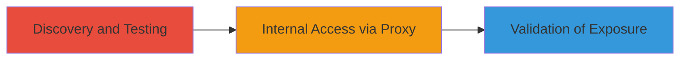

# Blind SSRF in Chaturbate Image Proxy Allowing Internal Network Access

Multi-stage attack chain demonstrating a complete attack workflow.

## Chain Metrics Dashboard

| Metric | Value |
|--------|-------|
| Chain Status | Unverified |
| Total Steps | 1 |
| Execution Time | ~5 minutes |
| Skill Level | Intermediate |
| Complexity | Medium |
| Impact Level | Medium |

## Attack Flow Visualization



## Prerequisites & Requirements

### Required Tools

- None specific; standard web testing tools like curl or browser developer tools.

### Target Environment

- Web platform with an image proxy service (e.g., camo proxy).
- Required services/ports: HTTP/HTTPS on port 80/443 for proxy interaction.
- Network access requirements: Public internet access to the target proxy endpoint.

### Initial Access Requirements

- No credentials required; public-facing application.
- Network position: External attacker.
- Prior access needed: None.

## Detailed Attack Procedures

### Step 1: Discovery and Exploitation of SSRF
procedure: [[procedures/Exploit-Blind-SSRF-in-Image-Proxy]]

**Objective**: Identify and abuse the image proxy to make unauthorized requests to internal network endpoints, confirming SSRF vulnerability.

**Instructions**: Begin by testing the proxy endpoint with a crafted URL that points to an internal IP address. Use [[commands/curl-ssrf-image-proxy-test]] to send a request through the proxy:

```bash
curl -s "https://camo.stream.highwebmedia.com/http://127.0.0.1/" -o response.html
```

Inspect the response for signs of internal resource fetching, such as delays, errors, or partial content indicating successful backend request. Follow up by testing other internal IPs like 10.0.0.1 or 192.168.1.1 to map accessible endpoints:

```bash
curl -s "https://camo.stream.highwebmedia.com/https://10.0.0.1/internal-endpoint" -o internal_response.html
```

**Expected Output**: HTTP response from the proxy, potentially including blind indicators like timing differences or error messages revealing internal access.

**Success Indicators**:
- Response time variations suggesting internal request processing.
- Error messages or content snippets from internal servers.
- Confirmation of access to restricted IPs without direct connectivity.

## Attack Chain Summary

### Key Achievements

1. Successful identification of SSRF in the image proxy lacking IP restrictions.
2. Demonstration of access to internal HTTP/HTTPS endpoints on isolated cluster.
3. Limited impact due to network segmentation, but potential for endpoint exposure.

## Technique & Tactic Coverage

### MITRE ATT&CK Techniques

- [[Exploit Public-Facing Application]]

### MITRE ATT&CK Tactics

- [[Initial Access]]

---
*Last updated: 2023-10-01T00:00:00Z*
