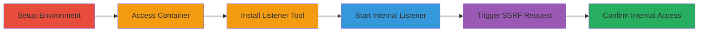

# Blind SSRF in GitLab FogBugz Project Import for Internal Network Access

Multi-stage attack chain demonstrating exploitation of a blind SSRF vulnerability in GitLab CE 12.3.5's FogBugz project import feature, allowing arbitrary internal requests without URL validation.

## Chain Metrics Dashboard

| Metric | Value |
|--------|-------|
| Chain Status | Unverified |
| Total Steps | 5 |
| Execution Time | ~15 minutes |
| Skill Level | Intermediate |
| Complexity | Medium |
| Impact Level | High |

## Attack Flow Visualization



## Prerequisites & Requirements

### Required Tools

- [[tools/Docker]]
- [[tools/Netcat]]
- [[tools/Apt]]

### Target Environment

- GitLab CE 12.3.5 running in Docker on Linux
- Exposed ports: 80 (HTTP), 443 (HTTPS), 22 (SSH)
- Internal network access within the container

### Initial Access Requirements

- Local machine with Docker installed
- Administrative access to run Docker containers
- No prior authentication needed for setup, but GitLab UI access for import

## Detailed Attack Procedures

### Step 1: Setup GitLab Docker Container
procedure: [[procedures/Setup-GitLab-Docker-Container]]

**Objective**: Launch a vulnerable GitLab instance in a Docker container to simulate the target environment.

**Instructions**: Deploy the official GitLab CE image using [[commands/docker-run-gitlab-setup]] to create a controlled reproduction setup.

```bash
docker run --detach --hostname gitlab.example.com --publish 443:443 --publish 80:80 --publish 22:22 --name gitlab gitlab/gitlab-ce:latest
```

Wait for the container to fully start (approximately 5-10 minutes), monitoring logs with `docker logs -f gitlab`.

**Expected Output**: Container ID printed, and GitLab accessible at http://localhost.

**Success Indicators**:
- Container running without errors
- GitLab web interface loads on port 80/443

### Step 2: Access GitLab Container Shell
procedure: [[procedures/Access-GitLab-Container-Shell]]

**Objective**: Gain interactive shell access inside the running GitLab container to prepare for tool installation.

**Instructions**: Use [[commands/docker-exec-gitlab-bash]] to enter the container's bash shell.

```bash
docker exec -it gitlab /bin/bash
```

**Expected Output**: Bash prompt inside the container (e.g., root@gitlab:/#).

**Success Indicators**:
- Interactive shell session established
- Ability to execute commands within the container

### Step 3: Install Netcat in GitLab Container
procedure: [[procedures/Install-Netcat-in-GitLab-Container]]

**Objective**: Install netcat tool inside the container to set up an internal listener for capturing SSRF connections.

**Instructions**: From the container shell, run [[commands/apt-install-netcat]] to update packages and install netcat.

```bash
apt update && apt install -y netcat
```

**Expected Output**: Package lists updated, netcat installed successfully without errors.

**Success Indicators**:
- `nc` command available in the shell (verify with `nc --version`)
- No installation failures

### Step 4: Start Netcat Listener in Container
procedure: [[procedures/Start-Netcat-Listener-in-Container]]

**Objective**: Create a TCP listener on an internal port to receive and confirm the SSRF-triggered connection.

**Instructions**: In the container shell, execute [[commands/nc-listen-12345]] to start listening on port 12345.

```bash
nc -llvp 12345
```

Keep this terminal open; it will wait for connections.

**Expected Output**: Message like "Listening on [0.0.0.0] (family 0, port 12345)".

**Success Indicators**:
- Listener active and waiting for connections
- No port binding errors

### Step 5: Trigger SSRF via FogBugz Import
procedure: [[procedures/Trigger-SSRF-via-FogBugz-Import]]

**Objective**: Exploit the SSRF by inputting an internal URL during the FogBugz project import process, confirming access via the listener.

**Instructions**: Access the GitLab UI at http://localhost, navigate to project import, select FogBugz, and enter `http://localhost:12345` as the URL. Initiate the import to trigger the request.

**Expected Output**: In the netcat listener terminal, a connection from the GitLab process to port 12345, confirming the SSRF.

**Success Indicators**:
- Incoming connection logged in netcat
- Proof of internal request without external validation

## Attack Chain Summary

### Key Achievements

1. Successful setup of vulnerable GitLab environment in Docker
2. Installation and activation of internal listener to capture SSRF traffic
3. Exploitation of blind SSRF to reach localhost services, enabling potential data exposure or lateral movement

## Technique & Tactic Coverage

### MITRE ATT&CK Techniques

- [[Exploit Public-Facing Application]]

### MITRE ATT&CK Tactics

- [[Initial Access]]
- [[Discovery]]

---
*Last updated: 2023-10-01T00:00:00Z*
