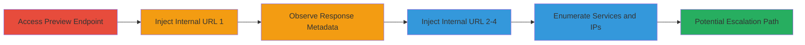

# Blind SSRF in Matrix Preview URL to Enumerate Internal Services

Multi-stage attack chain demonstrating exploitation of a blind Server-Side Request Forgery (SSRF) in Reddit's Matrix chat preview_url API endpoint to enumerate internal services and their IPs by injecting internal URLs and observing leaked metadata in responses.

## Chain Metrics Dashboard

| Metric | Value |
|--------|-------|
| Chain Status | Unverified |
| Total Steps | 5 |
| Execution Time | ~5 minutes |
| Skill Level | Intermediate |
| Complexity | Medium |
| Impact Level | High |

## Attack Flow Visualization



## Prerequisites & Requirements

### Required Tools

- Web browser (e.g., Chrome) for manual testing
- Optional: [[tools/curl]] for scripted requests

### Target Environment

- Web platform with Matrix chat integration
- Exposed preview_url endpoint at https://matrix.redditspace.com/_matrix/media/r0/preview_url/
- No authentication required for public endpoint

### Initial Access Requirements

- Public internet access to the target endpoint
- No credentials needed
- Ability to observe HTTP responses (via browser dev tools or curl)

## Detailed Attack Procedures

### Step 1: Access the Matrix Preview URL Endpoint
procedure: [[procedures/Exploit-Blind-SSRF-in-Matrix-Preview-URL]]

**Objective**: Locate and access the vulnerable preview_url API endpoint to prepare for SSRF injection.

**Instructions**: Open a web browser and navigate to the endpoint with a placeholder external URL to confirm functionality. Use dev tools to monitor network requests.

**Expected Output**: Successful response with metadata for the placeholder URL, no errors.

**Success Indicators**:
- Endpoint loads without authentication prompt
- Network tab shows GET request to /_matrix/media/r0/preview_url/

### Step 2: Inject First Internal URL and Observe Response
procedure: [[procedures/Exploit-Blind-SSRF-in-Matrix-Preview-URL]]

**Objective**: Perform initial SSRF by injecting an internal IP or hostname to leak service information via og:title metadata.

**Instructions**: Modify the URL parameter to http://internal-ip-1 (redacted as ██████). Reload the page and check the response in dev tools. If the request hangs >2 seconds, reload to timeout and capture partial response.

Use [[commands/curl-ssrf-inject]] for scripted testing:

```bash
curl -s "https://matrix.redditspace.com/_matrix/media/r0/preview_url/?url=http://██████" | grep og:title
```

**Expected Output**: Response containing og:title with leaked internal service name (e.g., ███████).

**Success Indicators**:
- og:title reveals internal service details
- No full page load but metadata exfiltration

### Step 3: Inject Second Internal URL and Observe Response
procedure: [[procedures/Exploit-Blind-SSRF-in-Matrix-Preview-URL]]

**Objective**: Extend enumeration by targeting another internal resource to gather additional service metadata.

**Instructions**: Update the URL parameter to http://internal-host-2 (redacted as ████████). Reload and inspect response, handling hangs by reloading.

Use [[commands/curl-ssrf-inject]] adapted for this target:

```bash
curl -s "https://matrix.redditspace.com/_matrix/media/r0/preview_url/?url=http://█████████" | grep og:title
```

**Expected Output**: og:title exposing further internal service info (e.g., ███████).

**Success Indicators**:
- Additional service names or IPs leaked
- Consistent metadata pattern confirming SSRF

### Step 4: Inject Third Internal URL and Observe Response
procedure: [[procedures/Exploit-Blind-SSRF-in-Matrix-Preview-URL]]

**Objective**: Continue port scanning and service discovery with a third internal target.

**Instructions**: Set URL parameter to http://internal-service-3 (redacted as ██████████). Monitor for response leaks, reload if necessary.

Use [[commands/curl-ssrf-inject]]:

```bash
curl -s "https://matrix.redditspace.com/_matrix/media/r0/preview_url/?url=http://██████████" | grep og:title
```

**Expected Output**: og:title with service details (e.g., ██████).

**Success Indicators**:
- Enumeration of third service
- Potential port scan via timeout behaviors

### Step 5: Inject Fourth Internal URL and Observe Response
procedure: [[procedures/Exploit-Blind-SSRF-in-Matrix-Preview-URL]]

**Objective**: Finalize internal network mapping and assess escalation potential.

**Instructions**: Replace with final internal URL (redacted as ████████). Analyze response for comprehensive leaks.

Use [[commands/curl-ssrf-inject]]:

```bash
curl -s "https://matrix.redditspace.com/_matrix/media/r0/preview_url/?url=███████" | grep og:title
```

**Expected Output**: og:title revealing last service (e.g., █████████).

**Success Indicators**:
- Full list of internal services enumerated
- Basis for potential RCE escalation identified but not pursued

## Attack Chain Summary

### Key Achievements

1. Successful blind SSRF exploitation without direct response visibility
2. Exfiltration of internal service names and IPs via og:title metadata
3. Demonstration of port scanning capabilities through request behaviors
4. Highlighted path to severe impacts like RCE on enumerated services

## Technique & Tactic Coverage

### MITRE ATT&CK Techniques

- [[Exploit Public-Facing Application]] Exploit Public-Facing Application
- [[Gather Victim Host Information]] Gather Victim Host Information

### MITRE ATT&CK Tactics

- [[Initial Access]] Initial Access
- [[Reconnaissance]] Reconnaissance

---
*Last updated: 2023-10-01T00:00:00Z*
