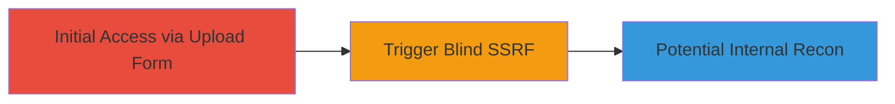

# Blind SSRF in Nextcloud Appstore Release Upload Form via Improper Access Control

Multi-stage attack chain demonstrating a complete attack workflow.

## Chain Metrics Dashboard

| Metric | Value |
|--------|-------|
| Chain Status | Unverified |
| Total Steps | 1 |
| Execution Time | ~5 minutes |
| Skill Level | Intermediate |
| Complexity | Low |
| Impact Level | Low |

## Attack Flow Visualization



## Prerequisites & Requirements

### Required Tools

- None (uses standard HTTP client like curl)

### Target Environment

- Nextcloud instance with Appstore Release Upload Form exposed
- Web platform, typically over HTTPS on port 443
- No specific services required beyond the web application

### Initial Access Requirements

- Public access to the Nextcloud Appstore upload endpoint
- No credentials needed for unauthenticated form submission
- Network position allowing outbound requests to the target

## Detailed Attack Procedures

### Step 1: Trigger Blind SSRF via Upload Form
procedure: [[procedures/Exploit-Blind-SSRF-in-Nextcloud-Upload-Form]]

**Objective**: Submit a malicious payload to the Appstore Release Upload Form to trigger a blind SSRF, potentially allowing requests to internal resources.

**Instructions**: Identify the upload form endpoint, typically at `/index.php/apps/appstore/upload` or similar in Nextcloud. Craft a form submission that includes a URL parameter pointing to an internal service, such as `http://169.254.169.254/latest/meta-data/` for AWS metadata (if applicable). Use [[commands/curl-ssrf-upload-test]] to send the request:

```bash
curl -X POST 'https://target-nextcloud.com/index.php/apps/appstore/upload' \
  -F 'release_url=http://169.254.169.254/latest/meta-data/' \
  -F 'other_form_fields=...' \
  --verbose
```

Monitor for blind indicators like response time differences or error patterns to confirm SSRF.

**Expected Output**: Server response without direct output from internal request, but potential delays or errors indicating successful SSRF trigger.

**Success Indicators**:
- Response time increases when targeting slow internal endpoints
- No direct data exfiltration, but confirmation via timing attacks or oracle-based inference
- HTTP 200 or form processing success without blocking the malicious URL

## Attack Chain Summary

### Key Achievements

1. Successful submission of SSRF payload to the upload form without authentication
2. Triggering of internal server requests, enabling blind reconnaissance of internal network
3. Demonstration of improper access control bypass in a low-severity context

## Technique & Tactic Coverage

### MITRE ATT&CK Techniques

- [[Exploit Public-Facing Application]]

### MITRE ATT&CK Tactics

- [[Initial Access]]

---
*Last updated: 2025-01-15T00:00:00Z*
