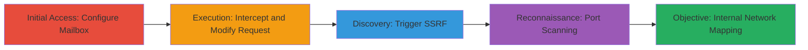

# Blind SSRF in Nextcloud Mail App for Internal Network Reconnaissance

Multi-stage attack chain demonstrating exploitation of a Blind Server-Side Request Forgery (SSRF) vulnerability in Nextcloud Mail app version 2.0.1 to map internal network services via port scanning.

## Chain Metrics Dashboard

| Metric | Value |
|--------|-------|
| Chain Status | Unverified |
| Total Steps | 4 |
| Execution Time | ~10 minutes |
| Skill Level | Intermediate |
| Complexity | Medium |
| Impact Level | High |

## Attack Flow Visualization

## Prerequisites & Requirements

### Required Tools

- [[tools/Burp-Suite]]

### Target Environment

- Nextcloud instance with Mail app version 2.0.1
- Valid user account with access to Mail app
- Services/ports: Internal hosts on ports like 22 (SSH), 3306 (MySQL), 6379 (Redis)
- Network access: Authenticated session to the Nextcloud web interface

### Initial Access Requirements

- Authenticated user credentials for Nextcloud
- Proxy setup (e.g., Burp Suite) to intercept traffic
- No prior internal access needed; exploits from external authenticated position

## Detailed Attack Procedures

### Step 1: Initial Access
procedure: [[procedures/Add-Mailbox-and-Navigate-to-Sieve-Settings]]

**Objective**: Set up a mailbox to access Sieve filter configuration, triggering the vulnerable PUT request endpoint.

**Instructions**: Log in to Nextcloud, add a new mailbox in the Mail app, and navigate to the Sieve filter server settings.

**Expected Output**: Interface loads for Sieve configuration, preparing the PUT request to /apps/mail/api/sieve/account/{id}.

**Success Indicators**:
- Mailbox added successfully
- Sieve settings page accessible

### Step 2: Execution
procedure: [[procedures/Intercept-PUT-Request-for-Sieve-Configuration]]

**Objective**: Capture the outgoing PUT request used to update Sieve settings for modification.

**Instructions**: Configure your browser proxy to Burp Suite and intercept the request when saving Sieve settings.

**Expected Output**: Intercepted HTTP PUT request with JSON payload containing sieve parameters.

**Success Indicators**:
- Request body visible in Burp, including sieveHost, sievePort, etc.
- No errors in request forwarding

### Step 3: Privilege Escalation
procedure: [[procedures/Modify-SieveHost-for-SSRF-Exploitation]]

**Objective**: Alter the request to point sieveHost to an internal target like localhost, bypassing SSL to enable SSRF.

**Instructions**: In Burp, edit the JSON payload: set sieveHost to "127.0.0.1", sievePort to "80", and sieveSslMode to "none". Forward the modified request.

**Expected Output**: Server accepts the update, but attempts a backend connection to the specified internal host/port.

**Success Indicators**:
- HTTP 200 response from server
- Varied response times indicating connection attempts

### Step 4: Objective
procedure: [[procedures/Fuzz-Ports-with-Burp-Intruder-for-Blind-Scanning]]

**Objective**: Perform blind port scanning by fuzzing sievePort values and analyzing response times to identify open internal services.

**Instructions**: Use Burp Intruder to set payload positions on sievePort, load ports 1-65535, and send requests. Monitor response times: <100ms for closed, >5000ms for open.

**Expected Output**: List of open ports (e.g., 22, 3306, 6379) based on delayed responses, mapping services like SSH, MySQL, Redis.

**Success Indicators**:
- Delayed responses on known open ports
- Internal services identified for further exploitation

## Attack Chain Summary

### Key Achievements

1. Successful SSRF exploitation via Sieve configuration without direct feedback.
2. Blind detection of open internal ports using timing differences.
3. Network mapping enabling pivots to vulnerable services like databases or Redis.

## Technique & Tactic Coverage

### MITRE ATT&CK Techniques

- [[Exploit Public-Facing Application]] Exploit Public-Facing Application
- [[Network Service Scanning]] Network Service Scanning

### MITRE ATT&CK Tactics

- [[Initial Access]] Initial Access
- [[Discovery]] Discovery

---
*Last updated: 2024-01-01T00:00:00Z*
